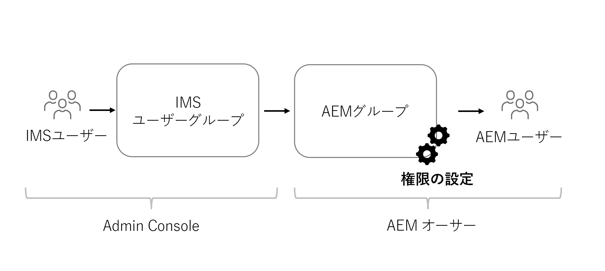

# ヘッドレスコンテンツの権限に関する考慮事項

ヘッドレス実装では、対処が必要なセキュリティおよび権限の領域がいくつかあります。権限とペルソナは、概ね、**オーサー**&#x200B;または&#x200B;**パブリッシュ**&#x200B;の AEM 環境に基づいていると考えることができます。各環境には、様々なペルソナが含まれており、ニーズも異なります。

## オーサーサービスに関する考慮事項

オーサーサービスでは、内部ユーザーがコンテンツの作成、管理および公開を行います。権限は、コンテンツを管理する様々なペルソナを中心に展開されます。

### グループレベルでの権限の管理

ベストプラクティスとして、権限は AEM のグループに設定してください。これらのグループはローカルグループとも呼ばれ、AEM オーサー環境内で管理できます。

グループメンバーシップを管理する最も簡単な方法は、Adobe Identity Management System（IMS）グループを使用し、[IMS グループをローカル AEM グループに割り当てる](https://experienceleague.adobe.com/docs/experience-manager-cloud-service/content/security/ims-support.html?lang=ja#managing-permissions-in-aem)ことです。

プロセスの概要は次のとおりです。

1. [Admin Console](https://adminconsole.adobe.com/) を使用して、IMS ユーザーを新規または既存の IMS ユーザーグループに追加します。
1. ユーザーがログインすると、IMS グループは AEM と同期されます。
1. IMS グループを AEM グループに割り当てます。
1. AEM グループに権限を設定します。
1. ユーザーは、AEM にログインして IMS で認証されると、AEM グループの権限を継承します。

>[!TIP]
>
> IMS および AEM ユーザー／グループの管理に関する詳細なビデオチュートリアルを[ここ](https://experienceleague.adobe.com/docs/experience-manager-learn/cloud-service/accessing/overview.html?lang=ja)で参照できます。

AEM で&#x200B;**グループ**&#x200B;を管理するには、**ツール**／**セキュリティ**／**グループ**&#x200B;に移動します。

AEM でグループの権限を管理するには、**ツール**／**セキュリティ**／**権限**&#x200B;に移動します。

### DAM ユーザー

このコンテキストでは、「DAM」はデジタルアセット管理を表します。**DAM ユーザー**&#x200B;は AEM の標準グループで、デジタルアセットやコンテンツフラグメントを管理する「日常業務」ユーザーに使用できます。このグループは、コンテンツフラグメントや AEM Assets 内のその他すべてのファイルを&#x200B;**表示**、**追加**、**更新**、**削除**&#x200B;および&#x200B;**公開**&#x200B;する権限を提供します。

グループメンバーシップに IMS を使用する場合は、適切な IMS グループを **DAM ユーザー**&#x200B;グループのメンバーとして追加します。IMS グループのメンバーは、AEM 環境にログインする際に DAM ユーザーグループの権限を継承します。

#### DAM ユーザーグループのカスタマイズ

標準で用意されているグループの権限を直接変更しないことをお勧めします。代わりに、**DAM ユーザー**&#x200B;グループ権限に倣って独自のグループを作成し、さらにアクセスの範囲を AEM Assets 内の異なる&#x200B;**フォルダー**&#x200B;に制限することもできます。

権限をよりきめ細かく制御するには、AEM の&#x200B;**権限**&#x200B;コンソールを使用して、パスを `/content/dam` からより具体的なパス（例：`/content/dam/mycontentfragments`）に更新します。

このユーザーグループには、コンテンツフラグメントを作成および編集する権限を付与し、削除する権限は付与しない方が望ましい場合があります。削除の権限を除いて編集の権限を確認し割り当てる場合は、[コンテンツフラグメント - 削除に関する考慮事項](/help/assets/content-fragments/content-fragments-delete.md)を参照してください。

### モデルエディター

**コンテンツフラグメントモデル**&#x200B;を変更する権限は、管理者のみに付与するか、管理者権限を持つ&#x200B;**少数のユーザーから成るグループ**&#x200B;に付与してください。コンテンツフラグメントモデルを変更すると、下流に対する多くの影響が生じます。

>[!CAUTION]
>
>コンテンツフラグメントモデルを変更すると、ヘッドレスアプリケーションの基盤となっている GraphQL API が変更されます。

コンテンツフラグメントモデルを管理はするものの、完全な管理者アクセス権を持たないグループを作成する場合は、次のアクセス制御エントリを持つグループを作成できます。

| パス | 可否 | 権限 |
|-----| -------------| ---------|
| `/conf` | **許可** | `jcr:read` |
| `/conf/<config-name>/settings/dam/cfm` | **許可** | `rep:write`、`crx:replicate` |

## パブリッシュサービスの権限

パブリッシュサービスは「ライブ」環境と見なされ、通常は GraphQL API ユーザーがやり取りする相手になります。コンテンツは、オーサーサービスで編集および承認された後、パブリッシュサービスに公開されます。この場合、ヘッドレスアプリケーションは、GraphQL API を介してパブリッシュサービスから提供される承認済みコンテンツを消費します。

AEM パブリッシュサービスの GraphQL エンドポイントを介して公開されるコンテンツは、デフォルトで、未認証ユーザーを含むすべてのユーザーからアクセスできます。

### コンテンツの権限

AEM の GraphQL API を使用して公開されるコンテンツは、アセットフォルダーに設定された[閉じられたユーザーグループ（CUG）](https://experienceleague.adobe.com/docs/experience-manager-learn/assets/advanced/closed-user-groups.html?lang=ja)を使用して制限できます。これは、アセットフォルダーのコンテンツにアクセスできる AEM ユーザーグループ（およびそのメンバー）を指定するものです。

アセット CUG は次のように動作します。

* まず、フォルダーおよびサブフォルダーへのすべてのアクセスを拒否します。
* 次に、CUG のリストに含まれているすべての AEM ユーザーグループのフォルダーとサブフォルダーへの読み取りアクセスを許可します。

CUG を設定できるのは、GraphQL API を使用して公開されるコンテンツを含んだアセットフォルダーです。AEM パブリッシュ上のアセットフォルダーに対するアクセスは、ユーザーごとに直接制御するのではなく、ユーザーグループを介して制御する必要があります。GraphQL API で公開されるコンテンツを含んだアセットフォルダーへのアクセス権を付与する AEM ユーザーグループを作成（または再利用）します。

#### 認証スキームの選択{#publish-permissions-users}

[AEM ヘッドレス SDK](https://github.com/adobe/aem-headless-client-js#create-aemheadless-client) では、次の 2 種類の認証をサポートしています。

* [トークンベースの認証](/help/implementing/developing/introduction/generating-access-tokens-for-server-side-apis.md)（単一のテクニカルアカウントにバインドされたサービス資格情報を使用）
* 基本認証（AEM ユーザーを使用）

### GraphQL API へのアクセス

AEM パブリッシュサービスの GraphQL API エンドポイントに[適した認証資格情報](https://github.com/adobe/aem-headless-client-js#create-aemheadless-client)を提供する HTTP リクエストには、資格情報を持つユーザーだけが読み取りを許可されたコンテンツや、匿名でアクセス可能なコンテンツが含まれます。GraphQL API の他のコンシューマーは、CUG で保護されたフォルダー内のコンテンツを読み取ることができません。
