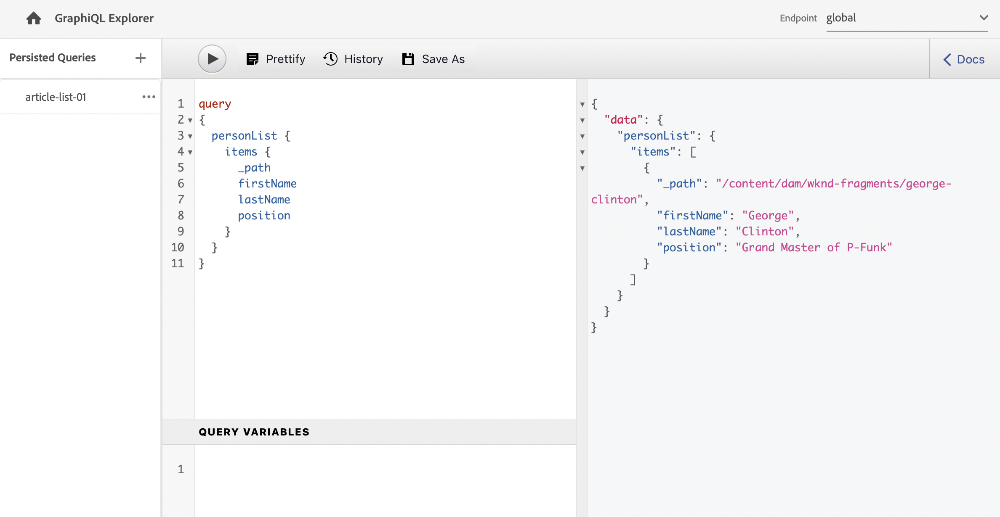

# API リクエストの作成 — ヘッドレス設定 {#accessing-delivering-content-fragments}

コンテンツフラグメントコンテンツとAEM Assets REST API のヘッドレス配信に GraphQL API を使用して、コンテンツフラグメントを管理する方法を説明します。

>[!NOTE]
>
>この機能の一部はプレリリースチャネルで利用できます。 特に、持続クエリに関連する機能です。
> 
>詳しくは、 [プレリリースチャネルドキュメント](https://experienceleague.adobe.com/docs/experience-manager-cloud-service/content/release-notes/prerelease.html#enable-prerelease) を参照してください。

## GraphQL API と Assets REST API とは {#what-are-the-apis}

[コンテンツフラグメントはいくつか作成したので、AEM API](create-content-fragment.md) を使用してそれらをヘッドレスで配信できます。

* [GraphQL](/help/headless/graphql-api/content-fragments.md) API を使用すると、コンテンツフラグメントにアクセスして配信するリクエストを作成できます。この API は、コンテンツフラグメントコンテンツのクエリと使用に最も堅牢な機能セットを提供します。
   * これを使用するには、[AEM でエンドポイントを定義して有効にする必要があり](/help/headless/graphql-api/graphql-endpoint.md)、必要に応じて [GraphiQL インターフェイスをインストールする必要があります](/help/headless/graphql-api/graphiql-ide.md)。
* [アセット REST API](/help/assets/content-fragments/assets-api-content-fragments.md) を使用すると、コンテンツフラグメント（およびその他のアセット）を作成および変更できます。

このガイドの残りの部分では、GraphQL へのアクセスとコンテンツフラグメントの配信について説明します。

## GraphQL エンドポイントの有効化

GraphQL API を使用する前に、GraphQL エンドポイントを作成する必要があります。

1. に移動します。 **ツール**, **一般**&#x200B;を選択し、「 **GraphQL**.
1. 「**作成**」を選択します。
1. **新しい GraphQL エンドポイントを作成** ダイアログが開きます。以下を指定します。
   * **名前**：エンドポイントの名前。任意のテキストを入力できます。
   * **次によって提供される GraphQL スキーマを使用**:ドロップダウンを使用して、必要な設定を選択します。
1. 「**作成**」で確認します。
1. コンソールで、 **パス** これで、前に作成した設定に基づいてが表示されます。 GraphQL クエリの実行に使用されるパスです。

   ```
   /content/cq:graphql/<configuration-name>/endpoint
   ```

有効化の詳細 [GraphQL エンドポイントは、こちらを参照してください](/help/headless/graphql-api/graphql-endpoint.md).

## GraphQL と GraphiQL を使用したクエリコンテンツ

情報アーキテクトは、コンテンツを配信するために、チャネルエンドポイント用のクエリを設計する必要があります。一般に、これらのクエリは、モデルやエンドポイントごとに 1 回だけ作成する必要があります。この「はじめる前に」ガイドの目的上、1 つだけ作成します。

GraphiQL は、AEM環境にインストールできる IDE です。 次の手順に従います。 [GraphiQL IDE の使用](/help/headless/graphql-api/graphiql-ide.md) をAEM環境にインストールする場合。

1. AEM as a Cloud Service にログインし、GraphiQL インターフェイスにアクセスします。

   クエリエディターには、次のいずれかからアクセスできます。

   * **ツール** -> **一般** -> **GraphQL クエリエディター**
   * 直接例： `http://localhost:4502/aem/graphiql.html`

1. GraphiQL IDE は、GraphQL 用のブラウザー内クエリエディターです。 これを使用してクエリを作成し、コンテンツフラグメントを取得して JSON としてヘッドレスに配信できます。
   * 右上のドロップダウンを使用すると、エンドポイントを選択できます。
   * 左端のパネルには、永続化されたクエリが表示されます（使用可能な場合）
   * 中央の左側のパネルを使用すると、クエリを作成できます。
   * 右中央のパネルに結果が表示されます。
   * クエリエディターは、コード補完機能とホットキーを備えており、クエリを簡単に実行できます。

   

1. 作成したモデルが `person` で `firstName`、`lastName`、`position` の各フィールドを持つ場合は、単純なクエリを構築して、コンテンツフラグメントのコンテンツを取得できます。

   ```text
   query 
   {
     personList {
       items {
         _path
         firstName
         lastName
         position
       }
     }
   }
   ```

1. 左側のパネルにクエリを入力します。
   

1. 「**クエリを実行**」ボタンをクリックするか `Ctrl-Enter` ホットキーを使用すると、結果が JSON として右側のパネルに表示されます。
   

1. ページの右上にある&#x200B;**ドキュメント**リンクをクリックすると、文脈依存ドキュメントが表示され、独自のモデルに適合するクエリの構築に役立ちます。
   

GraphQL を使用すると、特定のデータセットや個々のデータオブジェクトだけでなく、オブジェクトの特定の要素、ネストされた結果、クエリ変数のオファーサポートなどをターゲットできる構造化クエリが可能です。

GraphQL では、反復的な API リクエストと過剰な配信を回避でき、代わりに単一の API クエリに対するレンダリングに必要なものを一括配信できます。結果の JSON を使用して、他のサイトやアプリにデータを配信できます。

## 次の手順 {#next-steps}

これで作業は完了です。AEM のヘッドレスコンテンツ管理に関する基本的な内容を説明しました。もちろん、利用可能な機能の包括的な理解を深めるためのリソースは他にもたくさんあります。 

* **[コンテンツフラグメント](/help/assets/content-fragments/content-fragments.md)** - コンテンツフラグメントの作成と管理に関する詳細
* **[AEM Assets HTTP API でサポートされるコンテンツフラグメント](/help/assets/content-fragments/assets-api-content-fragments.md)** - CRUD 操作（作成、読み取り、更新、削除）を介して HTTP API 経由で直接 AEM コンテンツにアクセスする方法の詳細
* **[GraphQL API](/help/headless/graphql-api/content-fragments.md)** - コンテンツフラグメントをヘッドレスで配信する方法の詳細
