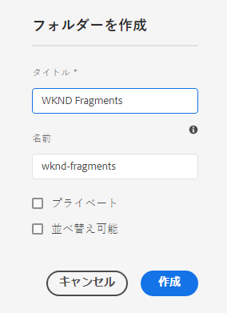
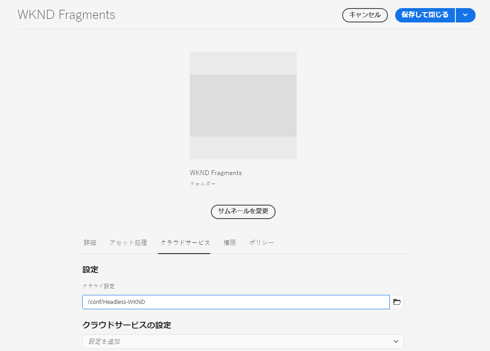
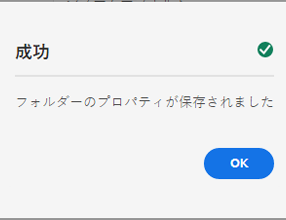

# アセットフォルダーの作成 - ヘッドレスセットアップ {#creating-an-assets-folder}

AEM コンテンツフラグメントモデルを使用すると、ヘッドレスコンテンツの基盤となるコンテンツフラグメントの構造を定義できます。コンテンツフラグメントはアセットフォルダーに保存されます。

## Assets フォルダーとは {#what-is-an-assets-folder}

今後のコンテンツフラグメントに必要な構造を定義する[コンテンツフラグメントモデルを作成](create-content-model.md)できたので、フラグメントを作成するのが楽しみかと思います。

ただし、まず、アセットを保存するアセットフォルダーを作成する必要があります。

アセットフォルダーは、コンテンツフラグメントと一緒に、画像やビデオなどの[従来のコンテンツアセットを整理する](/help/assets/manage-digital-assets.md)ために使用できます。

## アセットフォルダーの作成方法 {#how-to-create-an-assets-folder}

管理者は、コンテンツの作成時にフォルダーを作成してコンテンツを整理するだけで済みます。この「はじめる前に」ガイドの目的上、フォルダーを 1 つだけ作成します。

1. AEM as a Cloud Service にログインし、メインメニューで&#x200B;**ナビゲーション／アセット／ファイル**&#x200B;を選択します。
1. **作成／フォルダー**&#x200B;を選択します。
1. フォルダーの&#x200B;**タイトル**&#x200B;と&#x200B;**名前**&#x200B;を指定します。
   * **タイトル**&#x200B;は内容がわかるように付けます。
   * 「**名前**」はリポジトリ内のノード名になります。
      * タイトルに基づいて自動的に生成され、[AEM の命名規則](/help/implementing/developing/introduction/naming-conventions.md)に従って調整されます。
      * 必要に応じて調整できます。

   
1. 作成したフォルダーにポインタを合わせてチェックマークをタップして選択します。次に、ツールバーの「**プロパティ**」を選択します（または `p` [キーボードショートカット](/help/sites-cloud/authoring/sites-console/keyboard-shortcuts.md)を使用します）。
1. **プロパティ**&#x200B;ウィンドウで、「**Cloud Services**」タブを選択します。
1. **クラウド設定** に [ 前に作成した設定 ](create-configuration.md) を選択します。
   
1. 「**保存して閉じる**」を選択します。
1. 確認ウィンドウで「**OK**」を選択します。

   

作成したフォルダー内に、追加のサブフォルダーを作成できます。サブフォルダーは、親フォルダーの&#x200B;**クラウド設定**&#x200B;を継承します。別の設定モデルを使用する場合は、この設定を上書きできます。

ローカライズされたサイト構造を使用している場合は、新しいフォルダーの下に[言語ルートを作成](/help/assets/translate-assets.md)できます。

## 次の手順 {#next-steps}

コンテンツフラグメント用のフォルダーを作成したので、「はじめる前に」の 4 番目のパートに進み、[コンテンツフラグメントを作成](create-content-fragment.md)します。

>[!TIP]
>
>コンテンツフラグメントの管理について詳しくは、[コンテンツフラグメントのドキュメント](/help/sites-cloud/administering/content-fragments/overview.md)を参照してください。
