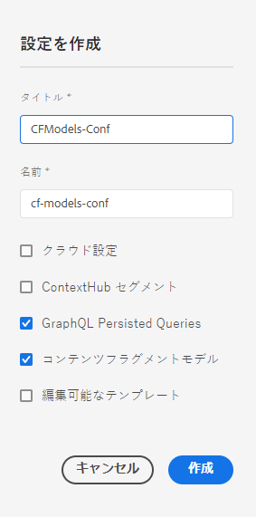

# 設定の作成 - ヘッドレスセットアップ {#creating-configuration}

AEM as a Cloud Service でヘッドレス機能を使い始めるには、まず設定を作成する必要があります。

## 設定とは  {#what-is-a-configuration}

設定ブラウザーには、AEM の設定用の汎用設定 API、コンテンツ構造、解決メカニズムが用意されています。

AEM のヘッドレスなコンテンツ管理に関しては、AEM 内でコンテンツモデルを作成できるワークプレイスとして設定を考えてみてください。これにより、将来のコンテンツとコンテンツフラグメントの構造を定義できます。複数の設定を作成して、これらのモデルを分離できます。

[ フルスタック AEM実装のページテンプレート ](/help/sites-cloud/authoring/page-editor/templates.md) を熟知している場合、コンテンツモデルの管理に設定を使用する方法は似ています。

## 設定の作成方法 {#how-to-create-a-configuration}

管理者は、設定を 1 回だけ作成する必要があります。コンテンツモデルの整理のために新しいワークスペースが必要になることはほとんどありません。この「はじめる前に」ガイドの目的上、設定を 1 つ作成する必要があります。

1. AEM as a Cloud Service にログインし、メインメニューで&#x200B;**ツール／一般／設定ブラウザー**&#x200B;を選択します。
1. 設定に&#x200B;**タイトル**&#x200B;と&#x200B;**名前**&#x200B;を指定します。
   * **タイトル**&#x200B;は内容がわかるように付けます。
   * 「**名前**」はリポジトリ内のノード名になります。
      * タイトルに基づいて自動的に生成され、[AEM の命名規則](/help/implementing/developing/introduction/naming-conventions.md)に従って調整されます。
      * 必要に応じて調整できます。
1. 次のオプションを確認します。
   * **コンテンツフラグメントモデル**
   * **GraphQL 永続クエリ**

   

1. 「**作成**」を選択します。

必要に応じて、複数の設定を作成できます。設定は入れ子にすることもできます。

>[!NOTE]
>
>実装要件によっては、**コンテンツフラグメントモデル**&#x200B;および **GraphQL 永続クエリ**&#x200B;に加えて、設定オプションが必要になる場合があります。

## 次の手順 {#next-steps}

この設定を使用して、「はじめる前に」ガイドの第 2 部および [ コンテンツフラグメントモデルを作成 ](create-content-model.md) に進むことができます。

>[!TIP]
>
>設定ブラウザーについて詳しくは、[ 設定ブラウザーのドキュメント ](/help/implementing/developing/introduction/configurations.md) を参照してください。
