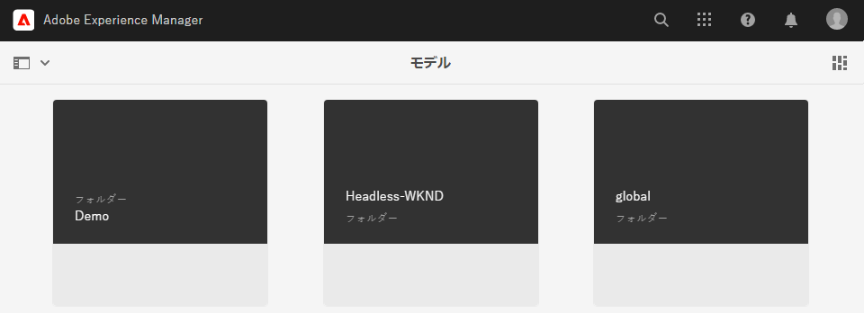
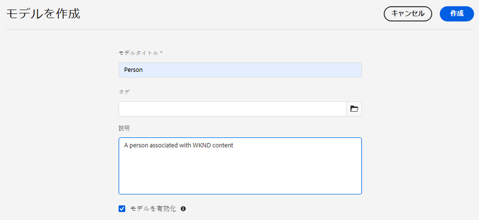
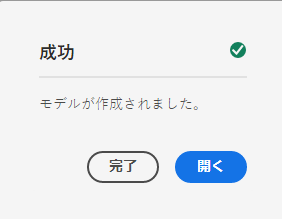
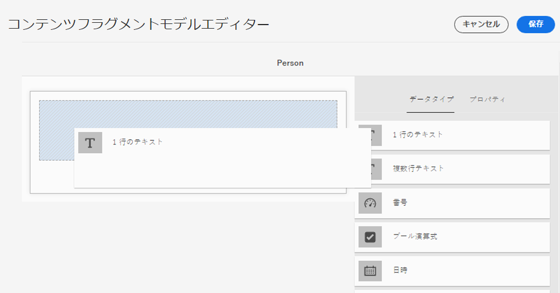
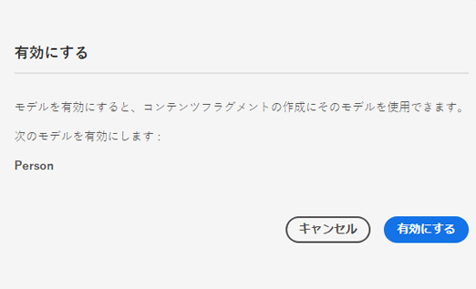
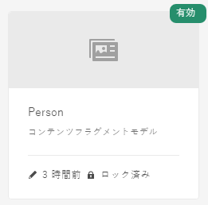

# コンテンツフラグメントモデルの作成 - ヘッドレスセットアップ {#creating-content-fragment-models}

コンテンツフラグメントモデルを使用して、AEM のヘッドレス機能を利用して作成および提供するコンテンツの構造を定義します。

## コンテンツフラグメントモデルとは  {#what-are-content-fragment-models}

[設定を作成したので、](create-configuration.md)この設定を使用してコンテンツフラグメントモデルを作成できます。

コンテンツフラグメントモデルは、AEM で作成および管理するデータとコンテンツの構造を定義するもので、コンテンツの一種の基礎として機能します。コンテンツの作成を選択すると、作成者はあなたが定義したコンテンツフラグメントモデルから選択します。これが、コンテンツの作成のガイドとなります。

## コンテンツフラグメントモデルの作成方法 {#how-to-create-a-content-fragment-model}

新しいモデルが必要な場合、情報アーキテクトはこれらのタスクを実行します。この「はじめる前に」ガイドの目的上、モデルを 1 つだけ作成します。

1. AEM as a Cloud Service にログインし、メインメニューで&#x200B;**ツール**／**一般**／**コンテンツフラグメントモデル**&#x200B;を選択します。
1. 設定時に作成されたフォルダーをタップまたはクリックします。

   
1. 「**作成**」をタップまたはクリックします。
1. 「**モデルタイトル**」、「**タグ**」、「**説明**」を入力します。また、「**モデルを有効化**」を選択／選択解除して、モデルを作成時にすぐに有効にするかどうかを指定することもできます。

   
1. 確認ウィンドウで、「**開く**」をタップまたはクリックして、モデルを設定します。

   
1. **コンテンツフラグメントモデルエディター** を使用して、 **データタイプ** 列からフィールドをドラッグ&amp;ドロップして、コンテンツフラグメントモデルを作成します。

   

1. フィールドを配置した後、そのプロパティを設定する必要があります。エディターは、追加されたフィールドの「**プロパティ**」タブに自動的に切り替わります。このタブで、必須フィールドを指定できます。

   

1. モデルの構築が完了したら、「**保存**」をタップまたはクリックします。

1. 新しく作成されたモデルのモードは、モデルの作成時に&#x200B;**モデルを有効にする**&#x200B;を選択したかどうかによって異なります。
   * 選択済み - 新しいモデルは既に **有効** になっています。
   * 未選択 — で新しいモデルが作成されます **ドラフト** mode

1. モデルがまだ有効になっていない場合は、モデルを **有効** を使用します。
   1. 作成したモデルを選択し、「**有効にする**」をタップまたはクリックします。

      
   1. 確認ダイアログで「**有効にする**」をタップまたはクリックして、モデルの有効化を確認します。

      
1. モデルが有効になり、使用できる状態になります。

   

**コンテンツフラグメントモデルエディター**&#x200B;は、単純なテキストフィールド、アセット参照、他のモデルへの参照、JSON データなど、様々なデータタイプをサポートしています。

モデルは複数作成できます。モデルは他のコンテンツフラグメントを参照できます。[設定](create-configuration.md)を使用して、モデルを整理します。

## 次の手順 {#next-steps}

モデルを作成してコンテンツフラグメントの構造を定義したら、「はじめる前に」ガイドガイドの第 3 部に進み、[フラグメント自体を保存するフォルダーを作成します。](create-assets-folder.md)

>[!TIP]
>
>コンテンツフラグメントモデルについて詳しくは、 [コンテンツフラグメントモデルのドキュメント](/help/sites-cloud/administering/content-fragments/content-fragments-models.md) を参照してください。
