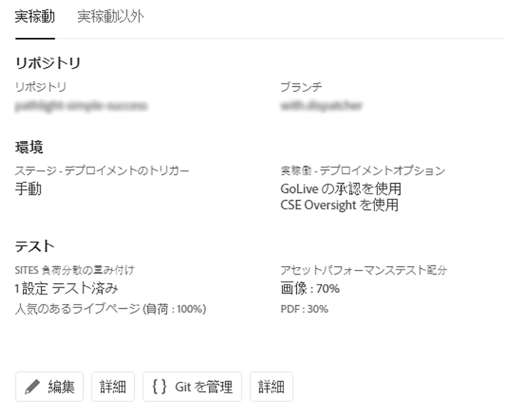
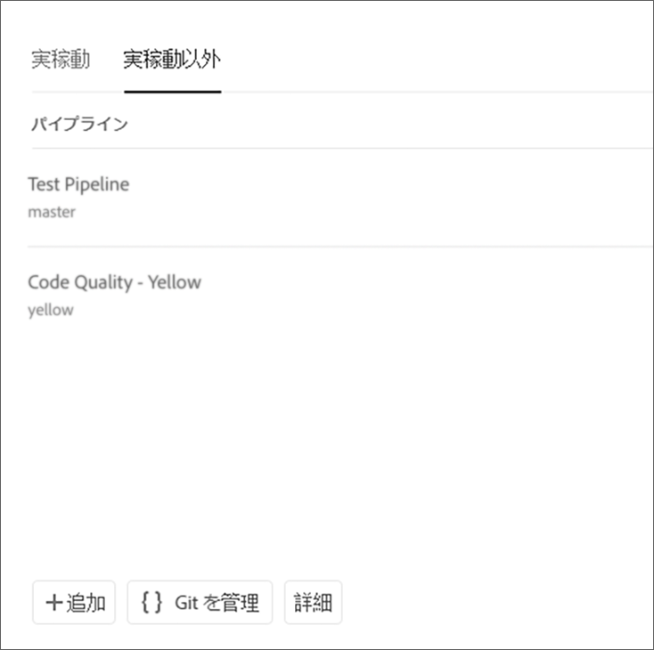
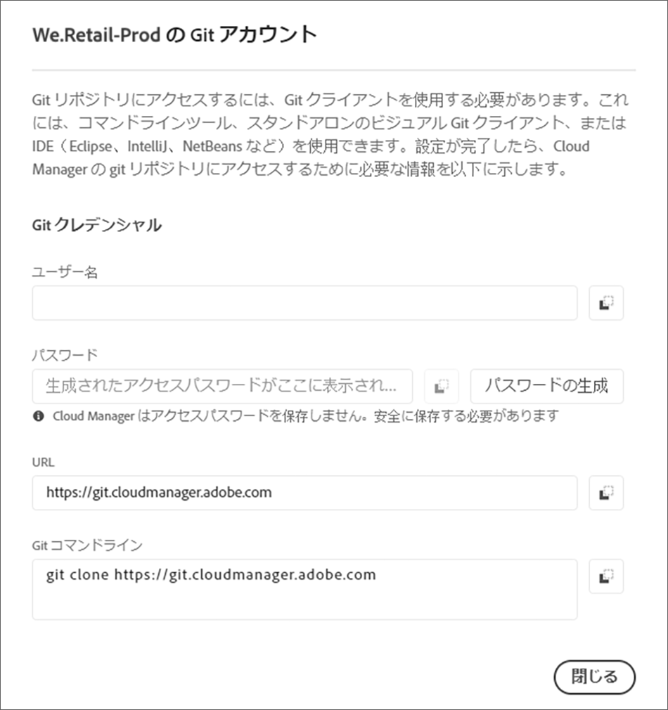

# Git へのアクセス {#accessing-git}

Cloud Manager UI のセルフサービス Git アカウント管理を使用して、Git リポジトリにアクセスし、管理できます。

## セルフサービス Git アカウント管理の使用 {#self-service-git}

Cloud Manager UI から利用できる「**Git を管理**」ボタンを使用します。このボタンはパイプラインカードで最も目立つ場所にあります。

1. 「*プログラムの概要*」ページに移動し、パイプラインカードに移動します。

1. Git リポジトリにアクセスして管理するための「**Git を管理**」オプションが表示されます。

   

   さらに、「**実稼動以外**」パイプラインタブを選択すると、そこにも「**Git を管理**」オプションが表示されます。

   

>[!NOTE]
>「**Git を管理**」オプションは、デベロッパーまたはデプロイメントマネージャーの役割を持つユーザーに表示されます。このボタンをクリックすると、Cloud Manager Git リポジトリへの URL およびユーザー名とパスワードを確認できるダイアログが開きます。

Cloud Manager で Git を管理するうえで重要な考慮事項は次のとおりです。

* **URL**：リポジトリの URL
* **ユーザー名**：ユーザー名
* **パスワード**：「**パスワードを生成**」ボタンをクリックしたときに表示される値。

>[!NOTE]
>
>ユーザーは、自分のコードのコピーをチェックアウトし、ローカルコードリポジトリで変更をおこなうことができます。準備ができたら、ユーザーはコードの変更内容を Cloud Manager のリモートコードリポジトリにコミットして戻すことができます。

