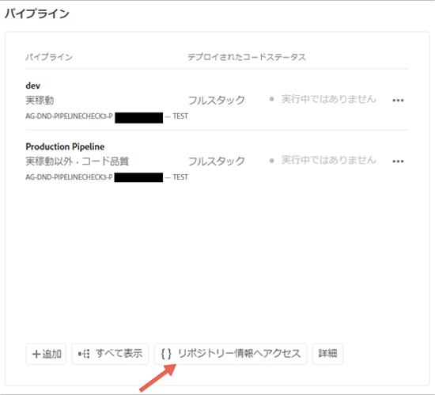
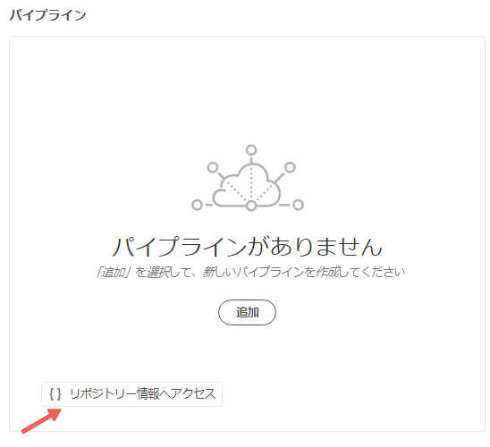
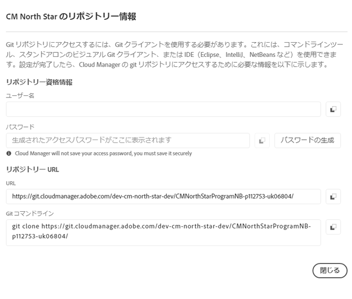

# リポジトリへのアクセス {#accessing-repos}

Cloud Manager UI のセルフサービス Git アカウント管理を使用して、Git リポジトリーにアクセスし、管理できます。

## セルフサービスリポジトリーのアカウント管理の使用 {#self-service-repos}

Cloud Manager UIの「 **リポジトリ情報にアクセス** 」ボタンを使用します。このボタンはパイプラインカードで最も目立つ場所にあります。

1. **プログラムの概要**&#x200B;ページから&#x200B;**パイプライン**&#x200B;カードに移動します。

1. Gitリポジトリにアクセスして管理するための「**Access Repo Info**」オプションが表示されます。

   

   さらに、「**非実稼動**&#x200B;パイプライン」タブを選択すると、そこに「**リポジトリ情報にアクセス**」オプションも表示されます。

   

   >[!NOTE]
   >「**リポジトリ情報**&#x200B;にアクセス」オプションは、デベロッパーまたはデプロイメントマネージャーの役割を持つユーザーに表示されます。 このボタンをクリックすると、Cloud Manager Git リポジトリーへの URL およびユーザー名とパスワードを確認できるダイアログが開きます。

   

   Cloud Manager で Git を管理するうえで重要な考慮事項は次のとおりです。

   * **URL**：リポジトリーの URL
   * **ユーザー名**：ユーザー名
   * **パスワード**：「**パスワードを生成**」ボタンをクリックしたときに表示される値。

      >[!NOTE]
      >ユーザーは、自分のコードのコピーをチェックアウトし、ローカルコードリポジトリーで変更を行うことができます。準備ができたら、ユーザーはコードの変更内容を Cloud Manager のリモートコードリポジトリーにコミットして戻すことができます。
