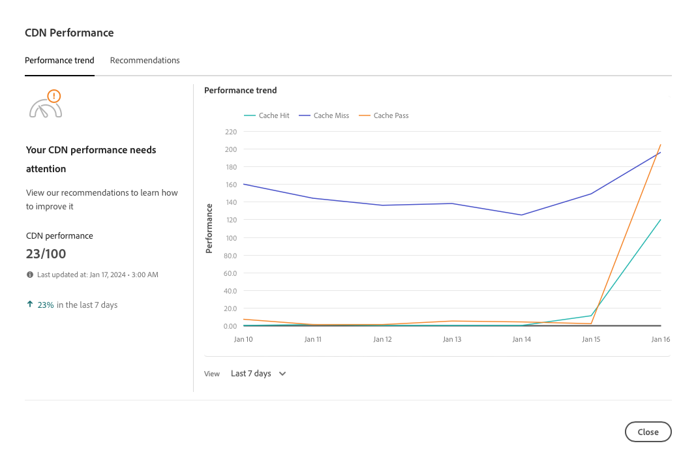

# CDN パフォーマンスダッシュボード {#cdn-performance}

Cloud Manager がコンテンツ配信ネットワーク（CDN）のパフォーマンスを評価する方法およびダッシュボードから学習できる内容について説明します。

## 概要 {#overview}

すべての Cloud Manager プログラムには、CDN パフォーマンスダッシュボードがあります。 このダッシュボードには、CDN パフォーマンスの全体的なスコアと、必要に応じて、改善のトレンド、アラート、提案が表示されます。


## ダッシュボードへのアクセス {#accessing}

CDN ダッシュボードは、すべてのプログラムの概要ページで利用できます。

{{sign-in-to-cloud-manager}}

1. **[マイプログラム](/help/implementing/cloud-manager/navigation.md#my-programs)**&#x200B;コンソールで、表示する CDN ダッシュボードのプログラムをクリックします。

   

1. **パフォーマンス** カードを表示するには、プログラムの&#x200B;**プログラム概要** ページの&#x200B;**環境**&#x200B;および&#x200B;**パイプライン** カードの下を下にスクロールします。

   

## ダッシュボードの使用 {#using}

ダッシュボードには、CDN パフォーマンスの全体的なスコアと、必要に応じて、改善のトレンド、アラート、提案が表示されます。


CDN のパフォーマンスの詳細と改善方法の提案は、「**トレンドを表示**」をクリックします。



グラフの下で「**表示**」をクリックして、グラフの期間を変更します。

CDN のパフォーマンスを向上させる方法の提案については、「**レコメンデーション**」タブを選択します。


リスト内の推奨事項の横にある山形アイコンをクリックして、必要な改善手順と問題の原因の詳細を表示します。

## キャッシュヒットの定義 {#cache-hit}

キャッシュヒット率は、受け取るリクエスト数と比較して、キャッシュが正常に記入できるコンテンツリクエスト数を示します。 キャッシュヒット率が高いほど、CDNのパフォーマンスが高いことを示します。

>[!TIP]
>
>Adobe では、ユーザーが 99％のキャッシュヒット率を目指すことをお勧めします。

```text
Cache Hit Ratio = Cache Hits / (Hits + Misses + Passes + Other)
```

* **ヒット** - データがキャッシュからリクエストされ、見つかりました。
* **ミス** - データがキャッシュからリクエストされましたが、見つかりません。
* **Pass** - データがキャッシュから要求され、このデータをキャッシュしないように設定されています。
* **その他** - キャッシュからのすべてのデータリクエストで、他の大文字と小文字がいずれも一致しません。

キャッシュ指標は24時間ごとに更新されます。

>[!TIP]
>
>Cloud Manager と CDN が Dispatcher とやり取りする方法について詳しくは、[AEM as a Cloud Service でのキャッシュ](/help/implementing/dispatcher/caching.md)を参照してください。
