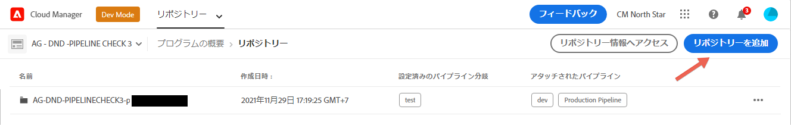
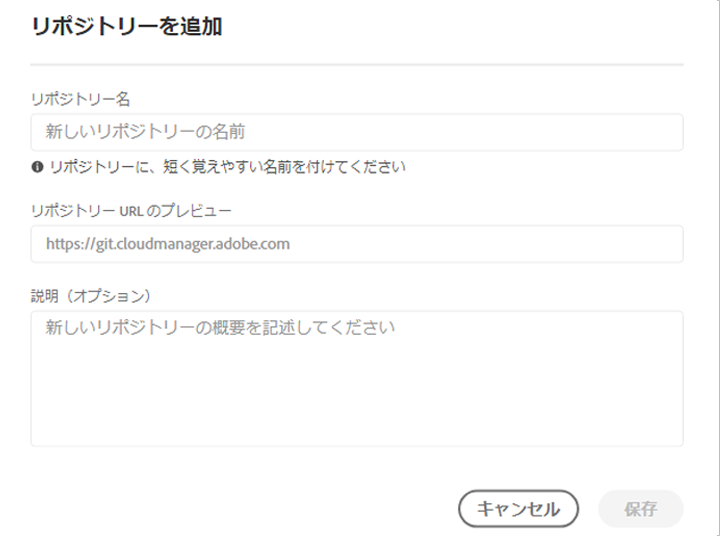
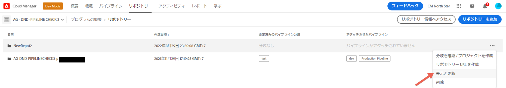

# Cloud Manager リポジトリー {#cloud-manager-repos}

Cloud Manager で作成されて使用可能なリポジトリーは、リポジトリーページで表示および管理できます。

>[!NOTE]
>特定の会社（またはIMS Org）のすべてのプログラムに対して、300個のリポジトリーの制限があります。

## リポジトリーの追加と管理 {#add-manage-repos}

Cloud Manager でリポジトリーを表示および管理するには、次の手順に従います。

1. **プログラムの概要**&#x200B;ページで、「**リポジトリー**」タブをクリックし、**リポジトリー**&#x200B;ページに移動します。

1. 「**リポジトリーを追加**」をクリックして、ウィザードを起動します。

   >[!NOTE]
   >リポジトリーを追加するには、デプロイメントマネージャーまたはビジネス所有者の役割を持つユーザーがログインしている必要があります。

   


1. 必要に応じて名前と説明を入力し、「**保存**」をクリックします。

   

1. 「**保存**」を選択します。次に示すように、新しく作成されたリポジトリーがテーブルに表示されます。

   >[!NOTE]
   >Cloud Manager で作成したリポジトリーは、パイプラインの追加または編集手順でも選択できます。詳しくは、[CI-CDパイプラインの設定](https://experienceleague.adobe.com/docs/experience-manager-cloud-service/implementing/using-cloud-manager/configure-pipeline.html?lang=en)を参照してください。 1つの&#x200B;*プライマリ*&#x200B;リポジトリまたは任意のパイプラインのブランチがあります。 [Gitサブモジュールのサポート](#git-submodule-support)を使用すると、ビルド時に多数のセカンダリブランチを含めることができます。

   

1. リポジトリーを選択し、表の右端にあるメニューオプションをクリックして、**リポジトリーの URL をコピー**、**表示と更新**、**削除**&#x200B;のいずれかを選択できます（下図を参照）。

   


## Git サブモジュールのサポート {#git-submodule-support}

Git サブモジュールを使用すると、ビルド時に Git リポジトリー間で複数のブランチのコンテンツを結合できます。Cloud Manager のビルドプロセスを実行すると、パイプライン用に設定されたリポジトリーのクローンを作成し、設定されたブランチをチェックアウトした後に、ブランチのルートディレクトリに `.gitmodules` ファイルが含まれている場合は、コマンドが実行されます。

```
$ git submodule update --init
```

これにより、各サブモジュールが適切なディレクトリにチェックアウトされます。この手法は、Git サブモジュールの使用に慣れており、外部マージプロセスの管理を希望しない組織にとって、https://experienceleague.adobe.com/docs/experience-manager-cloud-service/implementing/managing-code/working-with-multiple-source-git-repositories.html?lang=ja の代わりに使用できる可能性があります。

例えば、3 つのリポジトリーがあり、それぞれに main という名前のブランチが 1 つあるとします。「プライマリ」リポジトリー（パイプラインで設定されたもの）の main ブランチには、他の 2 つのリポジトリーに含まれるプロジェクトを宣言する pom.xml ファイルが含まれます。

```xml
<?xml version="1.0" encoding="UTF-8"?>
<project xmlns="http://maven.apache.org/POM/4.0.0" xmlns:xsi="http://www.w3.org/2001/XMLSchema-instance"
    xsi:schemaLocation="http://maven.apache.org/POM/4.0.0 http://maven.apache.org/maven-v4_0_0.xsd">
    <modelVersion>4.0.0</modelVersion>
   
    <groupId>customer.group.id</groupId>
    <artifactId>customer-reactor</artifactId>
    <version>0.0.1-SNAPSHOT</version>
    <packaging>pom</packaging>
   
    <modules>
        <module>project-a</module>
        <module>project-b</module>
    </modules>
   
</project>
```

次に、他の 2 つのリポジトリー用のサブモジュールを追加します。

```
$ git submodule add -b main https://git.cloudmanager.adobe.com/ProgramName/projectA/ project-a
$ git submodule add -b main https://git.cloudmanager.adobe.com/ProgramName/projectB/ project-b
```

その結果、`.gitmodules` ファイルは次のようになります。

```
[submodule "project-a"]
    path = project-a
    url = https://git.cloudmanager.adobe.com/ProgramName/projectA/
    branch = main
[submodule "project-b"]
    path = project-b
    url = https://git.cloudmanager.adobe.com/ProgramName/projectB/
    branch = main
```

Git サブモジュールの詳細については、[Git リファレンスマニュアル](https://git-scm.com/book/ja/v2/Git-Tools-Submodules)を参照してください。

Git サブモジュールを使用する場合は、次の点に注意してください。

* Git の URL は、上記の構文に正確に記述する必要があります。セキュリティ上の理由から、これらの URL に資格情報を埋め込まないでください。
* ブランチのルートにあるサブモジュールのみがサポートされます。
* Git サブモジュール参照は、特定の Git コミットに保存されます。その結果、サブモジュールリポジトリーに対して変更を加える場合、`git submodule update --remote` などを使用して、参照されるコミットを更新する必要があります。

