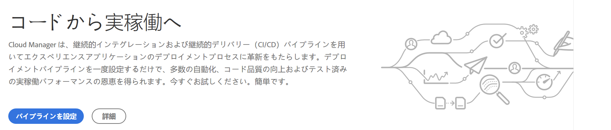
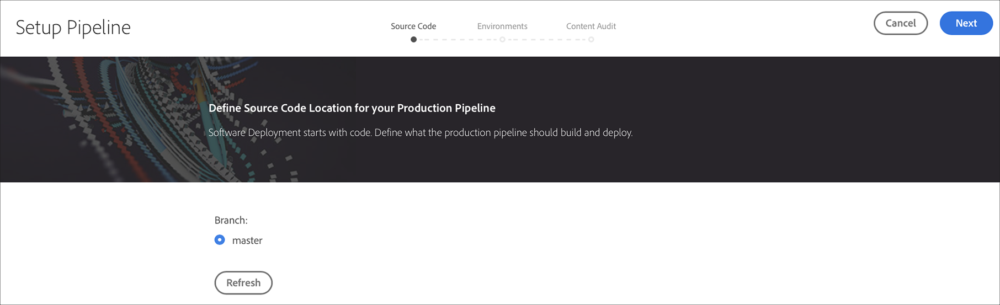
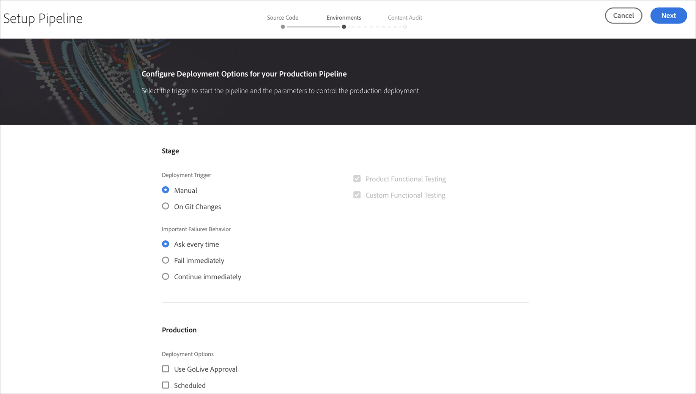
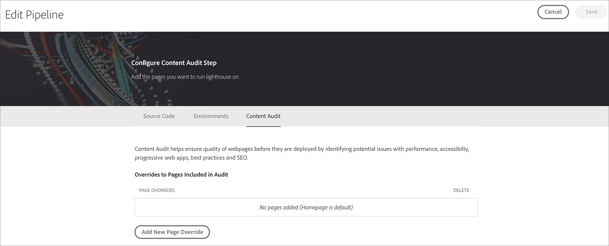
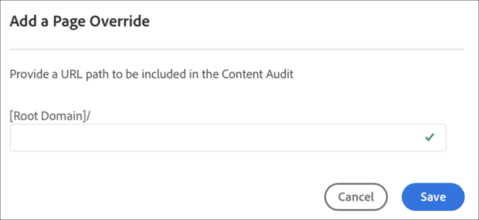
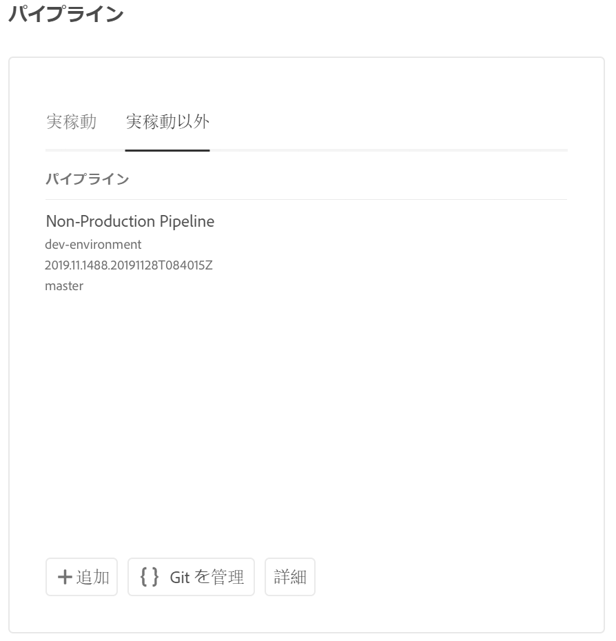
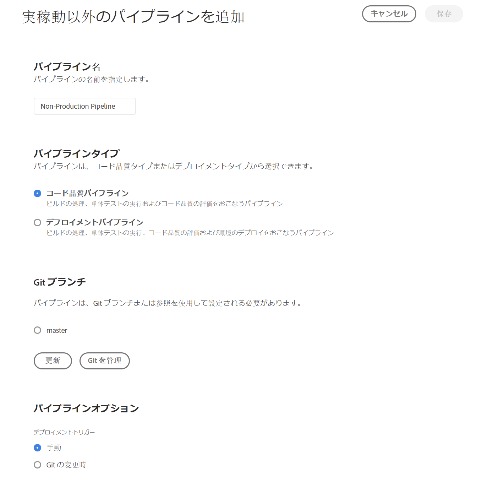

# CI/CD パイプラインの設定 {#configure-ci-cd-pipeline}

Cloud Managerには、次の2種類のパイプラインがあります。

* **実稼働用パイプライン**:
実稼働パイプラインは、実稼働およびステージ環境を作成した場合にのみ追加できます。

   詳細は、「パイプラインの [設定](configure-pipeline.md#setting-up-the-pipeline) 」を参照してください。

* **実稼動以外のパイプライン**:

   実稼動以外のパイプラインは、Cloud Managerのユーザーインターフェイスの **概要** ページから追加できます。

   詳細は、 [非実稼働およびコード品質のみのパイプラインを参照](configure-pipeline.md#non-production-pipelines) 。

## フローについて {#understanding-the-flow}

[!UICONTROL Cloud Manager] UI の&#x200B;**パイプライン設定**&#x200B;タイルからパイプラインを設定することができます。

パイプラインの設定はデプロイメントマネージャーが担当します。その際は、まず **Git リポジトリ**&#x200B;からブランチを選択します。

パイプラインを設定するには、以下をおこなう必要があります。

* パイプラインを開始するトリガーの定義
* 実稼動デプロイメントを制御するパラメーターの定義
* パフォーマンステストパラメーターの設定

## パイプラインの設定 {#setting-up-the-pipeline}

>[!CAUTION]
>
>1 つのプログラムの作成が完了し、Git リポジトリに少なくとも 1 つのブランチができるまで、パイプラインは設定できません。

コードのデプロイを開始する前に、[!UICONTROL Cloud Manager] からパイプライン設定を指定する必要があります。

>[!NOTE]
>
>初期設定後にパイプライン設定を変更できます。

## [!UICONTROL Cloud Manager] からパイプライン設定を指定する{#configuring-the-pipeline-settings-from-cloud-manager}

[!UICONTROL Cloud Manager] UI を使用してプログラムをセットアップし、少なくとも 1 つの環境ができたら、いつでもデプロイメントパイプラインをセットアップできます。

パイプラインの動作と環境を設定するには、次の手順に従います。

1. 「**パイプラインを設定**」をクリックして、パイプラインを設定します。

   

1. **パイプラインを設定**&#x200B;画面が表示されます。ブランチを選択して、「**次へ**」をクリックします。

   

1. デプロイメントオプションを設定します。

   

   パイプラインを開始するトリガーを定義できます。

   * **手動** - UI を使用して、パイプラインを手動で開始します。
   * **Git の変更時** - 設定された Git ブランチにコミットが追加されるたびに CI/CD パイプラインを開始します。このオプションを選択しても、常にパイプラインを手動で開始できます。

   パイプラインのセットアップまたは編集中に、デプロイメントマネージャーは、品質ゲートのいずれかで重要なエラーが検出された場合のパイプラインの動作を定義できます。

   これは、より自動化されたプロセスを求めるお客様に役に立ちます。使用できるオプションは以下のとおりです。

   * **毎回確認する** - デフォルトの設定。重要なエラーが検出されたときに手動で介入する必要があります。
   * **直ちに失敗** - 重要なエラーが検出されると、常にパイプラインはキャンセルされます。このオプションでは、基本的に、各エラーをユーザーが手動で拒否する状況をエミュレートします。
   * **直ちに続行** - 重要なエラーが検出されても、常にパイプラインは自動的に続行されます。このオプションでは、基本的に、各エラーをユーザーが手動で承認する状況をエミュレートします。

1. 実稼働用パイプライン設定には、「 **コンテンツ監査**」というラベルの付いた3番目のタブが含まれています。

   このオプションは、コンテンツ監査に常に含めるURLパスの表を提供します。 ユーザーは、含めるURLパスを手動で入力できます。 最大25行まで含めることができます。 このセクションにユーザが送信したページがない場合、サイトのホームページはデフォルトとしてコンテンツ監査に含まれます。

   >[!NOTE]
   > 設定されたページはサービスに送信され、パフォーマンス、アクセシビリティ、SEO(Search Engine Optimization)、ベストプラクティス、PWA（プログレッシブWeb App）のテストに従って評価されます。

   詳細は、「コンテンツ監査結果 [について](/help/implementing/developing/introduction/understand-test-results.md#content-audit-testing) 」を参照してください。

   

   「 **追加New Page Override** 」をクリックして、コンテンツ監査に含めるURLパスを指定します。 パスを追加したら、「 **保存**」をクリックします。

   

1. 「パイプラインを **編集** 」(Edit Pipeline **)画面で「保存」(Save** )をクリックします。 **概要**&#x200B;ページに、**プログラムをデプロイ**&#x200B;カードが表示されます。「**デプロイ**」ボタンをクリックして、プログラムをデプロイします。

   

## 非実稼動パイプラインとコード品質専用パイプライン {#non-production-pipelines}

ステージングおよび実稼動環境にデプロイするメインパイプラインに加えて、顧客は、**非実稼動パイプライン**&#x200B;と呼ばれる追加のパイプラインを設定できます。このパイプラインでは、常にビルドステップとコード品質ステップを実行します。また、オプションで Adobe Managed Services 環境にデプロイすることもできます。

ホーム画面には、このパイプラインが新しいカードに一覧表示されます。

1. Cloud Manager のホーム画面から「**非実稼動パイプライン**」タイルにアクセスします。

   

1. 「**追加**」ボタンをクリックして、「パイプライン名」、「パイプラインタイプ」、「Git ブランチ」を指定します。

   さらに、パイプラインオプションから「デプロイメントトリガー」と「重要なエラー時の動作」も設定できます。

   

1. 「**保存**」をクリックすると、パイプラインがホーム画面上のカードに次の 3 つのアクションと共に表示されます（下図を参照）。

   

   * **編集** - パイプライン設定を編集できます
   * **ビルド** - 実行ページに移動し、そこからパイプラインを実行できるようになります
   * **Git を管理** - Cloud Manager Git リポジトリへのアクセスに必要な情報をユーザーが取得できるようにします

## 次の手順 {#the-next-steps}

パイプラインを設定したら、コードをデプロイする必要があります。

詳しくは、[コードのデプロイ](deploy-code.md)を参照してください。
