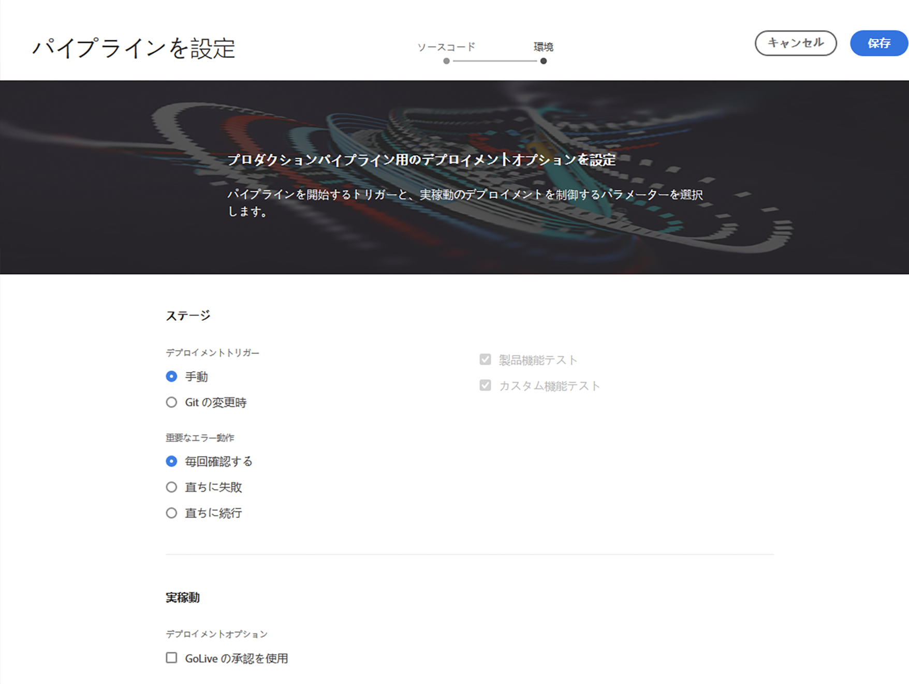
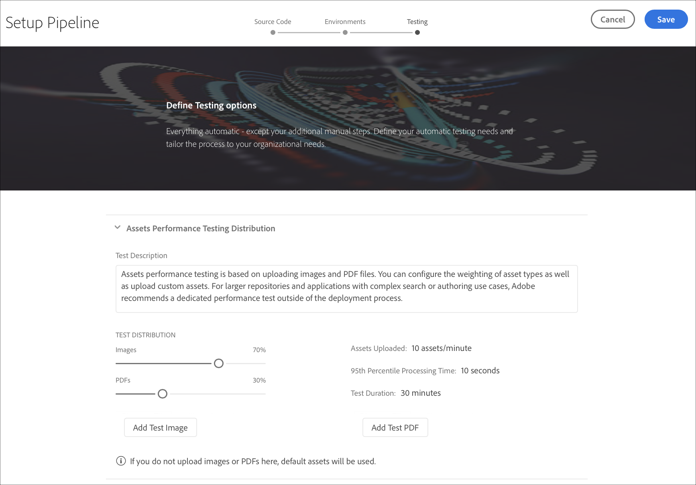
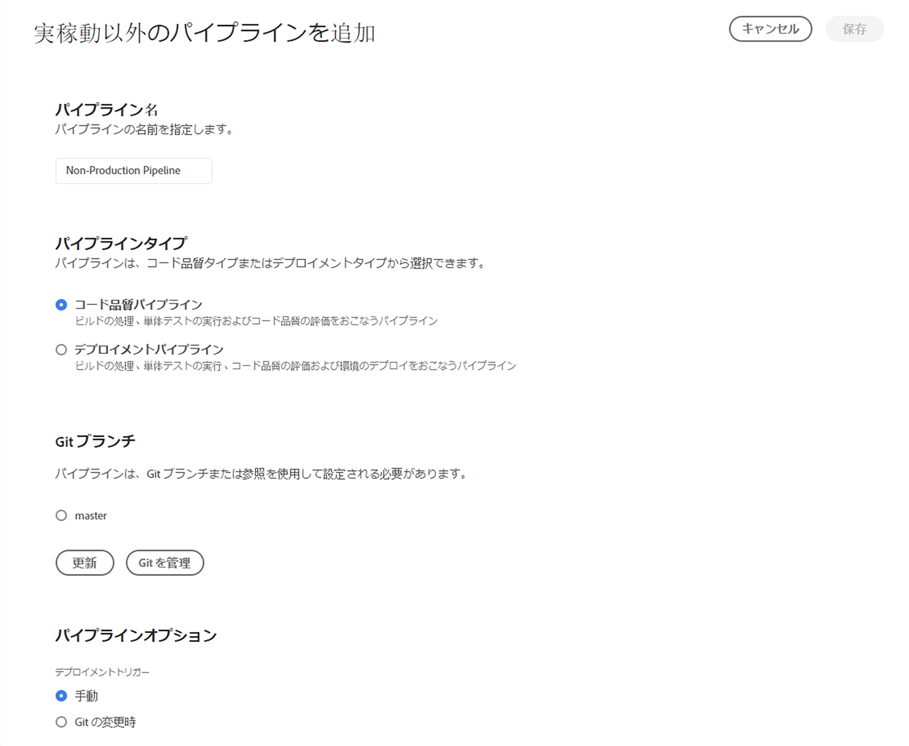

# CI-CDパイプラインの設定 {#configure-ci-cd-pipeline}

## フローについて {#understanding-the-flow}

[!UICONTROL Cloud Manager] UI の&#x200B;**パイプライン設定**&#x200B;タイルからパイプラインを設定することができます。

パイプラインの設定はデプロイメントマネージャーが担当します。その際は、まず **Git リポジトリ**&#x200B;からブランチを選択します。

パイプラインを設定するには、次の操作を行う必要があります。

* パイプラインを開始するトリガーを定義します。
* 実稼働環境のデプロイメントを制御するパラメーターを定義します。
* パフォーマンステストのパラメーターを設定します。

## パイプラインの設定 {#setting-up-the-pipeline}

>[!CAUTION]
>
>1つのプログラムの作成が完了し、Gitリポジトリに少なくとも1つのブランチがあるまで、パイプラインを設定できません。

コードのデプロイを開始する前に、[!UICONTROL Cloud Manager] からパイプライン設定を指定する必要があります。

>[!NOTE]
>
>初期設定後にパイプライン設定を変更できます。

## [!UICONTROL Cloud Manager] からパイプライン設定を指定する{#configuring-the-pipeline-settings-from-cloud-manager}

プログラムを設定し、 [!UICONTROL Cloud Manager] UIを使用して少なくとも1つの環境を設定したら、デプロイメントパイプラインを設定する準備が整います。

パイプラインの動作と環境を設定するには、次の手順に従います。

1. 「**パイプラインを設定**」をクリックして、パイプラインを設定します。

   

1. **パイプラインを設定**&#x200B;画面が表示されます。Select the branch and click **Next**.

   

1. 展開オプションを設定します。

   

   パイプラインを開始するトリガーを定義できます。

   * **手動** - UI を使用して、パイプラインを手動で開始します。
   * **Git の変更時** - 設定された Git ブランチにコミットが追加されるたびに CI／CD パイプラインを開始します。このオプションを選択しても、常にパイプラインを手動で開始できます。
   パイプラインの設定または編集中に、Deployment Managerには、品質ゲートで重要な障害が発生した場合のパイプラインの動作を定義するオプションがあります。

   これは、より自動化されたプロセスを求めるお客様に役に立ちます。使用できるオプションは以下のとおりです。

   * **毎回確認する** - デフォルトの設定。重要なエラーが検出されたときに手動で介入する必要があります。
   * **直ちに失敗** - 重要なエラーが検出されると、常にパイプラインはキャンセルされます。このオプションでは、基本的に、各エラーをユーザーが手動で拒否する状況をエミュレートします。
   * **直ちに続行** - 重要なエラーが検出されても、常にパイプラインは自動的に続行されます。このオプションでは、基本的に、各エラーをユーザーが手動で承認する状況をエミュレートします。

1. Click **Next** to access the **Testing** tab to define your testing criteria for your program.

   

1. 「**保存**」をクリックします。概要ペー *ジに* 、プログラムカード **のデプロイが表示されます** 。 「 **Deploy** 」ボタンをクリックして、プログラムをデプロイします。

   

## 非実稼動パイプラインとコード品質専用パイプライン

ステージングおよび実稼動環境にデプロイするメインパイプラインに加えて、顧客は、**非実稼動パイプライン**&#x200B;と呼ばれる追加のパイプラインを設定できます。このパイプラインでは、常にビルドステップとコード品質ステップを実行します。また、オプションで Adobe Managed Services 環境にデプロイすることもできます。

ホーム画面には、このパイプラインが新しいカードに一覧表示されます。

1. Cloud Manager のホーム画面から「**非実稼動パイプライン**」タイルにアクセスします。

   

1. Clicking on the **Add** button, to specify the Pipeline Name, Pipeline Type, and the Git Branch.

   さらに、パイプラインオプションから「デプロイメントトリガー」と「重要なエラー時の動作」も設定できます。

   

1. Click **Save** and the pipeline is shown on the card on the home screen with three actions, as shown below:

   

   * **編集** - パイプライン設定を編集できます
   * **ビルド** - 実行ページに移動し、そこからパイプラインを実行できるようになります
   * **Gitの管理** - Cloud Manager Gitリポジトリへのアクセスに必要な情報をユーザーが取得できるようにします

## 次の手順 {#the-next-steps}

パイプラインを設定したら、コードをデプロイする必要があります。

詳しくは、[コードのデプロイ](deploy-code.md)を参照してください。
