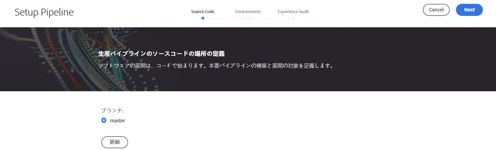
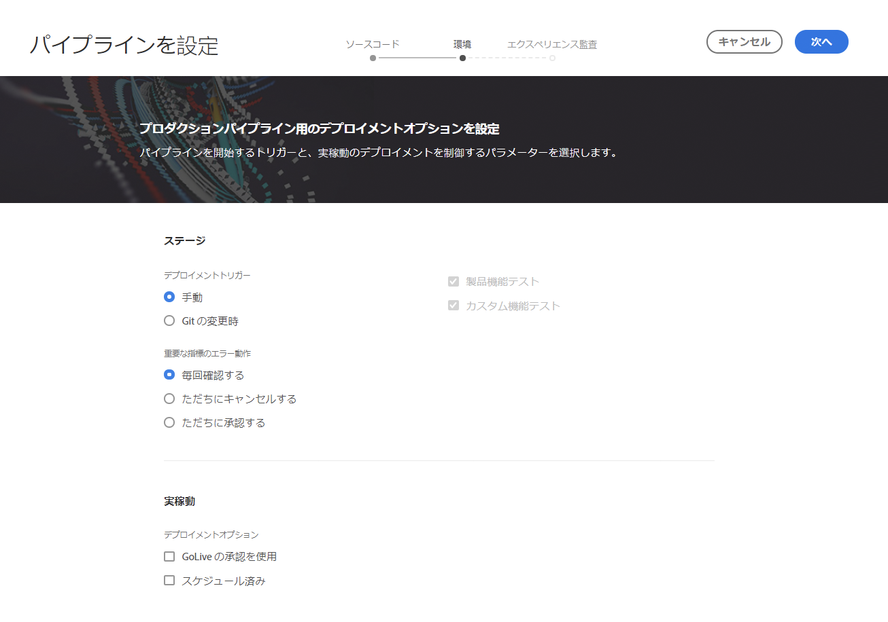
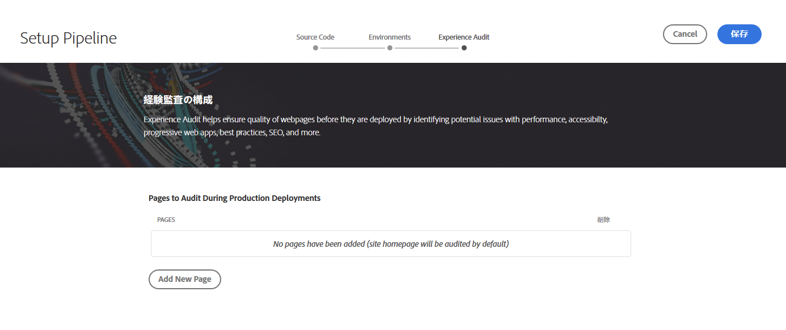

# CI/CD パイプラインの設定 {#configure-ci-cd-pipeline}

Cloud Manager には、次の 2 種類のパイプラインがあります。

* **実稼動パイプライン**：

   実稼働パイプラインは、実稼働とステージング環境のセットを作成した場合にのみ追加できます。

   詳しくは、[実稼働パイプラインの設定](configure-pipeline.md#setting-up-the-pipeline)を参照してください。

* **実稼動以外のパイプライン**：

   実稼動以外のパイプラインは、Cloud Manager のユーザーインターフェイスの&#x200B;**概要**&#x200B;ページから追加できます。

   詳細は、[非実稼動パイプラインとコード品質専用パイプライン](configure-pipeline.md#non-production-pipelines)を参照してください。

>[!NOTE]
>パイプラインを設定するには、次の操作を行う必要があります。
> * パイプラインを開始するトリガーの定義
> * 実稼動デプロイメントを制御するパラメーターの定義
> * パフォーマンステストパラメーターの設定

## 実稼働パイプラインの設定 {#setting-up-production-pipeline}

実稼働パイプラインの設定はデプロイメントマネージャーが担当します。

>[!NOTE]
>プログラムの作成が完了し、Git リポジトリーに少なくとも 1 つのブランチがあり、実稼働とステージングの環境セットが作成されるまで、実稼動パイプラインを設定できません。

コードのデプロイを開始する前に、[!UICONTROL Cloud Manager] からパイプライン設定を指定する必要があります。

>[!NOTE]
>
>初期設定後にパイプライン設定を変更できます。

## [!UICONTROL Cloud Manager] からパイプライン設定を指定する {#configuring-the-pipeline-settings-from-cloud-manager}

[!UICONTROL Cloud Manager] UI を使用してプログラムをセットアップし、少なくとも 1 つの環境ができたら、いつでもデプロイメントパイプラインをセットアップできます。

パイプラインの動作と環境を設定するには、次の手順に従います。

1. 「**パイプラインを設定**」をクリックして、パイプラインを設定します。

   

1. **パイプラインを設定**&#x200B;画面が表示されます。ブランチを選択して、「**次へ**」をクリックします。

   

1. デプロイメントオプションを設定します。

   

   パイプラインを開始するトリガーを定義できます。

   * **手動** - UI を使用して、パイプラインを手動で開始します。
   * **Git の変更時** - 設定された Git ブランチにコミットが追加されるたびに CI/CD パイプラインを開始します。このオプションを選択しても、常にパイプラインを手動で開始できます。

   パイプラインのセットアップまたは編集中に、デプロイメントマネージャーは、品質ゲートのいずれかで重要なエラーが検出された場合のパイプラインの動作を定義できます。

   これは、より自動化されたプロセスを求めるお客様に役に立ちます。使用できるオプションは以下のとおりです。

   * **毎回確認する** - デフォルトの設定。重要なエラーが検出されたときに手動で介入する必要があります。
   * **ただちにキャンセルする** - 重要なエラーが検出されると、常にパイプラインはキャンセルされます。このオプションでは、基本的に、各エラーをユーザーが手動で拒否する状況をエミュレートします。
   * **ただちに承認する** - 重要なエラーが検出されても、常にパイプラインは自動的に続行されます。このオプションでは、基本的に、各エラーをユーザーが手動で承認する状況をエミュレートします。

1. 実稼動パイプライン設定には、**エクスペリエンス監査**&#x200B;というラベルの付いた 3 番目のタブが含まれています。このオプションは、エクスペリエンス監査に常に含める必要がある URL パスの表を提供します。

   >[!NOTE]
   >「**新規ページを追加**」をクリックして、独自のカスタムリンクを定義する必要があります。

   

   「**新規ページを追加**」をクリックして、エクスペリエンス監査に含める URL パスを指定します。

   例えば、`https://wknd.site/us/en/about-us.html` をエクスペリエンス監査に含める場合は、このフィールドにパス `us/en/about-us.html` を入力し、「**保存**」をクリックします。

   

   表に表示される URL は次のとおりです。

   `https://publish-p14253-e43686.adobeaemcloud.com/us/en/about-us.html`

   

   最大 25 行まで含めることができます。このセクションにユーザーが送信したページがない場合、サイトのホームページはデフォルトでエクスペリエンス監査に含まれます。

   詳しくは、「[エクスペリエンス監査結果について](/help/implementing/cloud-manager/experience-audit-testing.md)」ｓを参照してください。

   >[!NOTE]
   > 設定されたページはサービスに送信され、パフォーマンス、アクセシビリティ、SEO（検索エンジン最適化）、ベストプラクティス、PWA（プログレッシブ Web アプリ）のテストに従って評価されます。

1. **パイプラインを編集**&#x200B;画面で「**保存**」をクリックします。**概要**&#x200B;ページに、**プログラムをデプロイ**&#x200B;カードが表示されます。「**デプロイ**」ボタンをクリックして、プログラムをデプロイします。

   

## 非実稼動パイプラインとコード品質専用パイプライン {#non-production-pipelines}

ステージングおよび実稼動環境にデプロイするメインパイプラインに加えて、顧客は、**非実稼動パイプライン**&#x200B;と呼ばれる追加のパイプラインを設定できます。このパイプラインでは、常にビルドステップとコード品質ステップを実行します。オプションで、AEM as a Experience Cloud環境にデプロイすることもできます。

ホーム画面には、このパイプラインが新しいカードに一覧表示されます。

1. Cloud Manager のホーム画面から「**非実稼動パイプライン**」タイルにアクセスします。

   

1. 「**追加**」ボタンをクリックして、「パイプライン名」、「パイプラインタイプ」、「Git ブランチ」を指定します。

   さらに、パイプラインオプションから「デプロイメントトリガー」と「重要なエラー時の動作」も設定できます。

   

1. 「**保存**」をクリックすると、パイプラインがホーム画面のカードに5つのアクションと共に表示されます（下図を参照）。

   

   * **編集** - パイプライン設定を編集できます
   * **詳細**  — パイプライン実行の詳細を提供します。
   * **ビルド** - 実行ページに移動し、そこからパイプラインを実行できるようになります
   * **リポジトリ情報にアクセス**  - Cloud Manager Gitリポジトリへのアクセスに必要な情報をユーザーが取得できます
   * **詳細情報**  - CI/CDパイプラインのドキュメントリソースに関する理解に進みます。

## 次の手順 {#the-next-steps}

パイプラインを設定したら、コードをデプロイする必要があります。

詳しくは、[コードのデプロイ](deploy-code.md)を参照してください。
