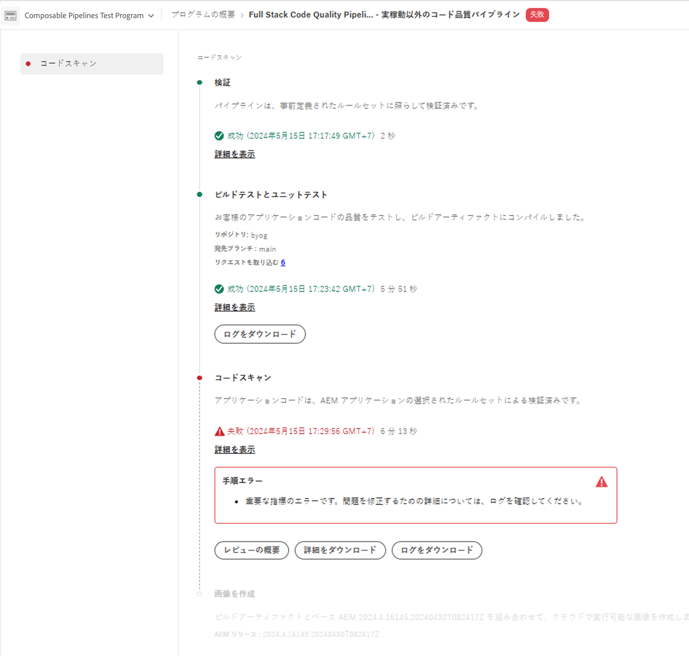

# パイプラインの管理 {#managing-pipelines}

既存のパイプラインの管理方法（編集、実行、削除を含む）を説明します。

## パイプラインカード {#pipeline-card}

Cloud Manager の&#x200B;**プログラムの概要**&#x200B;ページにある&#x200B;**パイプライン**&#x200B;カードには、すべてのパイプラインとその現在のステータスの概要が表示されます。

各パイプラインの横にあるをクリックすると、次の操作を実行できます。

* [パイプラインの実行](#running-pipelines)
* [パイプラインのキャンセル](#cancel)
* [パイプラインの編集](#editing-pipelines)
* [パイプラインの削除](#deleting-pipelines)
* [前回のパイプライン実行の詳細を表示](#view-details)

パイプラインのリストの下部には、次の一般的なオプションがあります。

* **追加** - [新しい実稼動パイプラインを追加](configuring-production-pipelines.md)するか、[新しい実稼動以外のパイプラインを追加](configuring-non-production-pipelines.md)します。
* **すべて表示** - ユーザーをパイプライン画面に移動して、すべてのパイプラインをより詳細なテーブルに表示します
* **リポジトリ情報にアクセス** - Cloud Manager の Git リポジトリへのアクセスに必要な情報を表示します
* **詳細情報** - CI／CD パイプラインのドキュメントリソースに移動します。

## パイプラインページ {#pipelines}

**パイプライン**&#x200B;ページには、選択したプログラムのすべてのパイプラインの完全なリストが表示されます。この情報は、[パイプラインカード](#pipeline-card)で使用可能な情報よりも包括的な情報を表示するので便利です。

1. [my.cloudmanager.adobe.com](https://my.cloudmanager.adobe.com/) で Cloud Manager にログインし、適切な組織を選択します。

1. **[マイプログラム](/help/implementing/cloud-manager/navigation.md#my-programs)**&#x200B;コンソールで、プログラムを選択します。

1. **プログラムの概要**&#x200B;ページで、「**パイプライン**」タブをクリックします。

1. **パイプライン**&#x200B;ページでは、プログラムのすべてのパイプラインのリストを確認できるほか、**パイプラインカード**&#x200B;の場合と同様に、パイプラインの実行を開始および停止することができます。

パイプラインが実行中の場合は、「**ステータス**」列の  をクリックして、実行に関する詳細を示すポップアップを表示します。ポップアップ内で、「**詳細を表示**」をクリックして[パイプライン実行の詳細](#view-details)を表示します。

また、パイプラインの横にある  をクリックして、パイプラインの[編集](#editing-pipelines)や[実行のキャンセル](#cancel)など、パイプラインの状態に応じて追加のアクションを実行することもできます。

### パイプラインのお気に入りのマーク{#pipeline-favorites}

特定のパイプラインをお気に入りとしてマークして、「**パイプライン**」ページのリストの上部に表示できます。 この機能により、頻繁にアクセスするパイプラインを見つけて実行しやすくなります。

**パイプラインのお気に入りをマークするには：**

1. [my.cloudmanager.adobe.com](https://my.cloudmanager.adobe.com/) で Cloud Manager にログインし、適切な組織を選択します。
1. **[マイプログラム](/help/implementing/cloud-manager/navigation.md#my-programs)**&#x200B;コンソールで、プログラムを選択します。
1. **プログラムの概要**&#x200B;ページで、「**パイプライン**」タブをクリックします。
1. パイプライン ページのパイプライン名とタイプの左側で、 をクリックして、お気に入りリストに追加します。
または、 をクリックして、お気に入りリストからパイプラインを削除します。

## アクティビティページ {#activity}

**アクティビティ**&#x200B;ページには、選択したプログラムのすべてのパイプライン実行とその他の重要なプログラムイベントの完全なリストが表示されます。

1. [my.cloudmanager.adobe.com](https://my.cloudmanager.adobe.com/) で Cloud Manager にログインし、適切な組織とプログラムを選択します。

1. **プログラムの概要**&#x200B;ページのサイドメニューで、「**アクティビティ**」をクリックします。

1. **アクティビティ**&#x200B;ページでは、現在および過去の実行を含む、プログラムのすべてのパイプライン実行のリストを確認できます。

パイプラインが実行中の場合は、「**ステータス**」列の  をクリックして、実行に関する詳細を示すポップアップを表示します。

パイプライン実行を表す行をクリックすると、[パイプライン実行の詳細](#view-details)が表示されます。

また、 をクリックして、詳細の表示やログのダウンロードなど、パイプライン実行に関するさらなるアクションを実行することもできます。これにより、[パイプラインの詳細ページ](#view-details)が表示されます。

## パイプラインの実行 {#running-pipelines}

1. [my.cloudmanager.adobe.com](https://my.cloudmanager.adobe.com/) で Cloud Manager にログインし、適切な組織とプログラムを選択します。

1. **プログラムの概要**&#x200B;ページから&#x200B;**パイプライン**&#x200B;カードに移動します。

1. 実行するパイプラインの横にあるをクリックします。

1. ドロップダウンメニューから、「**実行**」をクリックします。

   パイプラインの実行が開始され、「**ステータス**」列に進行状況が表示されます。

実行の詳細を確認するには、 をもう一度クリックし、「**[詳細を表示](#view-details)**」をクリックします。

パイプラインのタイプによっては、 をもう一度クリックして「**キャンセル**」をクリックすると、実行をキャンセルできる場合があります。

## 複数のパイプラインの実行 {#run-multiple-pipelines}

Cloud Manager を使用すると、複数のパイプラインを同時に実行できるので、AEM as a Cloud Service のお客様のデプロイメント効率が向上します。**選択されている実行**&#x200B;機能を使用すると、複数のパイプラインを選択し、一度に実行するようにトリガーできます。これにより、パイプラインを個別に実行する必要がある手動の作業が軽減され、ビルドとデプロイメントのワークフローが最適化されます。

**複数のパイプラインを実行するには：**

1. [my.cloudmanager.adobe.com](https://my.cloudmanager.adobe.com/) で Cloud Manager にログインし、適切な組織とプログラムを選択します。
1. 左側のサイドメニューから、 **パイプライン**&#x200B;をクリックします。
1. **パイプライン**&#x200B;ページのテーブルで、実行するパイプラインの横にあるチェックボックスをオンにします。
必要に応じて、 **フィルター**&#x200B;をクリックして、パイプラインを名前、環境、デプロイされたコードタイプ、またはこれら 3 つすべての組み合わせで並べ替えます。
1. ページの右上隅付近にある「**選択されている実行（x）**」をクリックします。
1. **選択されているパイプラインを実行（x）**&#x200B;ダイアログボックスで、「**実行（x）**」をクリックします。

   「**実行**」ボタンには、実行できるパイプラインの数が反映されます。例えば、4 つのパイプラインを選択したが、1 つが既に実行されている場合があります。または、選択したパイプラインにリンクされた環境が存在しなくなりました。このような場合、システムはそれに応じて調整します。ボタンが「実行（3）」に更新され、3 つのパイプラインが続行できることが示されます。

1. パイプラインの実行が開始され、**パイプライン**&#x200B;リストにそのステータスが更新されます。

## パイプラインの編集 {#editing-pipelines}

実行されていないパイプラインは編集できます。

1. [my.cloudmanager.adobe.com](https://my.cloudmanager.adobe.com/) で Cloud Manager にログインし、適切な組織とプログラムを選択します。

1. **プログラムの概要**&#x200B;ページから&#x200B;**パイプライン**&#x200B;カードに移動します。

1. 編集するパイプラインの横にあるをクリックします。

1. ドロップダウンメニューで、「**編集**」をクリックします。

1. **実稼動パイプラインを編集**&#x200B;または&#x200B;**実稼動以外のパイプラインを編集**&#x200B;ダイアログボックスが表示され、パイプラインの作成時に入力したのと同じ詳細を編集できます。

   パイプラインで使用できるフィールドと設定オプションについて詳しくは、次のページを参照してください。
   * [実稼動パイプラインの設定](configuring-production-pipelines.md)
   * [実稼動以外のパイプラインの設定](configuring-non-production-pipelines.md)

1. 完了したら、「**更新**」をクリックします。

>[!NOTE]
>
>Web 階層設定パイプラインは、プライベートリポジトリではサポートされていません。制限の詳細と完全なリストについては、[Cloud Manager でのプライベート GitHub リポジトリの追加](/help/implementing/cloud-manager/managing-code/private-repositories.md)を参照してください。

## パイプラインの削除 {#deleting-pipelines}

実行されていないパイプラインは削除できます。

1. [my.cloudmanager.adobe.com](https://my.cloudmanager.adobe.com/) で Cloud Manager にログインし、適切な組織とプログラムを選択します。

1. **プログラムの概要**&#x200B;ページから&#x200B;**パイプライン**&#x200B;カードに移動します。

1. 実行するパイプラインの横にある  をクリックします。

1. ドロップダウンメニューで、「**削除**」をクリックします。

## 前回のパイプライン実行の詳細を表示 {#view-details}

パイプラインの詳細を確認して、最新の実行のステータスとログを表示できます。ただし、詳細にアクセスできるのは、パイプラインが現在実行中か、少なくとも 1 回実行されている場合のみです。

1. [my.cloudmanager.adobe.com](https://my.cloudmanager.adobe.com/) で Cloud Manager にログインし、適切な組織とプログラムを選択します。

1. **プログラムの概要**&#x200B;ページから&#x200B;**パイプライン**&#x200B;カードに移動します。

1. ドロップダウンメニューから、実行するパイプラインの横にある  をクリックします。

1. ドロップダウンメニューで、「**前回の実行を表示**」をクリックします。

   実行中のパイプラインの詳細ページに移動します。

   

   ここから、診断の目的で、パイプラインの様々なステップのステータスを確認し、ビルドログを取得できます。コードデプロイメントと実行されているテストについて詳しくは、[コードのデプロイ](/help/implementing/cloud-manager/deploy-code.md)を参照してください。

   パイプライン実行のすべての手順が表示され、まだ開始されていない手順はグレーアウトされます。完了した手順には、期間が表示されます。

   パイプラインの手順が完了すると、概要が表示されます。

   

1. 「**詳細を表示**」をクリックして「**期間**」セクションを展開すると、プログラムの過去のトレンドに基づくパイプラインの平均期間を確認できます。

   

1. パイプラインに、問題が発生した&#x200B;**コードスキャン**&#x200B;ステップが含まれていた場合は、「**詳細をダウンロード**」をクリックして、失敗した[コード品質テスト](/help/implementing/cloud-manager/code-quality-testing.md)のリストにアクセスします。

   

   CSV ファイルには「**プロジェクトファイルの場所**」列が含まれており、プロジェクトに関連する問題のあるコードへのパスを示しています。これに対し、「**ファイルの場所**」列には、Maven で生成されたパスが反映されます。

   

## パイプラインのキャンセル {#cancel}

検証またはビルド画像フェーズにあるパイプライン実行は安全にキャンセルできます。

1. [my.cloudmanager.adobe.com](https://my.cloudmanager.adobe.com/) で Cloud Manager にログインし、適切な組織とプログラムを選択します。

1. プログラムの概要ページで、**パイプライン**&#x200B;カードでキャンセルするパイプラインの  をクリックします。

   

1. 「**キャンセル**」をクリックします。

または、パイプラインの詳細ページからパイプラインをキャンセルすることもできます。

1. [my.cloudmanager.adobe.com](https://my.cloudmanager.adobe.com/) で Cloud Manager にログインし、適切な組織とプログラムを選択します。

1. **プログラムの概要**&#x200B;ページから、、「**パイプライン**」タブに移動し、キャンセルするパイプラインを選択します。

   実行中のパイプラインの詳細ページに移動します。

   

1. 「**キャンセル**」をクリックします。

