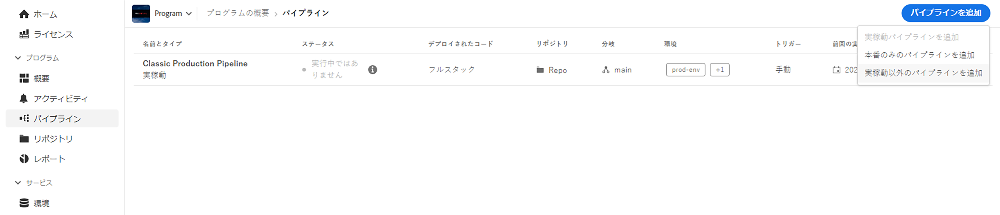
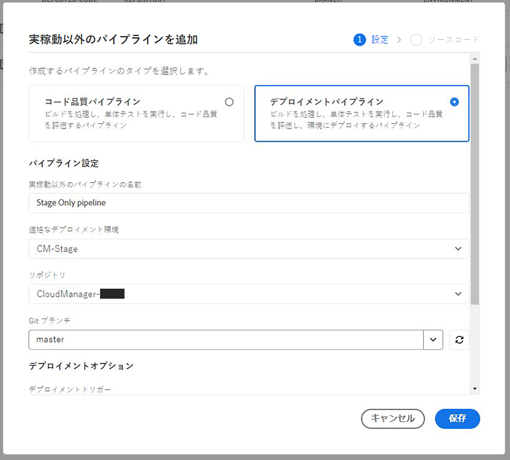

# ステージ専用パイプラインと実稼動専用パイプライン {#stage-prod-only}

専用パイプラインを使用してステージングデプロイメントと実稼動デプロイメントを分割する方法について説明します。

>[!NOTE]
>
>この機能は、[早期導入プログラム](/help/implementing/cloud-manager/release-notes/current.md#early-adoption)でのみ利用できます。

## 概要 {#overview}

ステージング環境と実稼動環境は緊密に結び付いています。デフォルトでは、それらに対するデプロイメントは単一のパイプラインにリンクされます。これは、そのプログラムのステージング環境と実稼動環境の両方にデプロイされるデプロイメントパイプラインです。この結合は通常は適切ですが、デメリットが存在する特定のユースケースがあります。

* ステージング専用環境にデプロイする場合は、パイプラインの&#x200B;**実稼動環境に昇格**&#x200B;手順を拒否することによってのみ実行できます。ただし、実行はキャンセルとしてマークされます。
* ステージング環境の最新コードを実稼動環境にデプロイする場合は、コードが変更されていなくても、ステージングデプロイメントを含むパイプライン全体を再デプロイする必要があります。
* デプロイメント中は環境を更新できないので、実稼動環境に昇格する前にステージング環境で数日間一時停止してテストする場合、実稼動環境を更新することはできません。これにより、[環境変数](/help/implementing/cloud-manager/getting-access-to-aem-in-cloud/build-environment-details.md#environment-variables)の更新などの非依存タスクが不可能になります。

ステージング専用パイプラインと実稼動専用パイプラインは、専用のデプロイメントオプションを提供することで、これらのユースケースに対するソリューションを提供します。

* **ステージング専用デプロイメントパイプライン**&#x200B;はステージング環境にのみデプロイされ、デプロイメントとテストが完了すると実行が終了します。
   * ステージング専用パイプラインは、標準の結合されたフルスタック実稼動パイプラインと同じように動作しますが、実稼動環境のデプロイメント手順（承認、スケジュール、デプロイ）はありません。
* **実稼動専用デプロイメントパイプライン**&#x200B;は、ステージ上で正常に完了して検証された実行を選択し、このアーティファクトを実稼動環境にデプロイするオプションを使用して、実稼動環境にのみデプロイします。
   * 実稼動専用パイプラインは、ステージングデプロイメントからのアーティファクトを再利用し、ビルドフェーズをスキップします。

フルスタック実稼動パイプラインの実行中は、ステージング専用パイプラインも実稼動専用パイプラインも実行されません。その逆も同様です。ステージング専用パイプラインとフルスタック実稼動パイプラインの両方に **Git の変更時**&#x200B;トリガーが設定され、同じブランチとリポジトリを指している場合、ステージング専用パイプラインのみが自動的に開始されます。実稼動専用パイプラインはリポジトリに直接リンクされていないので、**Git の変更時**&#x200B;には開始されません。

これらの専用パイプラインはより柔軟性に優れていますが、次の操作の詳細と推奨事項に注意してください。

## 制限事項 {#limitations}

実稼動専用パイプラインは、その間に標準の結合された実稼動パイプラインを通じてステージにデプロイされたアーティファクトに関係なく、常にステージング専用パイプラインからのアーティファクトを使用します。

* これにより、不要なコードのロールバックが発生する可能性があります。
* アドビでは、実稼動専用パイプラインとステージング専用パイプラインの使用を開始したら、結合された標準の実稼動パイプラインの使用を停止することをお勧めします。
* 引き続き標準の結合パイプラインとステージング専用パイプライン／実稼動専用パイプラインの両方を実行することにした場合は、コードのロールバックを回避するためにアーティファクトの再利用を念頭に置いてください。

## 既知の問題 {#known-issues}

この機能のテストを開始する前に、次の既知の問題にも注意してください。

* 実稼動専用パイプラインを使用すると、最新の AEM アップデートの効果が得られない場合があります
   * 場合によっては、AEM アップデートプロセスによって、コードがフルスタックパイプライン経由で最後にデプロイされたコードに戻されることがあります。
* 実稼動専用パイプラインまたはステージング専用パイプラインを使用している場合は、[環境の復元](/help/operations/restore.md#offsite-backup)をリクエストできません。

## パイプラインの作成 {#pipeline-creation}

実稼動専用パイプラインとステージング専用パイプラインは、標準の[実稼動パイプライン](/help/implementing/cloud-manager/configuring-pipelines/configuring-production-pipelines.md)と[実稼動以外のパイプライン](/help/implementing/cloud-manager/configuring-pipelines/configuring-non-production-pipelines.md)の結合と同様の方法で作成されます。詳しくは、これらの資料を参照してください。

1. **パイプライン**&#x200B;ウィンドウで、「**パイプラインを追加**」をクリックします。

   * ステージング専用パイプラインを作成するには、「**実稼動以外のパイプラインを追加**」を選択します。
   * 実稼動専用パイプラインを作成するには、「**実稼動専用パイプラインを追加**」を選択します。

   

>[!NOTE]
>
>対応するパイプラインが既に存在する場合、特定のオプションはグレー表示される場合があります。
>
>* ステージング専用パイプラインがまだ存在しない場合、「**実稼動専用パイプラインを追加**」は使用できません。
>* 標準の結合パイプラインが既に存在する場合、「**実稼動パイプラインを追加**」は使用できません。
>* プログラム別に許可される実稼動専用パイプラインとステージング専用パイプラインは 1 つだけです。

### ステージング専用パイプライン {#stage-only}

1. 「**実稼動以外のパイプラインを追加**」オプションを選択すると、**実稼動以外のパイプラインを追加**&#x200B;ダイアログが開きます。
1. ステージング専用パイプラインを作成するには、パイプラインの「**適格なデプロイメント環境**」フィールドでステージング環境を選択します。残りのフィールドに入力し、「**続行**」をクリックします。

   

1. 「**ステージテスト**」タブでは、ステージング環境で実行するテストを定義できます。「**保存**」をタップまたはクリックして、新しいパイプラインを保存します。

### 実稼動専用パイプライン {#prod-only}

1. 「**実稼動のみパイプラインを追加**」オプションを選択すると、「**実稼動のみパイプラインを追加**」ダイアログボックスが開きます。
1. **パイプライン名**&#x200B;を指定します。ダイアログの残りのオプションと機能は、標準の結合パイプライン作成ダイアログと同じように動作します。「**保存**」をクリックしてパイプラインを保存します。

## 実稼動専用パイプラインとステージング専用パイプラインの実行 {#running}

実稼動専用パイプラインとステージング専用パイプラインは、[他のすべてのパイプラインと同じ方法で実行されます](/help/implementing/cloud-manager/configuring-pipelines/managing-pipelines.md#running-pipelines)。詳しくは、そのドキュメントを参照してください。

また、ステージング専用パイプラインの実行の詳細から、実稼動専用パイプラインの実行を直接トリガーすることもできます。

### ステージング専用パイプライン {#stage-only-run}

ステージング専用パイプラインは、標準の結合パイプラインとほとんど同じ方法で実行されます。ただし、テスト手順後の実行の終了時にに、「**ビルドを昇格**」ボタンを使用すると、この実行によってステージにデプロイされたアーティファクトを使用して実稼動環境にデプロイする、実稼動専用パイプラインの実行を開始できます。

「**ビルドを昇格**」ボタンは、最新のステージング専用パイプラインの実行が成功した場合にのみ表示されます。クリックすると、実稼動専用パイプラインの実行を確認するか、まだ存在しない場合は実稼動専用パイプラインを作成するかを尋ねられます。

### 実稼動専用パイプライン {#prod-only-run}

実稼動専用パイプラインの場合、実稼動環境にデプロイするソースアーティファクトを特定することが重要です。詳しくは、**アーティファクトの準備**&#x200B;手順を参照してください。これらの実行に移動すると、詳細やログを確認できます。

