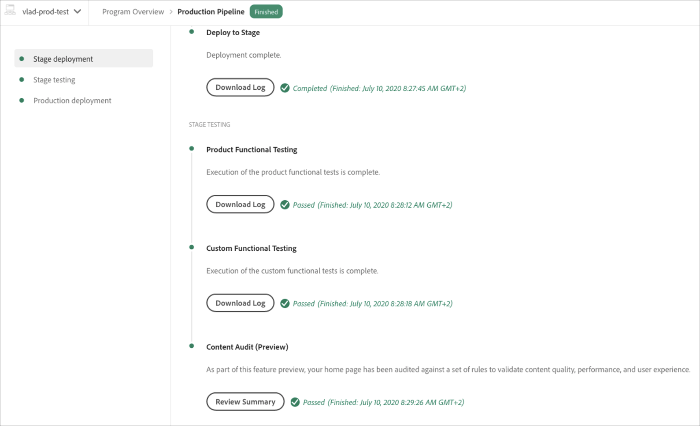

# コードのデプロイ {#deploy-your-code}

## Cloud Manager でのコードのデプロイ {#deploying-code-with-cloud-manager}

**パイプライン**（リポジトリ、環境、テスト環境）を設定したら、コードをデプロイする準備が整います。

1. Cloud Manager で「**デプロイ**」をクリックして、デプロイメントプロセスを開始します。

   

1. **パイプライン実行**&#x200B;画面が表示されます。

   「**ビルド**」をクリックしてプロセスを開始します。

   

1. 完全なビルドプロセスによってコードがデプロイされます。

   ビルドプロセスには、以下のステージが含まれます。

   1. ステージのデプロイメント
   1. ステージテスト
   1. 実稼動のデプロイメント

   >[!NOTE]
   >
   >さらに、テスト条件のログを表示したり、結果を確認したりすることで、様々なデプロイメントプロセスから手順を確認できます。

   **ステージのデプロイメント**&#x200B;には、以下の手順が含まれます。

   * 検証：この手順では、現在使用できるリソース（設定済みの分岐が存在する場合など）を使用するようにパイプラインが設定され、環境が使用できることを確認します。
   * ビルドおよび単体テスト：この手順では、コンテナ化されたビルドプロセスを実行します。ビルド環境について詳しくは、[AEM アプリケーションプロジェクトの作成](/help/onboarding/getting-access-to-aem-in-cloud/creating-aem-application-project.md)を参照してください。
   * コードスキャン：この手順では、アプリケーションコードの品質を評価します。テストプロセスについて詳しくは、[テスト結果の理解](/help/implementing/developing/introduction/understand-test-results.md)を参照してください。
   * イメージのビルド：このステップには、イメージのビルドに使用されたプロセスのログファイルが含まれます。このプロセスでは、ビルドステップで生成されたコンテンツおよび Dispatcher パッケージを Docker イメージと Kubernetes 設定に変換します。
   * ステージへのデプロイ

      
   **ステージテスト**&#x200B;には、以下のステップが含まれます。

   * 製品の機能テスト： Cloud Managerのパイプライン実行では、ステージ環境に対して実行するテストの実行がサポートされます。
Refer to [Understand your Test Results](/help/implementing/developing/introduction/understand-test-results.md) for details on the testing process.

   * カスタム機能テスト：パイプライン内のこのステップは常に存在し、スキップできません。ただし、ビルドでテスト JAR が生成されない場合、テストはデフォルトで合格します。\
      Refer to [Understand your Test Results](/help/implementing/developing/introduction/understand-test-results.md) for details on the testing process.

   * コンテンツ監査： パイプライン内のこのステップは常に存在し、スキップできません。 実稼動パイプラインの実行時に、チェックを実行するカスタム機能テストの後に、コンテンツ監査手順が含まれます。 設定されたページがサービスに送信され、評価されます。 結果は情報を提供するもので、ユーザーはスコアや現在のスコアと以前のスコアの変化を確認できます。 この洞察は、現在のデプロイメントで導入される回帰があるかどうかを判断するのに役立ちます。
詳細は、 [「コンテンツ監査結果について](/help/implementing/developing/introduction/understand-test-results.md#content-audit-testing) 」を参照してください。

      

## デプロイメントプロセス {#deployment-process}

以下の節では、ステージフェーズおよび実稼動フェーズでの AEM および Dispatcher パッケージのデプロイ方法について説明します。

Cloud Manager は、ビルドプロセスによって生成されたすべての target/*.zip ファイルをステージの場所にアップロードします。これらのアーティファクトは、パイプラインのデプロイフェーズで、この場所から取得されます。

Cloud Manager が実稼動以外のトポロジにデプロイされる場合、目的はできるだけ早くデプロイメントを完了することです。そのため、アーティファクトは、以下のようにすべてのノードに同時にデプロイされます。

1. Cloud Manager は、各アーティファクトが AEM または Dispatcher パッケージであるかどうかを判断します。
1. Cloud Manager は、デプロイメント中に環境を分離するために、ロードバランサーからすべての Dispatcher を削除します。

   特に設定されている場合を除き、開発およびステージデプロイメントでのロードバランサーの変更、つまり、非実稼動パイプライン（開発環境用）と実稼動パイプライン（ステージ環境用）の両方のデタッチとアタッチの手順をスキップできます。

   >[!NOTE]
   >
   >この機能は、主に 1-1-1 のお客様が使用すると想定されています。

1. 各 AEM アーティファクトは、パッケージマネージャー API を介して各 AEM インスタンスにデプロイされ、パッケージの依存関係がデプロイメントの順序を決定します。

   パッケージを使用した新機能のインストール、インスタンス間のコンテンツの転送、リポジトリコンテンツのバックアップ方法について詳しくは、「パッケージの使用方法」を参照してください。

   >[!NOTE]
   >
   >すべての AEM アーティファクトは、オーサーとパブリッシャーの両方にデプロイされます。ノード専用の設定が必要な場合は、実行モードを使用する必要があります。特定の目的のために実行モードを使用して AEM インスタンスを調整できるようにする方法について詳しくは、「実行モード」を参照してください。

1. Dispatcher のアーティファクトは、以下のように各 Dispatcher にデプロイされます。

   1. 現在の設定はバックアップされ、一時的な場所にコピーされます。
   1. すべての設定は、不変ファイルを除いて削除されます。詳しくは、Dispatcher 設定の管理を参照してください。これにより、孤立したファイルが残らないようにディレクトリがクリアされます。
   1. アーティファクトは、httpd ディレクトリに抽出されます。不変ファイルは上書きされません。Git リポジトリ内の不変ファイルに対して加えた変更は、デプロイメント時に無視されます。これらのファイルは、AMS Dispatcher フレームワークのコアであり、変更できません。
   1. Apache が設定テストを実行します。エラーが見つからない場合は、サービスが再読み込みされます。エラーが発生した場合、設定がバックアップから復元され、サービスが再読み込みされて、エラーが Cloud Manager に再レポートされます。
   1. パイプライン設定で指定された各パスは、無効化または Dispatcher キャッシュからフラッシュされます。

   >[!NOTE]
   >
   >Cloud Manager では、Dispatcher アーティファクトに完全なファイルセットが含まれていることが想定されています。すべての Dispatcher 設定ファイルが、Git リポジトリに存在する必要があります。ファイルやフォルダーが見つからない場合、デプロイメントに失敗します。

1. すべての AEM および Dispatcher パッケージのすべてのノードへのデプロイメントが正常に完了すると、Dispatcher がロードバランサーに再追加され、デプロイメントが完了します。

   >[!NOTE]
   >
   >開発およびステージデプロイメントでのロードバランサーの変更、つまり、非実稼動パイプライン（開発環境用）と実稼動パイプライン（ステージ環境用）の両方のデタッチとアタッチの手順をスキップできます。

### 実稼動フェーズへのデプロイメント {#deployment-production-phase}

AEM サイト訪問者への影響を最小限に抑えるために、実稼動トポロジへのデプロイプロセスはわずかに異なります。

実稼動のデプロイメントは、通常、上記と同じ手順に従いますが、周期的な方法で実行します。

1. オーサーに AEM パッケージをデプロイします。
1. dispatcher1 をロードバランサーから分離します。
1. AEM パッケージを publish1 にデプロイし、Dispatcher を dispatcher1 にデプロイして、Dispatcher キャッシュをフラッシュします。
1. dispatcher1 をロードバランサーに戻します。
1. dispatcher1 がサービスを再開したら、dispatcher2 をロードバランサーから分離します。
1. AEM パッケージを publish2 にデプロイし、Dispatcher パッケージを dispatcher2 にデプロイして、Dispatcher キャッシュをフラッシュします。
1. dispatcher2 をロードバランサーに戻します。
このプロセスは、デプロイメントがトポロジのすべてのパブリッシャーおよび Dispatcher に到達するまで続行されます。

