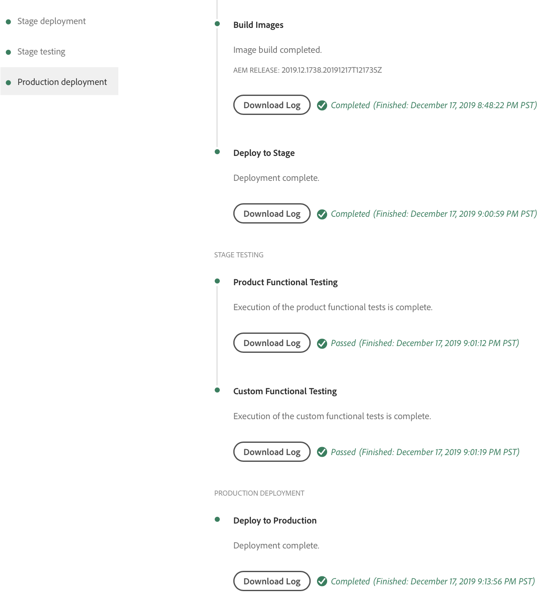

# コードのデプロイ {#deploy-your-code}

AEM as a Cloud Serviceの Cloud Manager パイプラインを使用してコードをデプロイする方法を説明します。

## AEM as a Cloud Serviceでの Cloud Manager でのコードのデプロイ {#deploying-code-with-cloud-manager}

一度 [実稼動パイプラインを設定済み](/help/implementing/cloud-manager/configuring-pipelines/configuring-production-pipelines.md) リポジトリ、環境、テスト環境を含め、コードをデプロイする準備が整いました。

1. Cloud Manager( ) にログインします。 [my.cloudmanager.adobe.com](https://my.cloudmanager.adobe.com/) 適切な組織を選択します。

1. コードをデプロイするプログラムをクリックします。

1. クリック **デプロイ** のコールトゥアクションから **概要** 画面を開いて、デプロイメントプロセスを開始します。

   

1. **パイプライン実行**&#x200B;画面が表示されます。「**ビルド**」をクリックしてプロセスを開始します。

   

ビルドプロセスにより、3 つの段階を経てコードがデプロイされます。

1. [ステージのデプロイメント](#stage-deployment)
1. [ステージテスト](#stage-testing)
1. [実稼動のデプロイメント](#production-deployment)

>[!TIP]
>
>テスト条件のログを表示したり、結果を確認したりして、様々なデプロイメントプロセスの手順を確認できます。

## ステージのデプロイメントフェーズ {#stage-deployment}

この **ステージのデプロイメント** フェーズ。 には、これらの手順が含まれます。

* **検証**   — この手順では、現在使用可能なリソースを使用するようにパイプラインが設定されるようにします。 例えば、設定されたブランチが存在し、環境が使用可能であることをテストします。
* **ビルドおよび単体テスト**  — この手順は、コンテナ化されたビルドプロセスを実行します。
   * ドキュメントを参照してください [ビルド環境の詳細](/help/implementing/cloud-manager/getting-access-to-aem-in-cloud/build-environment-details.md) を参照してください。
* **コードスキャン**  — この手順では、アプリケーションコードの品質を評価します。
   * ドキュメントを参照してください [コード品質テスト](/help/implementing/cloud-manager/code-quality-testing.md) を参照してください。
* **画像の作成**  — このプロセスでは、ビルド手順で生成されたコンテンツおよび Dispatcher パッケージを Docker イメージと Kubernetes 設定に変換します。
* **ステージにデプロイ**  — イメージは、 [ステージテスト段階。](#stage-testing)

## ステージテストフェーズ {#stage-testing}

この **ステージテスト** フェーズでは、これらの手順を実行します。

* **製品機能テスト** - Cloud Manager パイプラインは、ステージ環境に対して実行されるテストを実行します。
   * ドキュメントを参照してください [製品機能テスト](/help/implementing/cloud-manager/functional-testing.md#product-functional-testing) を参照してください。

* **カスタム機能テスト**  — パイプライン内のこのステップは常に実行され、スキップできません。 ビルドでテスト JAR が生成されない場合、テストはデフォルトで合格します。
   * ドキュメントを参照してください [カスタム機能テスト](/help/implementing/cloud-manager/functional-testing.md#custom-functional-testing) を参照してください。

* **カスタム UI テスト**  — この手順は、カスタムアプリケーション用に作成された UI テストを自動的に実行するオプションの機能です。
   * UI テストは、Docker イメージにパッケージ化された Selenium ベースのテストで、言語とフレームワーク（Java、Maven、Node、WebDriver.io など、Selenium に基づいて構築されたその他のフレームワークとテクノロジー）を幅広く選択できます。
   * ドキュメントを参照してください [カスタム UI テスト](/help/implementing/cloud-manager/functional-testing.md#custom-ui-testing) を参照してください。

* **エクスペリエンス監査**  — パイプライン内のこのステップは常に実行され、スキップできません。 実稼動パイプラインの実行時に、チェックを実行するカスタム機能テストの後に、エクスペリエンスの監査手順が組み込まれます。
   * 設定されたページがサービスに送信され、評価されます。
   * 結果は情報提供であり、スコアおよび現在のスコアと以前のスコアの変化を示します。
   * このインサイトは、現在のデプロイメントで前のバージョンになかった不具合が導入されるかどうかを判断するのに役立ちます。
   * ドキュメントを参照してください [エクスペリエンス監査結果について](/help/implementing/cloud-manager/experience-audit-testing.md) を参照してください。

## 実稼動のデプロイメントフェーズ {#deployment-production}

訪問者がAEMサイトに与える影響を最小限に抑えるために、実稼動トポロジにデプロイするプロセスは少し異なります。

実稼動のデプロイメントは、通常、前述と同じ手順に従いますが、周期的な方法で実行します。

1. オーサーに AEM パッケージをデプロイします。
1. dispatcher1 をロードバランサーから分離します。
1. AEM パッケージを publish1 にデプロイし、Dispatcher を dispatcher1 にデプロイして、Dispatcher キャッシュをフラッシュします。
1. dispatcher1 をロードバランサーに戻します。
1. dispatcher1 がサービスを再開したら、dispatcher2 をロードバランサーから分離します。
1. AEM パッケージを publish2 にデプロイし、Dispatcher パッケージを dispatcher2 にデプロイして、Dispatcher キャッシュをフラッシュします。
1. dispatcher2 をロードバランサーに戻します。

このプロセスは、デプロイメントがトポロジのすべてのパブリッシャーおよび Dispatcher に到達するまで続行されます。

## デプロイメントプロセス {#deployment-process}

Cloud Service のすべてのデプロイメントでは、ダウンタイムをなくすために、ローリングプロセスに従います。ドキュメントを参照してください [ローリングデプロイメントの仕組み](/help/implementing/deploying/overview.md#how-rolling-deployments-work) を参照してください。