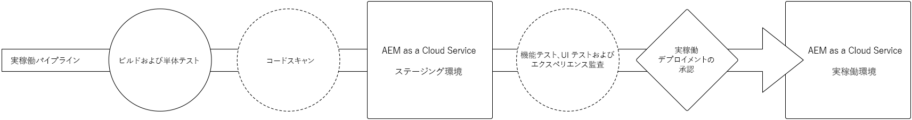

# コードのデプロイ {#deploy-your-code}

AEM as a Cloud Serviceの Cloud Manager パイプラインを使用して、コードを実稼動環境にデプロイする方法を説明します。



コードをステージング環境にシームレスにデプロイし、実稼動環境にデプロイするには、実稼動パイプラインを使用します。 実稼動パイプラインの実行は、2 つの論理フェーズに分類されます。

1. ステージ環境へのデプロイメント
   * コードは、自動化された機能テスト、UI テスト、エクスペリエンス監査、ユーザー受け入れテスト (UAT) のために、ステージング環境に構築およびデプロイされます。
1. 実稼動環境へのデプロイメント
   * ステージ上でビルドの検証がおこなわれ、実稼動環境へのプロモーションが承認されると、同じビルドアーティファクトが実稼動環境にデプロイされます。

_コードスキャン、関数テスト、UI テスト、エクスペリエンス監査をサポートするのは、フルスタックコードパイプラインタイプのみです。_

## AEM as a Cloud Serviceでの Cloud Manager でのコードのデプロイ {#deploying-code-with-cloud-manager}

一度 [実稼動パイプラインを設定済み](/help/implementing/cloud-manager/configuring-pipelines/configuring-production-pipelines.md) リポジトリ、環境、テスト環境を含め、コードをデプロイする準備が整いました。

1. Cloud Manager( ) にログインします。 [my.cloudmanager.adobe.com](https://my.cloudmanager.adobe.com/) 適切な組織を選択します。

1. コードをデプロイするプログラムをクリックします。

1. クリック **デプロイ** のコールトゥアクションから **概要** 画面を開いて、デプロイメントプロセスを開始します。

   

1. **パイプライン実行**&#x200B;画面が表示されます。「**ビルド**」をクリックしてプロセスを開始します。

   

ビルドプロセスにより、3 つの段階を経てコードがデプロイされます。

1. [ステージのデプロイメント](#stage-deployment)
1. [ステージテスト](#stage-testing)
1. [実稼動のデプロイメント](#production-deployment)

>[!TIP]
>
>テスト条件のログを表示したり、結果を確認したりして、様々なデプロイメントプロセスの手順を確認できます。

## ステージのデプロイメントフェーズ {#stage-deployment}

この **ステージのデプロイメント** フェーズ。 には、これらの手順が含まれます。

* **検証**   — この手順では、現在使用可能なリソースを使用するようにパイプラインが設定されるようにします。 例えば、設定されたブランチが存在し、環境が使用可能であることをテストします。
* **ビルドおよび単体テスト**  — この手順は、コンテナ化されたビルドプロセスを実行します。
   * ドキュメントを参照してください [ビルド環境の詳細](/help/implementing/cloud-manager/getting-access-to-aem-in-cloud/build-environment-details.md) を参照してください。
* **コードスキャン**  — この手順では、アプリケーションコードの品質を評価します。
   * ドキュメントを参照してください [コード品質テスト](/help/implementing/cloud-manager/code-quality-testing.md) を参照してください。
* **画像の作成**  — このプロセスでは、ビルド手順で生成されたコンテンツおよび Dispatcher パッケージを Docker イメージと Kubernetes 設定に変換します。
* **ステージにデプロイ**  — イメージは、 [ステージテスト段階。](#stage-testing)


## ステージテストフェーズ {#stage-testing}

この **ステージテスト** フェーズでは、これらの手順を実行します。

* **製品機能テスト** - Cloud Manager パイプラインは、ステージ環境に対して実行されるテストを実行します。
   * ドキュメントを参照してください [製品機能テスト](/help/implementing/cloud-manager/functional-testing.md#product-functional-testing) を参照してください。

* **カスタム機能テスト**  — パイプライン内のこのステップは常に実行され、スキップできません。 ビルドでテスト JAR が生成されない場合、テストはデフォルトで合格します。
   * ドキュメントを参照してください [カスタム機能テスト](/help/implementing/cloud-manager/functional-testing.md#custom-functional-testing) を参照してください。

* **カスタム UI テスト**  — この手順は、カスタムアプリケーション用に作成された UI テストを自動的に実行するオプションの機能です。
   * UI テストは、Docker イメージにパッケージ化された Selenium ベースのテストで、言語とフレームワーク（Java、Maven、Node、WebDriver.io など、Selenium に基づいて構築されたその他のフレームワークとテクノロジー）を幅広く選択できます。
   * ドキュメントを参照してください [カスタム UI テスト](/help/implementing/cloud-manager/functional-testing.md#custom-ui-testing) を参照してください。

* **エクスペリエンス監査**  — パイプライン内のこのステップは常に実行され、スキップできません。 実稼動パイプラインの実行時に、チェックを実行するカスタム機能テストの後に、エクスペリエンスの監査手順が組み込まれます。
   * 設定されたページがサービスに送信され、評価されます。
   * 結果は情報提供であり、スコアおよび現在のスコアと以前のスコアの変化を示します。
   * このインサイトは、現在のデプロイメントで前のバージョンになかった不具合が導入されるかどうかを判断するのに役立ちます。
   * ドキュメントを参照してください [エクスペリエンス監査結果について](/help/implementing/cloud-manager/experience-audit-testing.md) を参照してください。


## 実稼動のデプロイメントフェーズ {#deployment-production}

訪問者がAEMサイトに与える影響を最小限に抑えるために、実稼動トポロジにデプロイするプロセスは少し異なります。

実稼動のデプロイメントは、通常、前述と同じ手順に従いますが、周期的な方法で実行します。

1. オーサーに AEM パッケージをデプロイします。
1. dispatcher1 をロードバランサーから分離します。
1. AEM パッケージを publish1 にデプロイし、Dispatcher を dispatcher1 にデプロイして、Dispatcher キャッシュをフラッシュします。
1. dispatcher1 をロードバランサーに戻します。
1. dispatcher1 がサービスを再開したら、dispatcher2 をロードバランサーから分離します。
1. AEM パッケージを publish2 にデプロイし、Dispatcher パッケージを dispatcher2 にデプロイして、Dispatcher キャッシュをフラッシュします。
1. dispatcher2 をロードバランサーに戻します。


このプロセスは、デプロイメントがトポロジのすべてのパブリッシャーおよび Dispatcher に到達するまで続行されます。


## タイムアウト {#timeouts}

ユーザーのフィードバックを待機したままにすると、次の手順はタイムアウトします。

| ステップ | タイムアウト |
|--- |--- |
| コード品質テスト | 14 日 |
| セキュリティテスト | 14 日 |
| パフォーマンステスト | 14 日 |
| アプリケーションの承認 | 14 日 |
| 実稼動デプロイメントをスケジュール | 14 日 |
| CSE サポート | 14 日 |

## デプロイメントプロセス {#deployment-process}

Cloud Service のすべてのデプロイメントでは、ダウンタイムをなくすために、ローリングプロセスに従います。ドキュメントを参照してください [ローリングデプロイメントの仕組み](/help/implementing/deploying/overview.md#how-rolling-deployments-work) を参照してください。

## 実稼動デプロイメントの再実行 {#Reexecute-Deployment}

実稼動デプロイメント手順の再実行は、実稼動デプロイ手順が完了した実行に対してサポートされます。 完了のタイプは重要ではありません。デプロイメントがキャンセルされたか、失敗した可能性があります。 ただし、主な使用例は、一時的な理由で実稼動のデプロイメント手順が失敗した場合です。 再実行は、同じパイプラインを使用して新しい実行を作成します。 この新しい実行は、次の 3 つの手順で構成されます。

1. 検証ステップ — 基本的に、パイプラインの通常の実行中に発生する検証と同じです。
1. ビルドステップ — 再実行のコンテキストでは、ビルドステップは、新しいビルドプロセスを実際に実行するのではなく、アーティファクトをコピーします。
1. 実稼動のデプロイメント手順 — 通常のパイプライン実行での実稼動のデプロイメント手順と同じ設定およびオプションを使用します。

ビルド手順のラベルが UI で若干異なる場合があります。これは、アーティファクトをコピーし、再構築しないことを示しています。


制限事項：

* 実稼動デプロイメント手順の再実行は、最後の実行時にのみ使用できます。
* プッシュ更新の実行では、再実行を使用できません。 最後の実行がプッシュ更新の実行の場合、再実行はできません。
* 最後の実行がプッシュ更新の実行の場合、再実行はできません。
* 実稼動デプロイメント手順の前の任意の時点で最後の実行が失敗した場合、再実行はできません。

### API を再実行 {#Reexecute-API}

### 再実行の識別

実行が再実行であるかどうかを識別するために、「トリガー」フィールドを調べることができます。 値は次のようになります。 *RE_EXECUTE*.

### 新しい実行のトリガー

再実行をトリガーするには、HAL リンクにPUTリクエストを送信する必要があります &lt;(<http://ns.adobe.com/adobecloud/rel/pipeline/reExecute>)> 実稼動デプロイステップの状態。 このリンクが存在する場合は、そのステップから実行を再開できます。 存在しない場合は、そのステップから実行を再開することはできません。 最初のリリースでは、このリンクは実稼動デプロイステップにのみ存在しますが、今後のリリースでは他のステップからのパイプラインの開始がサポートされる場合があります。 例：

```Javascript
 {
  "_links": {
    "http://ns.adobe.com/adobecloud/rel/pipeline/logs": {
      "href": "/api/program/4/pipeline/1/execution/953671/phase/1575676/step/2983530/logs",
      "templated": false
    },
    "http://ns.adobe.com/adobecloud/rel/pipeline/reExecute": {
      "href": "/api/program/4/pipeline/1/execution?stepId=2983530",
      "templated": false
    },
    "http://ns.adobe.com/adobecloud/rel/pipeline/metrics": {
      "href": "/api/program/4/pipeline/1/execution/953671/phase/1575676/step/2983530/metrics",
      "templated": false
    },
    "self": {
      "href": "/api/program/4/pipeline/1/execution/953671/phase/1575676/step/2983530",
      "templated": false
    }
  },
  "id": "6187842",
  "stepId": "2983530",
  "phaseId": "1575676",
  "action": "deploy",
  "environment": "weretail-global-b75-prod",
  "environmentType": "prod",
  "environmentId": "59254",
  "startedAt": "2022-01-20T14:47:41.247+0000",
  "finishedAt": "2022-01-20T15:06:19.885+0000",
  "updatedAt": "2022-01-20T15:06:20.803+0000",
  "details": {
  },
  "status": "FINISHED"
```


HAL リンクの構文 _href_  上記の値は、参照点として使用されません。 実際の値は、常に HAL リンクから読み取られ、生成されない必要があります。

の送信 *PUT* このエンドポイントへのリクエストは、 *201* 成功した場合はレスポンスの本文に、新しい実行が表示されます。 これは、API を使用して通常の実行を開始する場合と似ています。
