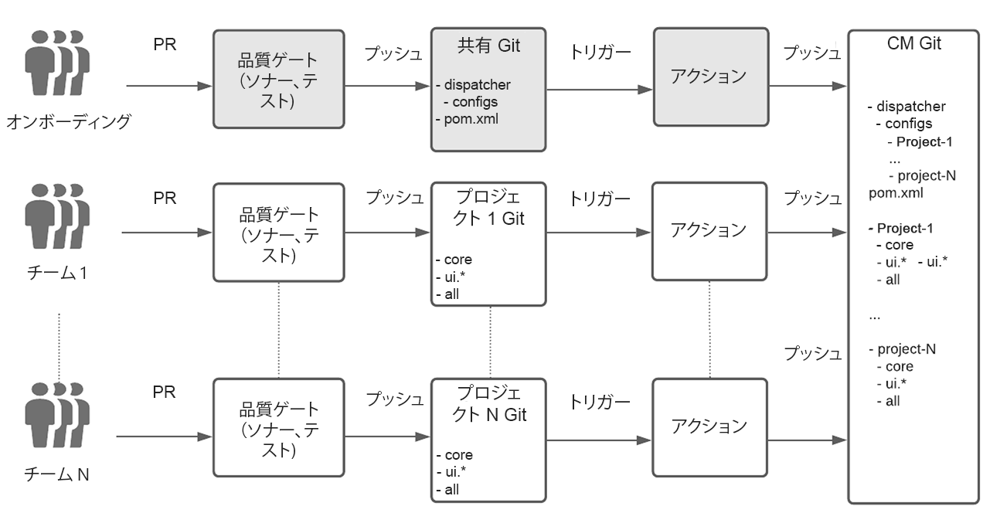
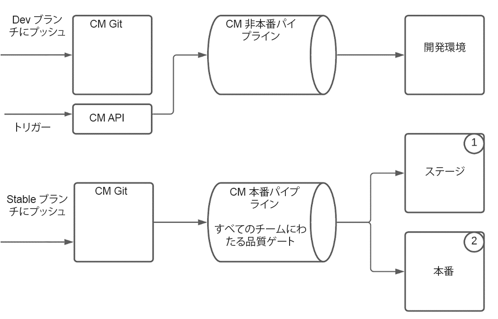
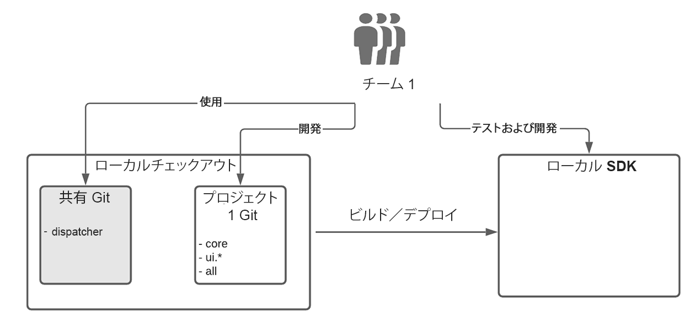

# AEM as a Cloud Service のエンタープライズチーム開発の設定{#enterprise-setup}

## はじめに {#introduction}

サービスとしての AEM を提供するクラウドネイティブのサービスである AEM as Cloud Service は、10 年以上にわたってエンタープライズソフトウェアを提供してきた経験を活かし、エンタープライズチームの特定要件に合わせて設計されています。AEM as Cloud Service は、AEM をクラウドネイティブの世界へと導き、常時稼働、常に最新、常にセキュア、常に大規模であるなどの新しい価値を提供する一方で、 AEM がカスタマイズ可能なプラットフォームとして顧客に提供する主要な価値は維持されており、エンタープライズグレードのチームが開発や提供の手順に統合できます。

顧客にエンタープライズ開発設定を提供するために、AEM as a Cloud Service は、Cloud Manager と目的に応じた専用の CI／CD パイプラインを完全に統合します。これには、エンタープライズグレードの開発とデプロイメントにおける長年の経験から得たベストプラクティスと学習が組み込まれており、徹底したテストと最高のコード品質が保証され、優れたエクスペリエンスが提供されます。

## エンタープライズチーム開発の設定での Cloud Manager のサポート{#cloud-manager}

Cloud Manager には、顧客がすばやくオンボーディングできるように、エクスペリエンスの開発を開始するために必要なものすべてが用意されています。カスタマイズ内容を保存する Git リポジトリーも用意されており、Cloud Manager で構築、検証、デプロイすることができます。Cloud Manager を使用することによって、開発チームは、アドビの担当者に依存することなく、頻繁に変更をコミットすることができます。

Cloud Manager では、次の 3 つの環境タイプを使用できます。

* 開発
* ステージ
* 実稼動

コードは、実稼動以外のパイプラインを使用して開発環境にデプロイできます。ステージングと実稼動は常に連携しているので、ベストプラクティスとして実稼動の前に検証を確実に実施できます。実稼動パイプラインでは、品質ゲートを使用してアプリケーションのコードと設定の変更を検証します。

実稼動パイプラインは、最初にコードと設定をステージング環境にデプロイし、アプリケーションをテストして、最後に実稼動環境にデプロイします。最新の Cloud Service 機能強化で常にアップデートされている Cloud Service SDK を使用すると、デベロッパーのローカルハードウェアを直接利用したローカル開発が可能になります。これにより、非常に短時間で迅速な開発が可能になります。したがって、デベロッパーは慣れ親しんだローカル環境で様々な開発ツールを選択し、必要に応じて適切な開発環境や実稼動環境にプッシュすることができます。

Cloud Manager は、企業のニーズに合わせて調整できる、柔軟なマルチチーム設定をサポートしています。これは、AMS だけでなく Cloud Service にも当てはまります。複数のチームで安定したデプロイメントを実現し、1 つのチームがすべてのチームの実稼動環境に影響を与えることを避けるために、Cloud Manager の固有パイプラインは常にすべてのチームのコードを同時に検証し、テストします。

## 実際の例{#real-world-example}

各企業には、チームの設定、プロセス、開発ワークフローなどで、異なる設定や要件があります。以下で説明する設定は、アドビが AEM as a Cloud Service をベースにエクスペリエンスを提供するいくつかのプロジェクトで使用されています。

例えば、Adobe Photoshop や Adobe Illustrator などの Adobe Creative Cloud アプリケーションには、エンドユーザーが使用できるチュートリアル、例、ガイドなどのコンテンツリソースが含まれています。こうしたコンテンツは、AEM as a Cloud Service を&#x200B;*使用するクライアントアプリケーションによってヘッドレス*&#x200B;で消費されます。AEM Cloud のパブリッシュ層には、API 呼び出しを実行して構造化されたコンテンツを JSON ストリームとして取得します。AEM as a Cloud Service の[コンテンツ配信ネットワーク（CDN）](https://experienceleague.adobe.com/docs/experience-manager-cloud-service/implementing/content-delivery/cdn.html?lang=ja#content-delivery)を活用することで、構造化コンテンツと非構造化コンテンツの両方を最適なパフォーマンスで提供できます。

このプロジェクトに参加しているチームは、以降で説明するプロセスに従います。

>[!NOTE]
>設定について詳しくは、「[複数のソース Git リポジトリーの操作](https://experienceleague.adobe.com/docs/experience-manager-cloud-manager/using/managing-code/working-with-multiple-source-git-repos.html?lang=ja#managing-code)」を参照してください。

各チームは独自の開発ワークフローを使用し、個別の Git リポジトリーを持ちます。追加の共有 Git リポジトリーは、プロジェクトのオンボーディングに使用されます。この Git リポジトリーには、共有ディスパッチャー設定を含む Cloud Manager の Git リポジトリーのルート構造が含まれています。新しいプロジェクトをオンボーディングするには、共有 Git リポジトリーのルートにあるリアクター Maven プロジェクトファイルをリストする必要があります。ディスパッチャー設定の場合、新しい設定ファイルがディスパッチャープロジェクト内に作成されます。このファイルは、メインのディスパッチャー設定によってインクルードされます。各チームは、それぞれのディスパッチャー設定ファイルを管理します。共有 Git リポジトリーの変更はほとんど行われず、通常は新しいプロジェクトをオンボードする場合にのみ必要です。主な作業は、各プロジェクトチームがそれぞれの Git リポジトリー内でおこないます。

各チームの Git リポジトリーは、AEM Maven アーキタイプを使用して設定されているので、AEM プロジェクトの設定のベストプラクティスに従っています。唯一の例外は、上述のように共有 Git リポジトリーで実行されるディスパッチャー設定の処理です。
各チームは、Git フローモデルに従って、2 + N のブランチがあるシンプルな Git ワークフローを使用します。

* 安定リリースブランチには、実稼動コードが含まれます

* 開発ブランチには、最新の開発が含まれます

* 各機能に対しては、新しいブランチが作成されます

開発は機能ブランチでおこなわれ、機能が成熟すると開発ブランチにマージされます。完了および検証済みの機能は、開発ランチから選択され、安定ランチにマージされます。すべての変更は、プルリクエスト（PR）を通じておこなわれます。各 PR は、品質ゲートによって自動的に検証されます。Sonar はコードの品質チェックに使用され、一連のテストスイートが実行されて、新しいコードがリグレッションを起こさなことを確認します。

Cloud Manager の Git リポジトリーの設定には、次の 2 つのブランチがあります。

* *安定リリースブランチ*&#x200B;には、すべてのチームの実稼動コードが含まれます。
* *開発ブランチ*&#x200B;には、すべてのチームの開発コードが含まれます。

開発または安定ブランチでのチームの Git リポジトリーに対するすべてのプッシュが、[github アクション](https://experienceleague.adobe.com/docs/experience-manager-cloud-manager/using/managing-code/working-with-multiple-source-git-repos.html?lang=ja#managing-code)をトリガーします。安定ブランチについては、すべてのプロジェクトが同じ設定に従います。プロジェクトの安定ブランチへのプッシュは、Cloud Manager の Git リポジトリーの安定ブランチに自動的にプッシュされます。Cloud Manager の実稼動パイプラインは、安定ブランチへのプッシュでトリガーされるように設定されています。したがって、チームの各プッシュによって安定ブランチに実稼動パイプラインが実行され、すべての品質ゲートが合格すると、実稼動のデプロイメントがアップデートされます。

開発ブランチへのプッシュの処理は異なります。チームの Git リポジトリー内の開発ブランチへのプッシュは github アクションもトリガーし、コードは Cloud Manager の Git リポジトリー内の開発ブランチにも自動的にプッシュされますが、非実稼動パイプラインはコードのプッシュによって自動的にトリガーされません。非実稼動パイプラインは、Cloud Manager の API の呼び出しでトリガーされます。
実稼動パイプラインの実行には、提供された品質ゲートを介したすべてのチームのコードをチェックすることが含まれます。コードがステージングにデプロイされると、テストと監査が実行され、すべてが期待どおりに動作していることが確認されます。すべてのゲートを通過すると、変更は中断やダウンタイムなしで実稼動環境にロールアウトされます。ローカル開発の場合は、[AEM as a Cloud Service](https://experienceleague.adobe.com/docs/experience-manager-cloud-service/implementing/developing/aem-as-a-cloud-service-sdk.html?lang=ja#developing) 用の SDK が使用されます。SDK を使用すると、ローカルのオーサー、パブリッシャー、ディスパッチャーを設定できます。これにより、オフラインでの開発が可能になり、短時間での開発がが可能となります。開発にはオーサーのみを使用する場合もありますが、ディスパッチャーとパブリッシャーを設定することで、Git リポジトリーにプッシュする前に、すべてをローカルでテストできます。各チームのメンバーは、通常、共有 Git および独自のプロジェクトコードからコードをチェックアウトします。プロジェクトは独立しているので、他のプロジェクトをチェックアウトする必要はありません。

この実際の設定を青写真として使用し、企業のニーズに合わせてカスタマイズできます。Git の柔軟なブランチとマージの概念により、上記のワークフローを様々なチームのニーズに合わせてカスタマイズできます。AEM as a Cloud Service は、専用の Cloud Manager パイプラインのコアバリューを犠牲にすることなく、これらすべてのバリエーションをサポートします。

### マルチチーム設定での考慮事項 {#considerations}

>[!NOTE]
>マルチチーム設定では、すべてのチームが従うガバナンスモデルと一連の標準を定義することが重要です。上記のマルチチーム設定の青写真では、多数のチームを対象に設定でき、この青写真を出発点として使用できます。

Cloud Manager の Git リポジトリーと実稼動パイプラインでは、完全な実稼動コードは、常にすべての品質ゲートを通じて実行され、1 つのデプロイメントユニットとして扱われます。このようにして、実稼動システムは中断やダウンタイムなしで&#x200B;*常時稼働*&#x200B;します。これに対し、このようなシステムがない場合は、各チームが個別にデプロイできるので、あるチームのアップデートが実稼動の安定性の問題につながるリスクがあります。さらに、アップデートをロールアウトするには、調整と計画的なダウンタイムが必要です。チーム数が増えるにつれ、調整作業はより複雑になり、すぐに管理不可能になります。

品質ゲートで問題が検出された場合、実稼動に影響はなく、アドビの担当者が介入しなくても問題の検出と修正が可能です。Cloud Service を利用せず、デプロイメント全体の常時テストを行っていないと、部分的なデプロイメントが停止を引き起こし、ロールバックやバックアップからの完全な復元が必要となることもあります。部分的なテストは、他の問題にもつながる可能性があります。これらの問題を、事後的に修正するには、アドビ担当者との調整やサポートが必要になることもあります。
