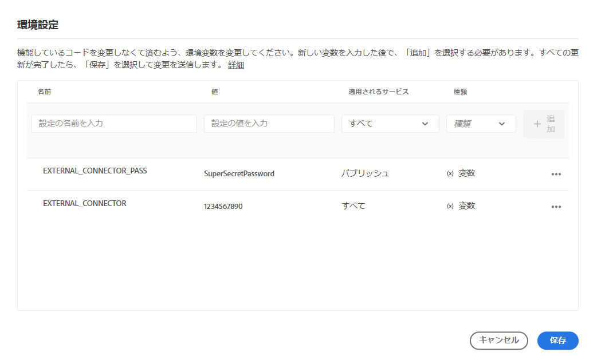
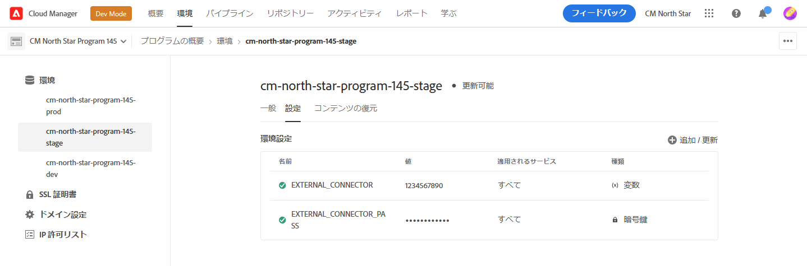

# Cloud Manager 環境変数 {#environment-variables}

標準環境変数は、Cloud Manager を介して設定および管理できます。 これらは実行時環境に提供され、OSGi 設定で使用できます。 環境変数には、変更内容に基づいて、環境固有の値または環境シークレットを指定できます。

## 概要 {#overview}

環境変数は、AEM as a Cloud Serviceのユーザーに次のような多くの利点を提供します。

* これにより、コードやアプリケーションの動作をコンテキストや環境に応じて変更できます。 例えば、実稼動環境やステージ環境と比較して開発環境で異なる設定を有効にして、コストのかかるミスを避けることができます。
* 設定と設定は 1 回だけで済み、必要に応じて更新や削除が可能です。
* その値は任意の時点で更新でき、コードの変更やデプロイメントをおこなう必要なく、即座に有効になります。
* 設定からコードを分離し、バージョン管理に機密情報を含める必要がなくなりました。
* AEMas a Cloud Serviceアプリケーションはコードの外部に存在するので、セキュリティが向上します。

環境変数の使用の一般的な使用例を次に示します。

* 別の外部エンドポイントを使用したAEMアプリケーションの接続
* パスワードをコードベースに直接格納する代わりに、参照を使用する
* 1 つのプログラムに複数の開発環境が存在し、一部の設定が 1 つの環境から次の環境へと異なる場合

## 環境変数の追加 {#add-variables}

1. 次の場所にあるAdobeCloud Manager にログインします。 [my.cloudmanager.adobe.com](https://my.cloudmanager.adobe.com/).
1. Cloud Manager には、使用可能な様々なプログラムのリストが表示されます。 管理するものを選択します。
1. を選択します。 **環境** 「 」タブで選択し、環境変数を作成する環境を左側のナビゲーションパネルで選択します。
1. 環境の詳細内で、 **設定** タブをクリックし、 **追加** 開く **環境設定** ダイアログ。
   * 初めて環境変数を追加する場合、 **設定を追加** ボタンをクリックします。 このボタンを使用するか、 **追加** 開く **環境設定** ダイアログ。

   

1. 変数の詳細を入力します。
   * **名前**
   * **値**
   * **適用されたサービス**  — 変数を適用するサービス（オーサー/パブリッシュ/プレビュー）を定義するか、変数がすべてのサービスに適用される場合はを定義します
   * **タイプ**  — 変数が通常の変数かシークレットかを定義します

   

1. 新しい変数を入力した後、 **追加** をクリックします。
   * 新しい行を入力し、「 」をクリックして、複数の変数を一度に入力できます。 **追加**.

   

1. 選択 **保存** を使用して変数を保持します。

ステータスを示す指標 **更新中** は、表の上部と、新しく追加された変数の横に表示され、環境が設定で更新されていることを示します。 完了すると、新しい環境変数がテーブルに表示されます。

>[!TIP]
>
>複数の変数を追加する場合は、最初の変数を追加し、 **追加** ボタン **環境設定** ダイアログを開き、変数を追加します。 これにより、1 回の更新で環境に追加できます。

## 環境変数の更新 {#update-variables}

環境変数を作成した後、 **追加/更新** ボタンをクリックして、 **環境設定** ダイアログ。

1. 次の場所にあるAdobeCloud Manager にログインします。 [my.cloudmanager.adobe.com](https://my.cloudmanager.adobe.com/).
1. Cloud Manager には、使用可能な様々なプログラムのリストが表示されます。 管理するものを選択します。
1. を選択します。 **環境** 「 」タブで選択し、環境変数を作成する環境を左側のナビゲーションパネルで選択します。
1. 環境の詳細内で、 **設定** タブをクリックし、 **追加/更新** を右上に表示して、 **環境設定** ダイアログ。

   

1. 変更する変数の行の最後の列にある省略記号ボタンを使用して、「 **編集** または **削除**.

   

1. 必要に応じて環境変数を編集します。
   * 編集時に、省略記号ボタンがオプションに変わり、元の値に戻るか、変更を確定します。
   * シークレットを編集する場合、値は更新のみ可能で、表示はできません。

   

1. 必要な設定の変更をすべて行ったら、「 」を選択します。 **保存**.

[変数を追加する場合と同様に、](#add-variables) ステータスを示す指標 **更新中** は、テーブルの上部と、新しく更新された変数の横に表示され、環境が設定で更新されていることを示します。 完了すると、更新された環境変数がテーブルに表示されます。

>[!TIP]
>
>複数の変数を更新する場合は、 **環境設定** をタップまたはクリックする前に必要なすべての変数を一度に更新するためのダイアログ **保存**. これにより、1 回の更新で環境に追加できます。
