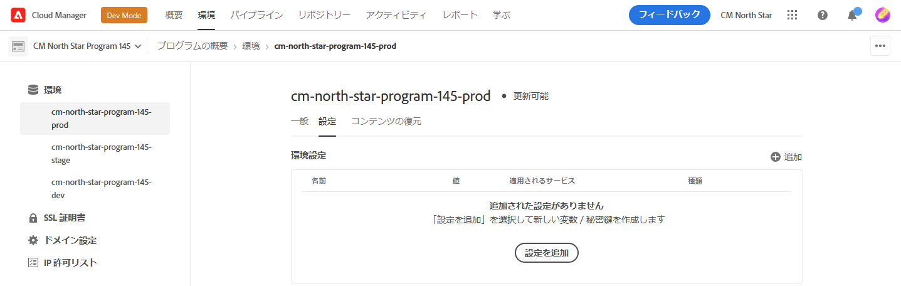
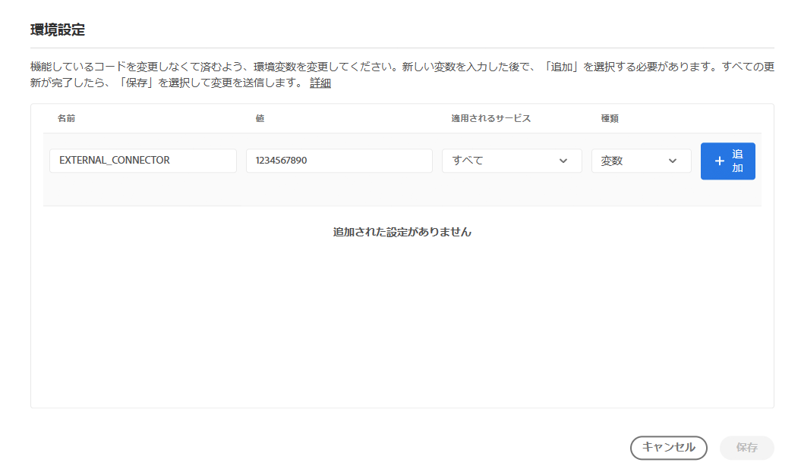
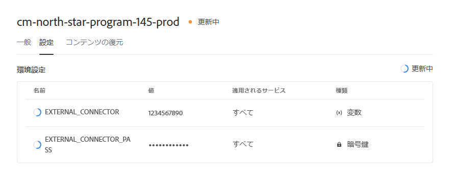
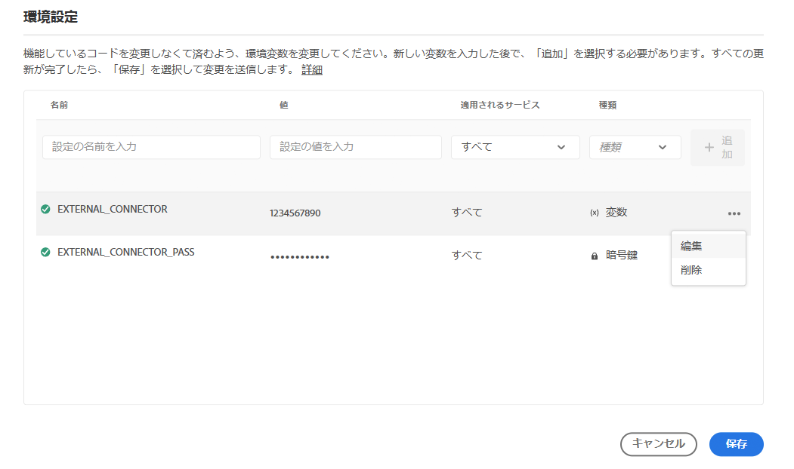
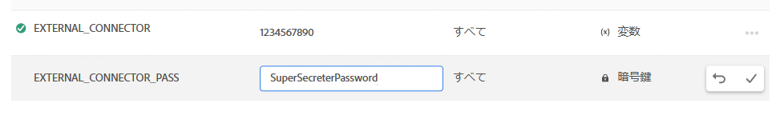

# Cloud Managerの環境変数 {#environment-variables}

標準環境変数は、Cloud Manager を介して設定および管理できます。これらは実行時環境に提供され、OSGi 設定で使用できます。

環境変数には、環境固有の値または環境シークレットを変更内容に応じて指定できます。

## 環境変数について {#overview}

環境変数は、AEM as a Cloud Serviceのユーザーに次のような多くの利点を提供します。

* コードやアプリケーションの動作を、コンテキストや環境に応じて変化させることができます。例えば、実稼動環境やステージング環境と比較して開発環境で異なる設定を有効にして、コストのかかるミスを避けることができます。
* 設定とセットアップは 1 回だけで済み、必要に応じて更新や削除が可能です。
* 値は任意の時点で更新でき、コードの変更やデプロイメントを行う必要なく、即座に有効になります。
* 設定からコードを分離でき、バージョン管理に機密情報を含める必要がありません。
* コードの外部に存在するので、AEM as a Cloud Service アプリケーションのセキュリティが向上します。

環境変数を使用した一般的なユースケースを次に示します。

* 別の外部エンドポイントを使用した AEM アプリケーションの接続
* パスワードをコードベースに直接格納する代わりに、参照を使用する場合
* 1 つのプログラムに開発環境が複数あり、環境によって一部の設定が異なる場合

## 環境変数の追加 {#add-variables}

Adobe複数の変数を追加する場合は、最初の変数を追加してから、「」ダイアログの「**Add icon**&#x200B;**Add**」を使用してその他の変数を追加することをお勧めします。 つまり、1 回の更新で環境に追加できます。

環境変数を追加、更新、削除するには、[**デプロイメントマネージャー** 役割 ](/help/onboarding/cloud-manager-introduction.md#role-based-premissions) のメンバーである必要があります。

**環境変数を追加するには：**

1. [my.cloudmanager.adobe.com](https://my.cloudmanager.adobe.com/) で Cloud Manager にログインし、適切な組織を選択します。
1. **[マイプログラム](/help/implementing/cloud-manager/navigation.md#my-programs)**&#x200B;コンソールで、管理する項目を選択します。
1. サイドメニューで、「**環境**」をクリックします。
1. **環境** ページで、環境変数を追加する環境があるテーブルの行を選択します。
1. 環境の詳細ページで、「**設定**」タブをクリックします。
1. **追加/更新** をクリックします。
初めて環境変数を追加する場合は、ページの中央にある **設定を追加** をクリックします。

   

1. **環境設定** ダイアログボックスで、テーブルの最初の行に詳細を入力します。

   | フィールド | 説明 |
   | --- | --- |
   | 名前 | 設定変数の一意の名前。 環境で使用される特定の変数を識別します。 次の命名規則に従う必要があります。<ul><li>変数には、英数字とアンダースコア（`_`）のみを含めることができます。</li><li>変数の数は環境ごとに最大 200 個までです。</li><li>名前は 100 文字以下にする必要があります。</li></ul> |
   | 値 | 変数が保持する値。 |
   | 適用されたステップ | 変数を適用するサービスを選択します。 「**すべて**」を選択すると、変数がすべてのサービスに適用されます。<ul><li>**すべて**</li><li>**作成者**</li><li>**公開**</li><li>**プレビュー**</li></ul> |
   | タイプ | 変数が標準かシークレットかを選択します。 |

   

1. **追加** をクリックします。

   必要に応じて、変数を追加します。

1. 「**保存**」をクリックします。

   ステータスが **更新中** のスピナーがテーブルの右上隅に表示されます。 新しく追加した変数の左側には、編集ボックスも表示されます。 これらのステータスは、設定で環境が更新されていることを示します。 完了すると、新しい環境変数が表に表示されます。

## 環境変数の更新 {#update-variables}

環境変数を作成したら、**追加/更新** を使用して環境変数を更新し、**環境設定** ダイアログボックスを開くことができます。

複数の変数を更新する場合は、「**Adobe設定**」ダイアログボックスを使用して、必要なすべての変数を一度に更新してから、「**保存**」をクリックすることをお勧めします。 これにより、1 回の更新で環境に追加できます。

**環境変数を更新するには：**

1. [my.cloudmanager.adobe.com](https://my.cloudmanager.adobe.com/) で Cloud Manager にログインし、適切な組織を選択します。
1. **[マイプログラム](/help/implementing/cloud-manager/navigation.md#my-programs)**&#x200B;コンソールで、管理する項目を選択します。
1. サイドメニューで、「**環境**」をクリックします。
1. **環境** ページで、変数を更新する環境があるテーブルの行を選択します。
1. 環境の詳細ページで、「**設定**」タブをクリックします。
1. **追加/更新** をクリックします。
1. **環境設定** ダイアログボックスで、変更する変数の行の最後の列にある  をクリックします。
1. ドロップダウンメニューで、「**編集**」をクリックします。

   

1. 必要に応じて、環境変数の値を更新します。
秘密鍵を編集する場合、値は更新のみ可能で、表示はできません。

   

1. 次のいずれかの操作を行います。

   *  をクリックして、変更を適用します。
   *  をクリックして、変更を取り消します。

1. 「**保存**」をクリックします。

   ステータスが **更新中** のスピナーがテーブルの右上隅に表示されます。 更新された変数の左側には、編集ボックスも表示されます。 これらのステータスは、設定で環境が更新されていることを示します。 完了後、更新された環境変数がテーブルに表示されます。

## 環境変数の削除 {#delete-env-variable}

1. [my.cloudmanager.adobe.com](https://my.cloudmanager.adobe.com/) で Cloud Manager にログインし、適切な組織を選択します。
1. **[マイプログラム](/help/implementing/cloud-manager/navigation.md#my-programs)**&#x200B;コンソールで、管理する項目を選択します。
1. サイドメニューで、「**環境**」をクリックします。
1. **環境** ページで、変数を更新する環境があるテーブルの行を選択します。
1. 環境の詳細ページで、「**設定**」タブをクリックします。
1. **追加/更新** をクリックします。
1. **環境設定** ダイアログボックスで、変更する変数の行の最後の列にある  をクリックします。
1. ドロップダウンメニューで **削除** をクリックして、変数をすぐに削除します。
1. 「**保存**」をクリックします。

## 環境変数の使用 {#using}

環境変数を使用すると、`pom.xml` 設定の安全性と柔軟性を高めることができます。例えば、パスワードをハードコードする必要はなく、環境変数の値に基づいて設定を適応させることができます。

次のように、XML を使用して環境変数とシークレットにアクセスできます。

`${env.VARIABLE_NAME}`

`pom.xml` ファイルで両方のタイプの変数を使用する方法の例については、[ プロジェクトの設定 ](/help/implementing/cloud-manager/getting-access-to-aem-in-cloud/setting-up-project.md#password-protected-maven-repository-support-password-protected-maven-repositories) を参照してください。

詳しくは、[Maven の公式ドキュメント ](https://maven.apache.org/settings.html#quick-overview) も参照してください。

## 環境変数の可用性 {#availability}

環境変数は、次の複数の場所で使用できます。

| 環境変数を使用できる場所 | 説明 |
| --- | --- |
| オーサー、プレビュー、パブリッシュ | オーサー、プレビュー、パブリッシュの各環境では、通常の環境変数とシークレットの両方を使用できます。 |
| Dispatcher | [Dispatcher](https://experienceleague.adobe.com/ja/docs/experience-manager-dispatcher/using/dispatcher) で使用できるのは、通常の環境変数のみです。<ul><li>秘密鍵は使用できません。</li><li>環境変数は、`IfDefine` ディレクティブでは使用できません。</li><li>デプロイする前に、[Dispatcher をローカルで](https://experienceleague.adobe.com/ja/docs/experience-manager-learn/cloud-service/local-development-environment-set-up/dispatcher-tools)使用して、環境変数の使用を検証します。</li></ul> |
| OSGi 設定 | [OSGi 設定 ](/help/implementing/deploying/configuring-osgi.md) では、通常の環境変数とシークレットの両方を使用できます。 |
| パイプライン変数 | 環境変数に加えて、ビルドフェーズで公開されるパイプライン変数もあります。パイプライン変数について詳しくは、[ ビルド環境 ](/help/implementing/cloud-manager/getting-access-to-aem-in-cloud/build-environment-details.md#pipeline-variables) を参照してください。 |

