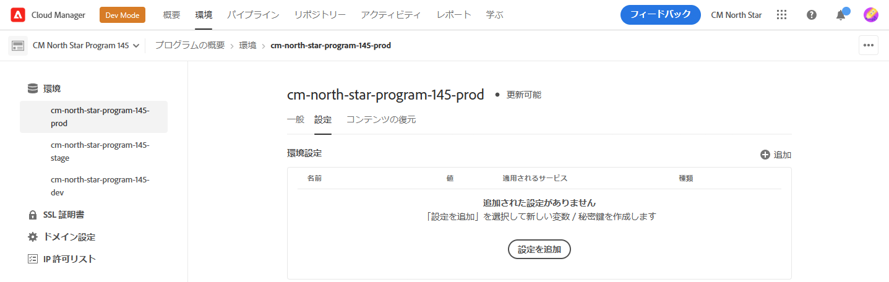
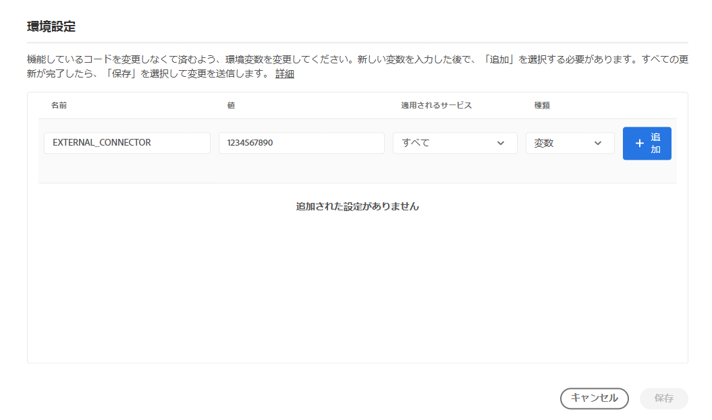
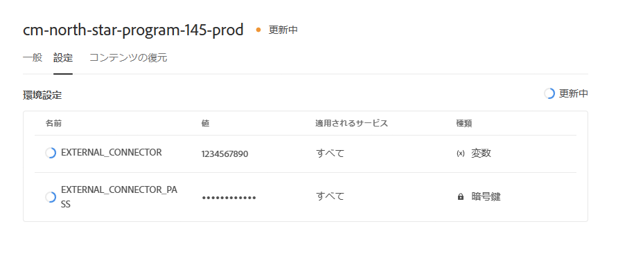
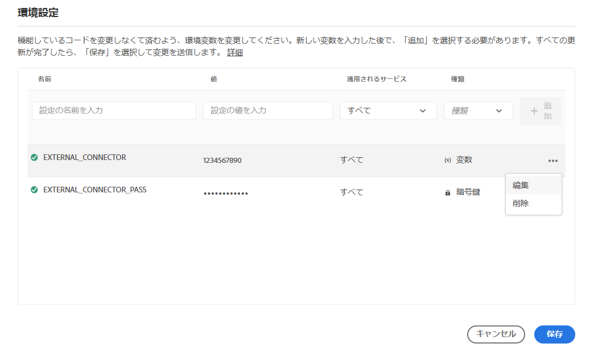
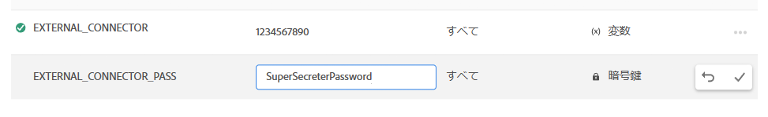

# Cloud Manager の環境変数 {#environment-variables}

標準環境変数は、Cloud Manager を介して設定および管理できます。 これらは実行時環境に提供され、OSGi 設定で使用できます。

環境変数には、変更内容に応じて、環境固有の値または環境シークレットのいずれかを指定できます。

## 環境変数について {#overview}

環境変数は、AEM as a Cloud Service ユーザーに次のようなメリットをもたらします。

* コードやアプリケーションの動作を、コンテキストや環境に応じて変化させることができます。 例えば、本番環境やステージング環境とは異なる設定を開発環境で有効にして、コストのかかるミスを避けることができます。
* 設定と設定は一度おこなうだけで、必要に応じて更新や削除が可能です。
* 値はいつでも更新でき、コードの変更やデプロイを必要とせずに即座に有効になります。
* 設定からコードを分離でき、バージョン管理に機密情報を含める必要がありません。
* コードベースの外部に存在するため、AEM as a Cloud Service アプリケーションのセキュリティが向上します。

環境変数を使用した一般的なユースケースを次に示します。

* AEM アプリケーションを様々な外部エンドポイントと接続する。
* パスワードをコードベースに直接保存する代わりに、パスワードを保存する際に参照を使用する。
* プログラムには複数の開発環境が存在し、一部の設定は環境ごとに異なります。

## 環境変数の追加 {#add-variables}

複数の変数を追加する場合、アドビでは、最初の変数を追加してから、**環境設定**&#x200B;ダイアログの  「**追加**」を使用してその他の変数を追加することをお勧めします。 この方法では、1回の環境アップデートで追加できます。

環境変数を追加、更新、または削除するには、[ デプロイメントマネージャーの役割](/help/onboarding/cloud-manager-introduction.md#role-based-premissions)のメンバーである必要があります。

**環境変数を追加するには：**

1. [my.cloudmanager.adobe.com](https://my.cloudmanager.adobe.com/) で Cloud Manager にログインし、適切な組織を選択します。
1. **[マイプログラム](/help/implementing/cloud-manager/navigation.md#my-programs)**&#x200B;コンソールで、管理する項目を選択します。
1. サイドメニューで、「**環境**」をクリックします。
1. **環境**&#x200B;ページで、環境変数を追加する環境が含まれるテーブルの行を選択します。
1. 環境の詳細ページで、「**設定**」タブをクリックします。
1.  **追加/更新**をクリックします。
環境変数を初めて追加する場合は、ページの中央にある「**設定を追加**」をクリックします。

   

1. **環境設定**&#x200B;ダイアログボックスで、テーブルの最初の行に詳細を入力します。

   | フィールド | 説明 |
   | --- | --- |
   | 名前 | 設定変数の一意の名前です。 環境で使用される特定の変数を識別します。 次の命名規則に従う必要があります。<ul><li>変数には、英数字とアンダースコア（`_`）のみ使用できます。</li><li>環境ごとに400個の変数の制限があります。</li><li>名前は 100 文字以下にする必要があります。</li></ul> |
   | 値 | 変数が保持する値です。 |
   | 適用されたステップ | 変数が適用されるサービスを選択します。 すべてのサービスに変数を適用するには、「**すべて**」を選択します。<ul><li>**すべて**</li><li>**作成者**</li><li>**公開**</li><li>**プレビュー**</li></ul> |
   | タイプ | 変数が通常か秘密鍵かを選択します。 |

   

1.  「**追加**」をクリックします。

   必要に応じて、変数を追加します。

1. 「**保存**」をクリックします。

   ステータスが&#x200B;**更新中**&#x200B;のスピナーがテーブルの右上隅に表示されます。 また、新しく追加した変数の左側にもスピナーが表示されます。 これらのステータスは、環境が設定によって更新されていることを示します。 完了すると、新しい環境変数が表に表示されます。

## 環境変数の更新 {#update-variables}

環境変数を作成したら、 「**追加／更新**」を使用して&#x200B;**環境設定**&#x200B;ダイアログボックスを開き、環境変数を更新できます。

複数の変数を更新する場合、アドビでは、**環境設定**&#x200B;ダイアログを使用して、必要なすべての変数を一度に更新してから、「**保存**」をクリックすることをお勧めします。 この方法では、環境アップデートを1回おこなうだけでアップデートできます。

**環境変数を更新するには：**

1. [my.cloudmanager.adobe.com](https://my.cloudmanager.adobe.com/) で Cloud Manager にログインし、適切な組織を選択します。
1. **[マイプログラム](/help/implementing/cloud-manager/navigation.md#my-programs)**&#x200B;コンソールで、管理する項目を選択します。
1. サイドメニューで、「**環境**」をクリックします。
1. **環境**&#x200B;ページで、環境変数を更新する環境が含まれるテーブルの行を選択します。
1. 環境の詳細ページで、「**設定**」タブをクリックします。
1.  「**追加／更新**」をクリックします。
1. **環境設定**&#x200B;ダイアログボックスで、変更する変数の行の最後の列にある  をクリックします。
1. ドロップダウンメニューで、「**編集**」をクリックします。

   

1. 必要に応じて、環境変数の値を更新します。
秘密鍵を編集する場合、値は更新のみで、表示できません。

   

1. 次のいずれかの操作を行います。

   *  をクリックして、変更を適用します。
   *  をクリックして、変更を取り消します。

1. 「**保存**」をクリックします。

   ステータスが&#x200B;**更新中**&#x200B;のスピナーがテーブルの右上隅に表示されます。 また、更新した変数の左側にもスピナーが表示されます。 これらのステータスは、環境が設定によって更新されていることを示します。 完了すると、更新された環境変数がテーブルに表示されます。

## 環境変数の削除 {#delete-env-variable}

1. [my.cloudmanager.adobe.com](https://my.cloudmanager.adobe.com/) で Cloud Manager にログインし、適切な組織を選択します。
1. **[マイプログラム](/help/implementing/cloud-manager/navigation.md#my-programs)**&#x200B;コンソールで、管理する項目を選択します。
1. サイドメニューで、「**環境**」をクリックします。
1. **環境**&#x200B;ページで、環境変数を更新する環境が含まれるテーブルの行を選択します。
1. 環境の詳細ページで、「**設定**」タブをクリックします。
1.  「**追加／更新**」をクリックします。
1. **環境設定**&#x200B;ダイアログボックスで、変更する変数の行の最後の列にある  をクリックします。
1. ドロップダウンメニューで、「**削除**」をクリックして変数をすぐに削除します。
1. 「**保存**」をクリックします。

## 環境変数の使用 {#using}

環境変数を使用すると、`pom.xml` 設定の安全性と柔軟性を高めることができます。 例えば、パスワードはハードコードされた値を必要とせず、設定は環境変数の値に適応できます。

XMLを通じて環境変数とシークレットにアクセスするには、次の手順を実行します。

`${env.VARIABLE_NAME}`

`pom.xml` ファイルで両方のタイプの変数を使用する方法の例については、[プロジェクトの設定](/help/implementing/cloud-manager/getting-access-to-aem-in-cloud/setting-up-project.md#password-protected-maven-repository-support-password-protected-maven-repositories)を参照してください。

また、詳しくは、[Maven の公式ドキュメント](https://maven.apache.org/settings.html#quick-overview)も参照してください。

## 環境変数の可用性 {#availability}

環境変数は、次のように複数の場所で使用できます。

| 環境変数を使用できる場所 | 説明 |
| --- | --- |
| オーサー、プレビュー、パブリッシュ | オーサー、プレビュー、パブリッシュの各環境では、通常の環境変数とシークレットの両方を使用できます。 |
| Dispatcher | [Dispatcher](https://experienceleague.adobe.com/ja/docs/experience-manager-dispatcher/using/dispatcher) で使用できるのは、通常の環境変数のみです。<ul><li>秘密鍵は使用できません。</li><li>環境変数は `IfDefine` ディレクティブでは使用できません。</li><li>デプロイする前に、[Dispatcher をローカルで](https://experienceleague.adobe.com/ja/docs/experience-manager-learn/cloud-service/local-development-environment-set-up/dispatcher-tools)使用して、環境変数の使用を検証します。</li></ul> |
| OSGi 設定 | [OSGi 設定](/help/implementing/deploying/configuring-osgi.md)では、通常の環境変数と秘密鍵の両方を使用できます。 |
| パイプライン変数 | 環境変数に加えて、ビルドフェーズで公開されるパイプライン変数もあります。 パイプライン変数について詳しくは、[ビルド環境](/help/implementing/cloud-manager/getting-access-to-aem-in-cloud/build-environment-details.md#pipeline-variables)を参照してください。 |

