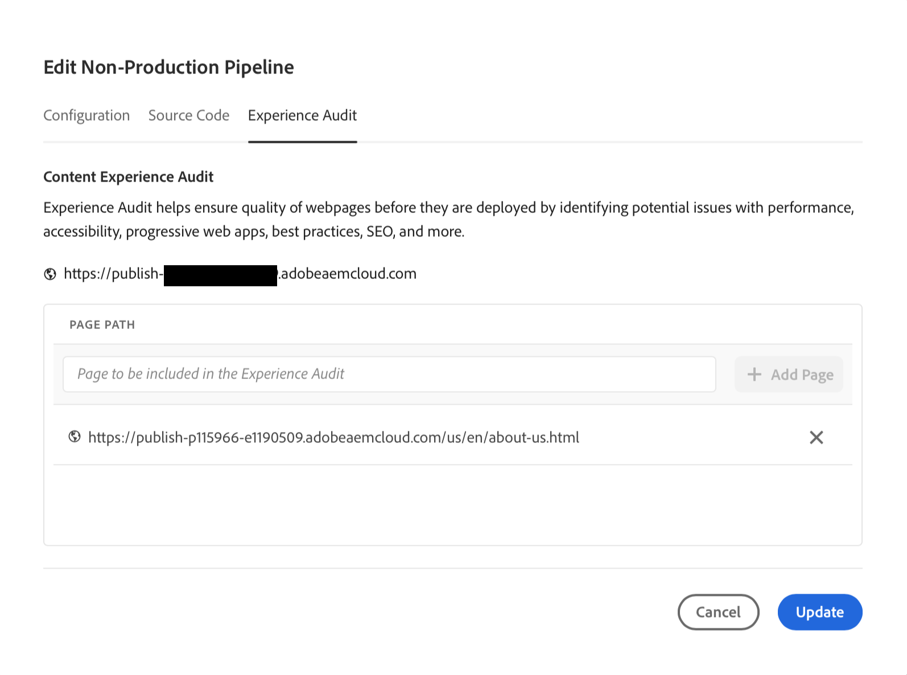
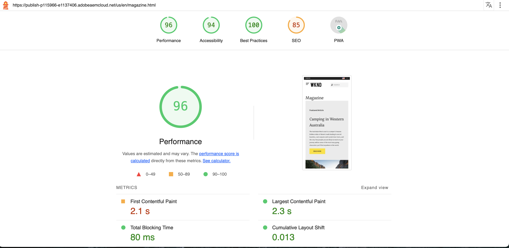

# エクスペリエンス監査ダッシュボード {#experience-audit-dashboard}

エクスペリエンス監査でデプロイメントプロセスを検証し、デプロイされた変更が、明確な情報ダッシュボードインターフェイスを通じて、パフォーマンス、アクセシビリティ、ベストプラクティス、SEO のベースライン標準を満たしていることを確認する方法について説明します。

>[!NOTE]
>
>この機能は、[早期導入プログラム](/help/implementing/cloud-manager/release-notes/current.md#early-adoption)でのみ利用できます。
>
>AEM as a Cloud Service の既存のエクスペリエンス監査機能について詳しくは、[エクスペリエンス監査テスト](/help/implementing/cloud-manager/experience-audit-testing.md)のドキュメントを参照してください。

## 概要 {#overview}

エクスペリエンス監査により、デプロイメントプロセスが検証され、次の変更がデプロイされていることを確認できます。

1. パフォーマンス、アクセシビリティ、ベストプラクティス、SEO（検索エンジン最適化）、PWA（プログレッシブ Web アプリ）のベースライン標準規格を満たす。

1. リグレッションを導入しない。

Cloud Manager のエクスペリエンス監査を使用すると、サイト上でのユーザーのエクスペリエンスが最も高い標準に準拠します。

監査結果は参考情報であり、デプロイメントマネージャーはスコアと、現在および以前のスコアとの間の変化を確認できます。このインサイトは、現在のデプロイメントで前のバージョンになかった不具合が導入されたかどうかを判断するのに役立ちます。

エクスペリエンス監査は、Google のオープンソースツールである [Google Lighthouse](https://developer.chrome.com/docs/lighthouse/overview/) を活用し、すべての Cloud Manager 実稼動パイプラインで有効になります。

## 可用性 {#availability}

エクスペリエンス監査は、Cloud Manager で使用できます。

* Sites 実稼動パイプライン（デフォルト）
* 開発フルスタックパイプライン（オプション）
* 開発フロントエンドパイプライン（オプション）

オプション環境の監査を設定する方法について詳しくは、[設定の節](#configuration)を参照してください。

監査はパイプラインの一部として実行されます。また、監査はパイプラインの外で[オンデマンドで実行](#on-demand)することもできます。

## 設定 {#configuration}

実稼動パイプラインでは、エクスペリエンス監査をデフォルトで使用できます。開発フルスタックおよびフロントエンドパイプラインに対して、オプションで有効にすることができます。どのような場合でも、パイプラインの実行中に評価されるコンテンツパスを定義する必要があります。

1. 設定するパイプラインのタイプに応じて、次の手順に従います。

   * 監査で評価されるパスを定義する場合は、新しい[実稼動パイプライン](/help/implementing/cloud-manager/configuring-pipelines/configuring-production-pipelines.md)を追加します。
   * フロントエンドまたは開発フルスタックパイプラインで監査を有効にする場合は、新しい[実稼動以外のパイプライン](/help/implementing/cloud-manager/configuring-pipelines/configuring-non-production-pipelines.md)を追加します。
   * または、[既存のパイプラインを編集](/help/implementing/cloud-manager/configuring-pipelines/managing-pipelines.md)し、既存のオプションを更新することもできます。

1. エクスペリエンス監査を使用する実稼動以外のパイプラインを追加または編集している場合は、「**ソースコード**」タブの「**エクスペリエンス監査**」チェックボックスをオンにする必要があります。

   

   * これは、実稼動以外のパイプラインの場合にのみ必要です。
   * 「**エクスペリエンス監査**」タブは、チェックボックスが選択されていると表示されます。

1. 実稼動および実稼動以外の両方のパイプラインでは、「**エクスペリエンス監査**」タブでエクスペリエンス監査に含めるパスを定義します。

   * ページのパスは `/` で始める必要があり、サイトに対する相対パスです。
   * 例えば、サイトが `wknd.site` で、エクスペリエンス監査に `https://wknd.site/us/en/about-us.html` を含める場合は、`/us/en/about-us.html` というパスを入力します。

   

1. 「**ページを追加**」をタップまたはクリックすると、パスが使用中の環境のアドレスで自動的に補完され、パスのテーブルに追加されます。

   

1. 上記の 2 つの手順を繰り返して、必要なパスを追加します。

   * 最大 25 個のパスを追加できます。
   * パスを定義しない場合は、デフォルトでサイトのホームページがエクスペリエンス監査に含められます。

1. 「**保存**」をクリックしてパイプラインを保存します。

## エクスペリエンス監査結果 {#results}

エクスペリエンス監査の結果は、[実稼動パイプラインの実行ページ](/help/implementing/cloud-manager/deploy-code.md)を介した実稼動パイプラインの&#x200B;**ステージテスト**&#x200B;フェーズで表示されます。

エクスペリエンス監査では、[設定済みのページ](#configuration)の Google Lighthouse スコアの中央値と、前回のスキャンとのスコアの差を提供します。

パイプラインの&#x200B;**ステージテスト**&#x200B;フェーズのこの概要ビューには、次の 2 つのオプションがあります。

* **[最も低速のページを表示](#view-slowest-pages)**
* **[フルレポートを表示](#view-full-report)**

パイプライン実行の詳細に表示される概要に加えて、Cloud Manager ダッシュボードの「**レポート**」タブを使用して[フルレポート](#view-full-report)に直接アクセスし、監査の完全な結果に直接アクセスすることもできます。

>[!TIP]
>
>次の節では、エクスペリエンス監査の結果を表示する方法について説明します。
>
>* 監査の仕組みについて詳しくは、[エクスペリエンス監査評価の詳細](#details)の節を参照してください。
>* オンデマンドでエクスペリエンス監査を実行する方法について詳しくは、[オンデマンド監査レポート](#on-demand)の節を参照してください。
>* エクスペリエンス監査で問題が発生した場合は、[エクスペリエンス監査で発生した問題](#issues)の節を参照してください。
>* 一般的なパフォーマンスに関するヒントについては、[一般的なパフォーマンスに関するヒント](#performance-tips)の節を参照してください。

### 最も低速のページを表示 {#view-slowest-pages}

「**最も低速のページを表示**」をタップまたはクリックすると、**最も低速の 5 ページ**&#x200B;ダイアログが開き、[監査するように設定](#configuration)したパフォーマンスのうち、最も低速の 5 ページが表示されます。

スコアは、**パフォーマンス**、**アクセシビリティ**、**ベストプラクティス**、**SEO** 別に分類され、前回の監査からの各指標の偏差も表示されます。

デフォルトでは、ダイアログが開き、モバイルデバイスのスコアが表示されます。これは、ダイアログの上部にある&#x200B;**デバイス**&#x200B;切替スイッチを使用して、デスクトップスコアに変更できます。

このダイアログは、概要を簡単に理解することを目的としています。詳しくは、「**フルレポートを表示**」をタップまたはクリックします。

### フルレポートを表示 {#view-full-report}

エクスペリエンス監査のフルレポートは、次の方法で表示できます。

* **[最も低速の 5 ページ](#view-slowest-pages)**&#x200B;ダイアログで「**フルレポートを表示**」をタップまたはクリックします。
* [パイプラインの実行](#results)を表示する際に、「**フルレポートを表示**」をタップまたはクリックします。
* Cloud Manager の「**レポート**」タブをタップまたはクリックします。

Cloud Manager の「**レポート**」タブが開き、**エクスペリエンス監査**&#x200B;が表示されます。

レポートは 2 つの領域に分割されています。

* **[ページスコア - トレンド](#trend)**
* **[エクスペリエンス監査スキャン結果](#results)**

#### ページスコア - トレンド {#trend}

デフォルトでは、**ページスコア - トレンド**&#x200B;の選択されたビューは、**過去 6 か月**&#x200B;の&#x200B;**中央値スコア**&#x200B;です。

グラフボタンの上部と下部にある&#x200B;**選択**&#x200B;および&#x200B;**表示**&#x200B;ドロップダウンを使用して、ページ固有の詳細と異なる時間枠をそれぞれ選択します。グラフの上部にある「**トレンドを更新**」ボタンをタップまたはクリックして、選択内容を適用し、グラフを更新します。

グラフ上でマウスを移動すると、特定の時点での Google Lighthouse カテゴリの値がツールヒントに表示されます。

特定の時点でチャートをタップまたはクリックすると、ポップオーバーが開き、そのスキャンの詳細が表示されます。**開いているエクスペリエンス監査スキャン**&#x200B;をタップまたはクリックしすると、そのスキャン結果が「**[エクスペリエンス監査スキャン結果](#scan-results)**」セクションに読み込まれます。

#### エクスペリエンス監査スキャン結果 {#scan-results}

「**エクスペリエンス監査スキャン結果**」セクションには、スコアを向上させる方法と、スキャンされたすべてのページの詳細に関するレコメンデーションが表示されます。これは 2 つのセクションに分割されています。

* **[レコメンデーション](#recommendations)**
* **[スキャンされたページ](#scanned-pages)**

##### レコメンデーション {#recommendations}

「**レコメンデーション**」セクションには、一連のインサイトの集計が表示されます。デフォルトでは、**パフォーマンス**&#x200B;に関するレコメンデーションが表示されます。別のカテゴリに変更するには、**レコメンデーション**&#x200B;見出しの横にあるドロップダウンを使用します。

レコメンデーションの山形をタップまたはクリックすると、その詳細が表示されます。

使用可能な場合、展開されたレコメンデーションの詳細には、最も影響力のある変更に焦点を当てるのに役立つように、レコメンデーションの影響の割合も含まれます。

詳細表示で「**ページを表示**」リンクをタップまたはクリックして、レコメンデーションが適用されるページを表示します。

##### スキャンされたページ {#scanned-pages}

「**スキャンされたページ**」セクションには、スキャンされたすべてのページの詳細スコアが表示されます。「**前へ**」ボタンと「**次へ**」ボタンを使用して結果をページ移動し、表示のページ番号を選択できます。

特定のページのリンクをタップまたはクリックすると、「[**ページスコア - トレンド**」セクション](#trend)の「**選択**」フィルターが更新され、選択したページの「**スコアとレコメンデーション**」タブが表示されます。

「**生レポート**」タブには、ページのすべての監査のスコアが表示されます。**ダウンロード**&#x200B;アイコンをタップまたはクリックして、生データの JSON ファイルを取得します。

これにより、ブラウザーで新しいタブが開き、選択したページの Lighthouse の生の JavaScript Object Notation（JSON）レポートの署名付き URL を含む `https://googlechrome.github.io/lighthouse/viewer/` が示されます。このタブは、詳細な検査のために自動的に開きます。

## オンデマンド監査レポート {#on-demand}

エクスペリエンス監査レポートは、パイプラインの実行中に実行されるだけでなく、オンデマンドで生成することもできます。これは、パイプラインを実行せずにページを素早くスキャンするための優れたソリューションです。

オンデマンドスキャンを実行するには、「**レポート**」タブに移動して完全な監査レポートを表示し、「**スキャンを実行**」ボタンをタップまたはクリックします。

オンデマンドスキャンは、最新の 25 の[設定済みページ](#configuration)のエクスペリエンス監査をトリガーし、通常は数分で終了します。

完了すると、スコアグラフが自動的に更新され、パイプライン実行スキャンと同様に結果を正確に検査できます。

**トリガー**&#x200B;セレクターを使用すると、トリガータイプに基づいてスコアグラフをフィルタリングできます。

>[!NOTE]
>
>オンデマンドスキャンは、環境が削除されておらず、同じ環境上に他の保留中のスキャンがない場合にのみ開始できます。

## エクスペリエンス監査で発生した問題 {#issues}

監査対象に[設定済みのページ](#configuration)が使用できない場合、エクスペリエンス監査で反映されます。

パイプラインには、アクセスできなかった相対 URL パスを表示するための展開可能なエラーセクションが表示されます。

フルレポートを表示すると、「**[エクスペリエンス監査スキャン結果](#results)**」セクションに詳細が表示されます。

ページが使用できない理由は、次のとおりです。

* 設定により、アクセスがブロックされる。
* ページが存在しない。
* ページにより、基本認証以外の認証を必要とするリダイレクトが行われる。
* 内部的な問題が発生した。
* 等。

>[!TIP]
>
>ページの[生レポートにアクセス](#scanned-pages)すると、ページが監査できなかった理由の詳細を示すことができます。

## 一般的なパフォーマンスに関するヒント {#performance-tips}

簡単に修正できる最も一般的な影響力のある問題のうち 2 つは、Cumulative Layout Shifts（CLS）と Largest Contentful Paint（LCP）に関連しています。

これらは、次の方法で改善できます。

* スクロールしないと見えない範囲にある画像（下にスクロールしなくてもブラウザーに表示されるコンテンツ）を遅延読み込みしない。
* リソースの読み込み方法に適切な優先度を付ける（例えば、ドキュメントを読み込んだ後に、スクロールしないと見えない範囲にある画像を非同期的に読み込むなど）。
* スクロールしないと見えない範囲にコンテンツをレンダリングするために使用される JavaScript および CSS ファイルをプリフェッチする（必要な場合）。
* 読み込みが遅いコンテナや後でレンダリングされるコンテナに縦横比を割り当てることで、垂直方向のスペースを確保する。
* 画像を WebP 形式に変換してサイズを削減する。
* `<picture>` と画像 `srcset` を使用して、ビューポートサイズごとに様々な画像サイズを指定する（およびサイズ変更が機能することを確認する）。

## エクスペリエンス監査評価の詳細 {#details}

次に、エクスペリエンス監査でのサイトの評価方法に関する追加情報を示します。これらは、機能の一般的な使用には必要ではなく、完全を期すためにここに提供されます。

* [設定済みのエクスペリエンス監査ページのパス](#configuration)には発行者の `.com` ドメインが表示されますが、監査では接触チャネルの（`.net`）ドメインがスキャンされ、開発中に発生した問題が確実に検出されます。
   * `.com` ドメインは CDN を使用しているので、より良いスコアが得られたり、キャッシュされた結果が含まれたりする可能性があります。
* 実稼動のフルスタックパイプラインでは、ステージング環境がスキャンされます。
   * 監査中に関連する詳細が監査で提供されるようにするには、ステージング環境のコンテンツを実稼動環境にできる限り近づける必要があります。
* 「[**ページスコア - トレンド**」セクション](#trend)の&#x200B;**選択**&#x200B;ドロップダウンに表示されるページは、すべてエクスペリエンス監査によって過去にスキャンされた既知のページです。
* [レコメンデーション](#recommendations)には、前回のスキャンからの潜在的なゲインと差異が含まれる場合があります。
   * エクスペリエンス監査では、各ページの生レポートを処理し、無駄になったバイト数またはミリ秒を、パフォーマンススコアに重み付けされた影響を与えるインサイトと関連付けることで、潜在的なゲインを推定します。
   * 監査では、追跡するレコメンデーションを決定するために、この情報（および影響を受けるページ）が提供されます。
   * 詳しくは、[一般的なパフォーマンスに関するヒント](#performance-tips)の節を参照してください
* フロントエンドパイプラインが既存の環境にデプロイされる可能性がある（または同じ環境をターゲティングする複数のフロントエンドパイプラインが存在する可能性がある）とすると、スキャン結果は環境レベルで集計され、スキャンをトリガーしたパイプライン実行に関係なく、スコア、トレンド、レコメンデーションが同じ選択した環境に表示されます。
