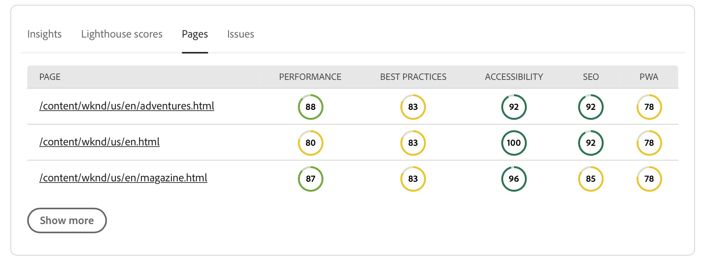
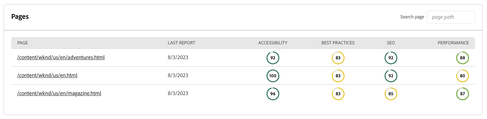

# エクスペリエンス監査ダッシュボード {#experience-audit-dashboard}

Experience Audit がデプロイメントプロセスを検証する方法、およびデプロイ済みの変更が、明確でわかりやすいダッシュボードインターフェイスを通じて、パフォーマンス、アクセシビリティ、ベストプラクティス、SEO の基準を満たしていることを確認する方法について説明します。

>[!NOTE]
>
>この機能は、次の場合にのみ使用できます。 [アーリーアダプタープログラム。](/help/implementing/cloud-manager/release-notes/current.md#early-adoption)
>
>AEM as a Cloud Serviceの既存のエクスペリエンス監査機能について詳しくは、 [エクスペリエンス監査テスト](/help/implementing/cloud-manager/experience-audit-testing.md).

## 概要 {#overview}

エクスペリエンス監査はCloud Manager Sites 実稼動パイプラインで使用できる機能であり、デプロイメントプロセスを検証し、デプロイされた変更が次を満たしていることを確認できます。

1. パフォーマンス、アクセシビリティ、ベストプラクティス、SEO（検索エンジン最適化）、PWA（プログレッシブ Web アプリ）のベースライン標準規格を満たす。

1. リグレッションを導入しない。

Cloud Manager のエクスペリエンス監査を使用すると、サイト上でのエンドユーザーのエクスペリエンスが最も高い標準に準拠します。

監査結果は参考情報であり、デプロイメントマネージャーはスコアおよび現在のスコアと以前のスコアの変化を確認できます。このインサイトは、現在のデプロイメントで前のバージョンになかった不具合が導入されたかどうかを判断するのに役立ちます。

エクスペリエンス監査は次の機能を利用します。 [Google Lighthouse](https://developer.chrome.com/docs/lighthouse/overview/):Googleのオープンソースツールで、すべての Cloud Manager 実稼働パイプラインで有効になっています。

>[!TIP]
>
>[パイプラインを設定するときに](/help/implementing/cloud-manager/configuring-pipelines/configuring-production-pipelines.md#full-stack-code)、エクスペリエンス監査に含めるページを設定します。

## Experience Audit ダッシュボード {#dashboard}

エクスペリエンス監査の結果は、 **ステージテスト** を介した実稼動パイプラインのフェーズ [実稼動パイプラインの実行ページ](/help/implementing/cloud-manager/deploy-code.md).

エクスペリエンス監査は、次の 4 つのタブに要約された集計と詳細なページレベルのテスト結果を提供します。

* **[インサイト](#insights)** サイトのパフォーマンスを向上させるための実用的なレコメンデーションの簡単な説明を提供します。
* **[Lighthouse スコア](#lighthouse)** は、このパイプライン実行にデプロイされたコードの Lighthouse スコアの概要です。
* **[ページ](#pages)** は、特に分析対象として設定されたページのパフォーマンスの概要です。
* **[問題](#issues)** は、このパイプライン実行のコードで検出されたパフォーマンスの問題の概要を示します。

### インサイト {#insights}

The **インサイト** 「 」タブでは、サイトのパフォーマンスを向上させるための実用的なレコメンデーションの簡単な説明を提供します。

を選択します。 **表示を増やす** ボタンをクリックして、完全なダッシュボードを開きます。

Adobe Analytics の **インサイトとレコメンデーション** 「 」セクションでは、アクションにつながるレコメンデーションの詳細なリストと、パフォーマンスで予想されるゲインに結び付けられた明確な値インジケーター、およびページの影響を受けた割合を示します。 これにより、チームに対してこれらのレコメンデーションを簡単に優先順位付けできます。

実稼動パイプラインの実行ページに戻るには、ブラウザーで戻る矢印を選択します。

### Lighthouse スコア {#lighthouse}

The **Lighthouse スコア** 「 」タブは、このパイプライン実行にデプロイされたコードの Lighthouse スコアの概要です。

を選択します。 **表示を増やす** ボタンをクリックして、完全なダッシュボードを開きます。

Adobe Analytics の **Lighthouse スコア** 「 」セクションには、様々なスコアのトレンド表示が表示されます。 選択 **パフォーマンス**, **アクセシビリティ**, **PWA**&#x200B;または **SEO** をクリックして、これらの値の月別トレンド表示を確認します。

グラフの各ポイントは、対象月のすべてのデプロイメントの平均です。

実稼動パイプラインの実行ページに戻るには、ブラウザーで戻る矢印を選択します。

### ページ {#pages}

The **ページ** 「 」タブには、分析対象として具体的に設定したページのパフォーマンスの概要が表示されます。

を選択します。 **表示を増やす** ボタンをクリックして、完全なダッシュボードを開きます。

The **ページ** 「 」セクションには、テストされたページと、その最新の Lighthouse パフォーマンススコアおよび分類のリストが表示されます。

[パイプラインを設定するときに](/help/implementing/cloud-manager/configuring-pipelines/configuring-production-pipelines.md#full-stack-code)、エクスペリエンス監査に含めるページを設定します。

実稼動パイプラインの実行ページに戻るには、ブラウザーで戻る矢印を選択します。

### 問題 {#issues}

The **問題** 「 」タブには、このパイプライン実行のコードで検出されたパフォーマンスの問題の概要が表示されます。

を選択します。 **表示を増やす** ボタンをクリックして、完全なダッシュボードを開きます。

Adobe Analytics の **インサイトとレコメンデーション** 「 」セクションでは、アクションにつながるレコメンデーションの詳細リストと、パフォーマンスで予想されるゲインに結び付けられた明確な値のインジケーター、およびページの影響を受ける割合のリストを確認できます。 これにより、チームに対してこれらのレコメンデーションを簡単に優先順位付けできます。

実稼動パイプラインの実行ページに戻るには、ブラウザーで戻る矢印を選択します。

### ページの詳細 {#page-detail}

ページのリンクを **エクスペリエンス監査** 」セクション内、または **ページ** 「エクスペリエンス監査」ダッシュボードのセクションで、特定のページの詳細を確認できます。

特定のテストでの個々のページのスコアを、前回のテスト実行からの変化とともに確認できます。

個々のページの詳細をクリックすると、評価されたページの要素に関する情報が表示され、改善の余地が検出された場合は、問題の修正に関するガイダンスも示されます。

実稼動パイプラインの実行ページに戻るには、ブラウザーで戻る矢印を選択します。
