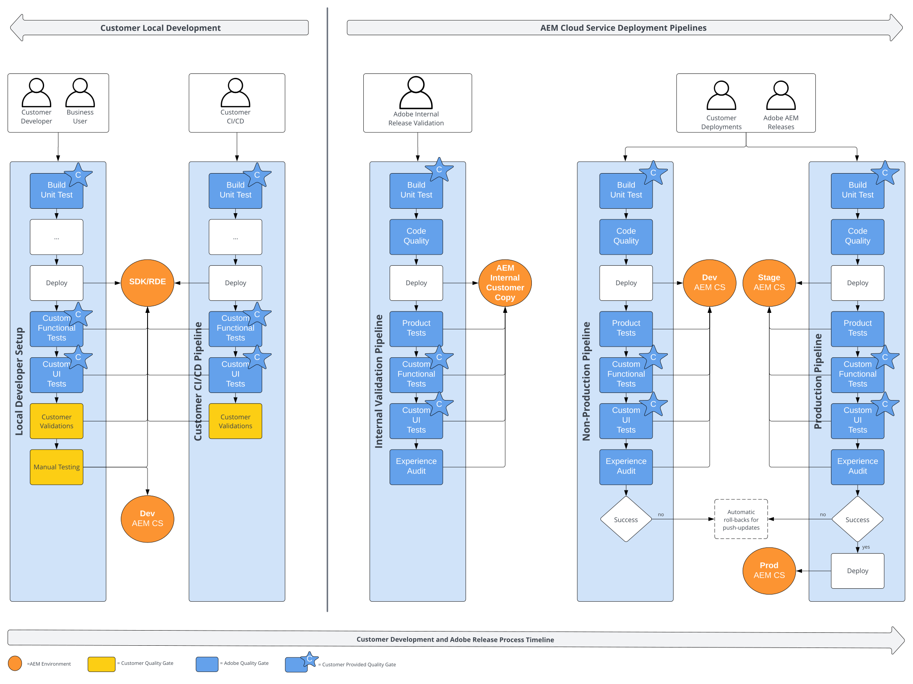

# はじめに {#functional-testing-introduction}

>[!CONTEXTUALHELP]
>id="aemcloud_nonbpa_functionaltesting"
>title="機能テスト"
>abstract="AEM as a Cloud Service デプロイメントプロセスに組み込まれている 3 種類の機能テストについて説明します。 テストにより、コードの品質と信頼性が確保されます。"

[AEM as a Cloud Service デプロイメントプロセス](/help/implementing/cloud-manager/deploy-code.md)で使用できる品質ゲートおよび様々なタイプのビルトインの機能テストについて説明します。包括的なテスト戦略のフレームワーク内で、どのように使用して、最適化できるかについて説明します。

## 機能テストについて

次の図は、テスト戦略全体のコンテキストで使用可能なパイプラインの概要と、[AEM as a Cloud Service デプロイメントプロセス](/help/implementing/cloud-manager/deploy-code.md)を示しています。

## 機能テストの目的

AEM Cloud Service デプロイメントパイプラインの目的は、開発および AEM 製品リリースのライフサイクルの様々な段階で、堅牢で安全なデプロイメントを容易にすることです。これらのパイプラインには、様々なレベルで複数の品質ゲートが組み込まれており、AEM アプリケーションの変更と AEM 製品のアップデートの両方に対するデプロイメントの整合性と安全性を確保できます。

アドビには、いくつかのビルトインの品質ゲートが用意されていますが、実装と設定に対してユーザーが介入する必要がある場合もあります。これらの品質ゲートは汎用性が高く、様々なライフサイクル段階で適用され、開発設定や CI/CD プロセスに直接統合されます。

ビルトインの品質ゲートでは、AEMアプリケーションのコンテキスト内でAEM製品の機能を主に検証します。一方、設定したカスタム品質ゲートは、アプリケーションの重要な機能とユーザーインタラクションが意図したとおりに実行されることを検証するように設計されています。これら 2 つの品質ゲートをまとめて連携させ、コードの変更と AEM 製品のアップデートの両方に対する堅牢で安全な自動デプロイメントを実現します。

これらの品質ゲートは、テスト戦略全体の包括的なテストフレームワークではないことに注意する必要があります。AEM 製品は、AEM Cloud Service のデプロイメントプロセスに入る前に、広範なテストが行われます。同様に、アプリケーションは、デプロイメントフェーズに達する前に、既に高品質である必要があります。このアプローチは、品質ゲートが完全なテスト計画の代わりとなるのではなく、デプロイメントプロセスを保護する主要目的に焦点を当てるようにします。

## テストの品質ゲート

次の図は、使用可能な品質ゲートの詳細図、テスト戦略全体でのその使用状況、および [AEM as a Cloud Service デプロイメントプロセス](/help/implementing/cloud-manager/deploy-code.md)を示します。

### 顧客が提供する品質ゲートの概要

|                               | 単体テスト | カスタム  機能テスト | カスタム  UI テスト | 顧客  検証 | 手動  テスト |
|:------------------------------|:---------------------:|:-----------------------------------:|:-----------------------------------:|:-------------------------:|:-------------------:|
| **実稼動パイプライン** | あり ブロック  | あり ブロック 60m タイムアウト | あり ブロック 30m タイムアウト | 不可 | 不可 |
| **実稼動以外のパイプライン** | あり ブロック  | オプトイン ブロック 60m タイムアウト | オプトイン ブロック 30m タイムアウト | 不可 | 不可 |
| **Adobe 内部検証** | あり ブロック  | あり ブロック 60m タイムアウト | あり ブロック 30m タイムアウト | 不可 | 不可 |
| **顧客の CI/CD** | はい | はい | はい | はい | はい |
| **顧客のローカル開発者** | はい | はい | はい | はい | はい |

### 単体テスト

すべてのテスト戦略の基盤となる、AEM アプリケーションの単体テストを実施することをお勧めします。このテストは、高速かつ頻繁な実行と早期の迅速なフィードバックの提供を目的としており、開発者ワークフロー、独自の CI/CD、AEM Cloud Service デプロイメントパイプラインに緊密に統合されています。

また、JUnit を使用して実装され、Maven で実行されます。AEM の単体テストの例と導入方法については、[AEM プロジェクトアーキタイプのコアモジュール](https://experienceleague.adobe.com/ja/docs/experience-manager-core-components/using/developing/archetype/using#unit-tests)を参照してください。

### コード品質

この品質ゲートは標準で設定され、AEM アプリケーションコードで静的コード分析を実行します。

詳しくは、[コード品質テスト](/help/implementing/cloud-manager/code-quality-testing.md)および[カスタムコード品質ルール](/help/implementing/cloud-manager/custom-code-quality-rules.md)を参照してください。

### 製品テスト

製品機能テストは、オーサリングタスクやレプリケーションタスクなど、AEM のコア機能に対する安定した HTTP 統合テスト（IT）です。アドビでは、これらを標準で提供、保守しています。これは、カスタムアプリケーションコードが AEM 製品のコア機能を破壊した場合に、カスタムアプリケーションコードに対する変更がデプロイされるのを防ぐためのものです。

実装には JUnit を使用し、Maven で実行され、公式の [AEM テストクライアント](https://github.com/adobe/aem-testing-clients)に依存します。製品テストスイートは
[オープンソースプロジェクト](https://github.com/adobe/aem-test-samples/tree/aem-cloud/smoke)として管理され、ベストプラクティスを採用しているので、テスト実装の出発点として適しています。

### カスタム機能テスト

製品テストと同様に、顧客の機能テストは HTTP 統合テスト（IT）です。これは、JUnit を使用して実装、Maven を使用して実行、および公式の [AEM テストクライアント](https://github.com/adobe/aem-testing-clients)上に構築されます。

>[!NOTE]
>
>カスタム機能テストは、AEM アプリケーションの変更デプロイメントと AEM 製品プッシュ更新によって使用される、実稼動パイプラインと実稼動以外（オプトイン）のパイプラインの両方で実行されます。これらは、アプリケーションが適切に機能することを保証し、リリースの安全性を高める上で重要な役割を果たします。顧客機能テストはそれぞれの内部プレリリース検証パイプラインで実行され、早期にフィードバックを得ることができます。

効率的なパイプラインの実行を維持するために、アドビは機能テストのランタイムを約 15 分以下にすることを目標にして、主な機能と主要なユーザーインタラクションフローに重点を置くことを推奨しています。今回を上回る完全な機能テストスイートは、開発プロセス中に一般的な顧客検証パイプラインの一部として実行する必要があります。

例については、[オープンソースの製品テスト](https://github.com/adobe/aem-test-samples/tree/aem-cloud/smoke)または [AEM プロジェクトアーキタイプの it.tests モジュール](https://github.com/adobe/aem-project-archetype/tree/develop/src/main/archetype/it.tests)を参照してください。

詳しくは、[Java 機能テスト](/help/implementing/cloud-manager/java-functional-testing.md)を参照してください。

### カスタム UI テスト

顧客固有の開発に対するリスク管理を最大限に高めるために、アドビでは重要な UI テストを AEM as a Cloud Service に取り込むことをお勧めします。それらを限定的に保持し、顧客体験への影響を最大化することに重点を置きます。

テストは Docker イメージでパッケージ化され、可能な限り変動するように設計されています（Cypress、Playwright、Selenium、Java および JavaScript のサポートを含む）。カスタム機能テストと同様に、同じ特性と目的に従います。

>[!NOTE]
>
>カスタム UI テストは、AEM アプリケーションの変更デプロイメントと AEM 製品プッシュ更新によって使用される、実稼動パイプラインと実稼動以外（オプトイン）のパイプラインの両方で実行されます。これらのテストは、アプリケーションが適切に機能することを保証し、リリースの安全性を高めるために不可欠です。また、顧客 UI テストは、各顧客の内部プレリリース検証パイプラインで実行され、早期にフィードバックを得るのに役立ちます。
>
>Selenium 以外のコンテナでは、[UI テストの節](/help/implementing/cloud-manager/ui-testing.md#custom-ui-testing)で示した環境変数に基づいて HTTP プロキシを使用してテストを実行する必要があります。

パイプラインの実行を効率化するために、アドビでは主な機能とユーザーのインタラクションフローに注力することをお勧めします。この品質ゲートを上回る完全な UI テストスイートは、一般的な顧客検証パイプラインの一部として実行する必要があります。それらを顧客の開発プロセスに組み込みます。

例として、[オープンソースのサンプルテスト](https://github.com/adobe/aem-test-samples/tree/aem-cloud/)または [AEMプロジェクトアーキタイプの ui.tests モジュール](/help/implementing/cloud-manager/ui-testing.md)を参照してください。

詳しくは、[カスタム UI テスト](/help/implementing/cloud-manager/ui-testing.md#custom-ui-testing)を参照してください。

### エクスペリエンス監査

エクスペリエンス監査品質ゲートが、顧客の web ページに対して [Google Lighthouse](https://developer.chrome.com/docs/lighthouse/overview/) 監査を実行中です。

この品質ゲートは、AEM の標準で提供されていますが、デプロイメントパイプラインをブロックしていません。デフォルトでは、パブリッシュインスタンスのルートページ（`/`）に対して監査が実行されます。監査対象と見なされる最大 25 個のカスタムパスを設定して貢献できます。

詳しくは、[エクスペリエンス監査テスト](/help/implementing/cloud-manager/reports/report-experience-audit.md)を参照してください。

### 顧客の検証

顧客検証の品質ゲートは、顧客独自のテスト戦略と作業のプレースホルダーです。このテスト戦略と作業は、顧客のアプリケーションの変更が AEM クラウドデプロイメントパイプラインに到達する前に実行されます。

ここでは、好みのツールとフレームワークを選択できます。顧客機能テストやカスタム UI テストとは異なり、AEM as a Cloud Service 関連の制限はありません。そのため、アドビでは、長期間実行する機能テストと UI テストをここで実行することをお勧めします。

どのツールやフレームワークでも選択できますが、アドビでは、HTTP ベースの統合テストと UI テストを、カスタム機能テストおよびカスタム UI テスト品質ゲートで使用されるツールとフレームワークと連携させることをお勧めします。さらに、アドビでは、AEM クラウド環境を厳密にミラーリングするために、[迅速な開発環境（RDE）](/help/implementing/developing/introduction/rapid-development-environments.md)をローカルのテスト戦略に組み込むことをお勧めします。

### 手動テスト

手動テストの品質ゲートは、手動テストを行うお客様向けのプレースホルダーです。AEM のクラウドパイプラインは手動でのテストをサポートしていないので、ローカルのテスト戦略に組み込む必要があります。

手動テストの場合、追加の AEM Cloud Service 開発環境と統合すると便利です。
