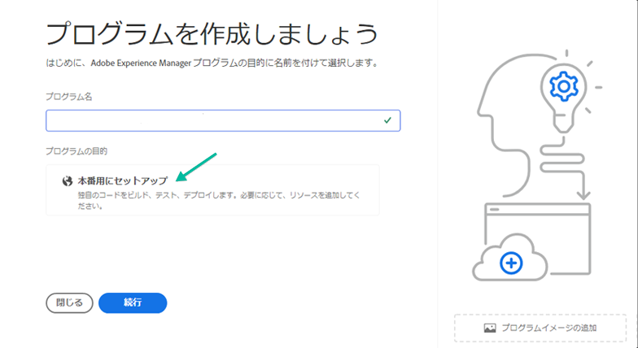
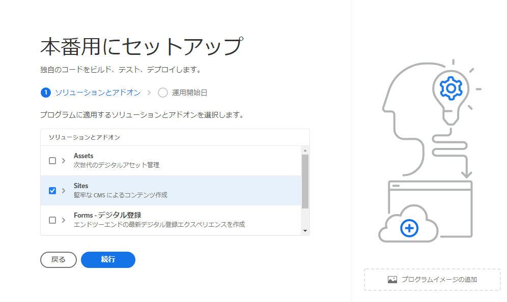

# 実稼働プログラムの作成 {#create-production-program}

実稼働プログラムは、AEMと Cloud Manager に詳しく、コードの記述、構築、テストを開始し、ライブトラフィックをホストするためにコードをデプロイする準備が整っているユーザーを対象としています。

プログラムの種類について詳しくは、ドキュメントを参照してください [プログラムとプログラムの種類について](program-types.md)

## ビデオTutorials {#video-tutorials}

Cloud Manager でのプログラムの作成方法を学ぶには、次の 2 つのチュートリアルビデオをご覧ください。 [ドキュメントに記載された手順に従います。](#create)

>[!VIDEO](https://video.tv.adobe.com/v/334953)

>[!VIDEO](https://video.tv.adobe.com/v/334954)

## 実稼動プログラムの作成 {#create}

実稼動プログラムを作成するには、次の手順に従います。

1. Cloud Manager( ) にログインします。 [my.cloudmanager.adobe.com](https://my.cloudmanager.adobe.com/) 適切な組織を選択します。

1. クリック **プログラムの追加** 画面の右上隅から。

   

1. 選択 **実稼動用に設定** （「プログラムの作成」ウィザード）をクリックし、実稼働用プログラムを作成します。 デフォルトのプログラム名を受け入れるか、選択前に編集することができます **作成**.

   

1. 次のタブで、プログラムに含めるソリューションを選択します。

   

1. ソリューション名の前の山形記号をクリックすると、「 **コマース** 以下のアドオンオプション **サイト**.

   

1. ソリューションとアドオンを選択した状態で、 **作成**.

プログラムは Cloud Manager で作成され、ランディングページに表示されて選択可能になります。

## プログラムにアクセス {#acessing}

1. ランディングページにプログラムカードが表示されたら、省略記号ボタンを選択して、使用可能なメニューオプションを表示します。

   

1. 選択 **プログラムの概要** Cloud Manager の **概要** ページ。

1. 概要ページのメインのコールトゥアクションカードでは、環境、非実稼動パイプライン、最後に実稼動パイプラインの作成手順をガイドします。

   

別のプログラムに切り替えたり、概要ページに戻って別のプログラムを作成する必要がある場合は、画面の左上にあるプログラム名をクリックすると、 **に移動します。** オプション。

 に移動します。

>[!NOTE]
>
>とは異なる [サンドボックスプログラム](introduction-sandbox-programs.md#auto-creation) 実稼動プログラムでは、適切な Cloud Manager の役割を持つユーザーがプロジェクトを作成し、セルフサービス UI を使用して環境を追加する必要があります。
