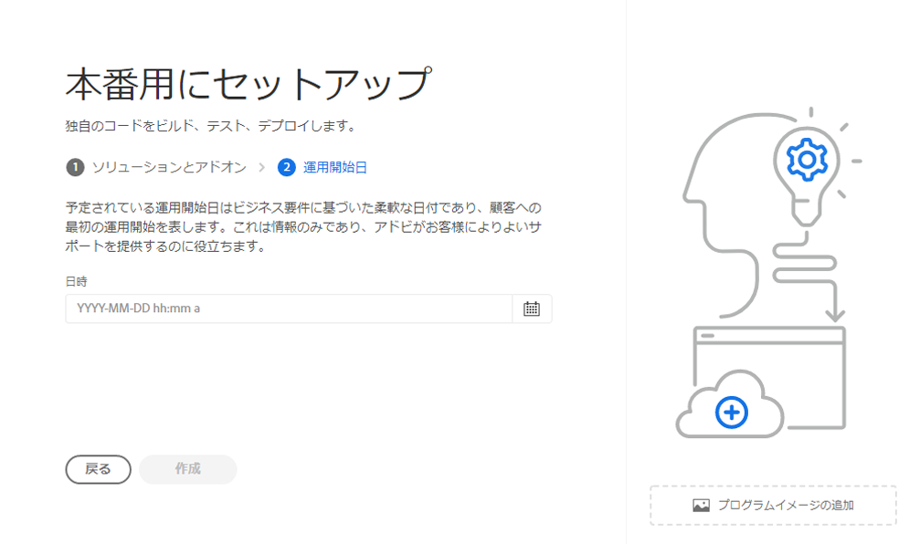

# 実稼動プログラムの作成 {#create-production-program}

実稼動プログラムの対象ユーザーは、AEM と Cloud Manager に精通し、ライブトラフィックをホストするためにコードをデプロイする目的でコードの作成、ビルドおよびテストを開始する準備が整っているユーザーです。

プログラムの種類について詳しくは、[プログラムとプログラムの種類について](program-types.md)のドキュメントを参照してください。

## 実稼動プログラムを作成する {#create}

実稼動プログラムを作成するには、次の手順に従います。お客様の組織の使用権限に応じて、プログラムを追加する際に[その他のオプション](#options)が表示される場合があります。

1. [my.cloudmanager.adobe.com](https://my.cloudmanager.adobe.com/) で Cloud Manager にログインし、適切な組織を選択します。

1. **[マイプログラム](/help/implementing/cloud-manager/getting-access-to-aem-in-cloud/editing-programs.md#my-programs)** 画面で、画面の右上隅にある&#x200B;**プログラムの追加**&#x200B;をタップまたはクリックします。

   

1. プログラムを作成ウィザードで「**実稼動用に設定**」を選択して、実稼動プログラムを作成し、プログラム名を指定します。

   

1. オプションとして、画像ファイルを&#x200B;**プログラム画像を追加**&#x200B;のターゲットにドラッグ＆ドロップするか、ファイルブラウザーからクリックして画像を選択することで、プログラムに画像を追加できます。「**続行**」を選択します。

1. 「**ソリューションとアドオン**」タブで、プログラムに含めるソリューションを選択します。

   * 利用可能な様々なソリューションに対して 1 つ以上のプログラムが必要かどうかが不明な場合は、最も興味のあるプログラムを選択します。後で[プログラムを編集](/help/implementing/cloud-manager/getting-access-to-aem-in-cloud/editing-programs.md)することで、追加のソリューションをアクティブ化することができます。プログラム設定の推奨事項について詳しくは、[実稼動プログラムの概要ドキュメント](/help/implementing/cloud-manager/getting-access-to-aem-in-cloud/introduction-production-programs.md)を参照してください。
   * プログラムを作成するには、少なくとも 1 つのソリューションが必要です。
   * 「**[セキュリティの強化を有効にする](#security)**」オプションを選択した場合は、HIPAA 資格が使用可能なソリューションのみを選択できます。

   

1. ソリューション名の前の山形記号をクリックすると、オプションのアドオンが表示されます。例えば、**Sites** で **Commerce** アドオンオプションを選択できます。

   

1. ソリューションやアドオンを選択してから、「**続行**」をクリックします。

1. 「**開始日**」タブで、実稼動プログラムの運用開始予定日を入力します。

   

   * この日付はいつでも編集できます。
   * この日付は情報提供のみを目的とし、[**プログラム概要**&#x200B;ページ ](/help/implementing/cloud-manager/getting-access-to-aem-in-cloud/editing-programs.md#program-overview) の運用開始ウィジェットをトリガーし、AEM as a Cloud Service のベストプラクティスドキュメントへの製品内リンクをタイムリーに提供して、運用開始エクスペリエンスの成功とスムーズ化を実現します。

1. 「**作成**」をクリックします。

プログラムが Cloud Manager により作成され、ランディングページに表示されて選択可能になります。

## その他の実稼動プログラムオプション {#options}

組織が使用できる使用権限に応じて、実稼動用プログラムの作成時に追加のオプションを使用できる場合があります。

### セキュリティ {#security}

必要な権限がある場合は、「**セキュリティ**」タブが&#x200B;**実稼動用に設定**&#x200B;ダイアログに最初のタブとして表示されます。

「**セキュリティ**」タブには、実稼動プログラム用の **HIPAA** または **WAF-DDOS 保護**&#x200B;をアクティブにするオプションが表示されます。

アドビの HIPAA 準拠の web アプリケーションファイアウォール（WAF）により、脆弱性から保護するための多層アプローチの一部としてクラウドベースのセキュリティが促進されます。

* **HIPAA** - このオプションは、アドビの HIPPA 対応ソリューションの実装を有効にします。
   * アドビの HIPAA 対応ソリューションの実装について詳しくは、[こちら](https://www.adobe.com/go/hipaa-ready)を参照してください。
   * プログラムの作成後に HIPAA を有効または無効にすることはできません。
* **WAF-DDOS 保護** - このオプションは、ルールを介した web アプリケーションファイアウォールで、アプリケーションを保護することを有効にします。
   * 有効化すると、WAF-DDOS 保護は、[実稼動以外のパイプライン](/help/implementing/cloud-manager/configuring-pipelines/configuring-non-production-pipelines.md)で設定できます。
   * リポジトリでフィックフィルタールールを管理し、適切にデプロイする方法については、[WAF ルールを含むトラフィックフィルタールール](/help/security/traffic-filter-rules-including-waf.md)を参照してください。

### SLA {#sla}

必要な権限がある場合は、「**SLA**」タブは、**実稼動用に設定**&#x200B;ダイアログで 2 番目か 3 番目のタブとして表示されます。

AEM Sitesは、標準の 99.9％のサービスレベル契約（SLA）を提供しています。「**99.99％のサービスレベル契約**」オプションを使用すると、実稼動環境で 99.99％の最小稼動時間の割合が有効になります。

99.99％の SLA には、可用性の向上や待ち時間の短縮を含むメリットがあり、プログラムの実稼動環境に[追加の公開地域](/help/implementing/cloud-manager/manage-environments.md#multiple-regions)を適用する必要があります。

99.99％の SLA を有効にするための[要件](#sla-requirements)が満たされたら、[フルスタックパイプライン](/help/implementing/cloud-manager/configuring-pipelines/configuring-production-pipelines.md)を実行してアクティベートする必要があります。

#### 99.99％の SLA の要件 {#sla-requirements}

99.99％の SLA には、必要な使用権限以外にも、使用に関する追加の要件があります。

* 99.99％の SLA をプログラムに適用する時点で、組織は 99.99％の SLA と追加の公開地域の使用権限の両方を使用できる必要があります。
* 99.99％の SLA をプログラムに適用するために、Cloud Manager では、未使用の[追加の公開地域](/help/implementing/cloud-manager/manage-environments.md#multiple-regions)の使用権限も使用可能であり、プログラムに適用できることを確認します。
* プログラムを編集する際、1 つ以上の追加の公開地域がある実稼動環境が既に含まれている場合、Cloud Manager では 99.99％の SLA 使用権限が使用可能かどうかのみを確認します。
* 99.99％の SLA とレポートをアクティベートするには、[実稼動環境／ステージ環境](/help/implementing/cloud-manager/manage-environments.md#adding-environments)が作成され、1 つ以上の追加の公開地域が実稼動環境／ステージ環境に適用されている必要があります。
   * [高度なネットワーク](/help/security/configuring-advanced-networking.md)を使用している場合は、地域に障害が発生した場合でも接続を維持するために、[新しい環境への複数の公開地域の追加](/help/implementing/cloud-manager/manage-environments.md#adding-regions)ドキュメントで推奨事項を必ず確認してください。
* 99.99％の SLA プログラムに 1 つ以上の追加の公開地域が維持する必要があります。ユーザーは、99.99％の SLA プログラムから最後の追加の公開地域を削除することは許可されていません。
* Sites ソリューションが有効になっている実稼動ププログラムでは、99.99％の SLA がサポートされます。
* 99.99％の SLA をアクティベートする（または、プログラム編集時にアクティベート解除する）には、[フルスタックパイプライン](/help/implementing/cloud-manager/configuring-pipelines/configuring-production-pipelines.md)を実行する必要があります。

## プログラムにアクセスする {#accessing}

1. ランディングページにプログラムカードが表示されたら、省略記号（...）ボタンを選択して、使用可能なメニューオプションを表示します。

   

1. 「**プログラムの概要**」を選択して、Cloud Manager の&#x200B;**概要**&#x200B;ページに移動します。

1. 概要ページのメインコールトゥアクションカードのガイドに従って、環境、実稼動以外のパイプライン、そして最終的に実稼動パイプラインを作成できます。

   

別のプログラムに切り替えたり、概要ページに戻って別のプログラムを作成したりする必要がある場合は、いつでも画面の左上のプログラム名をクリックして「**移動先**」オプションを表示します。

 に移動します。

>[!NOTE]
>
>[サンドボックスプログラム](introduction-sandbox-programs.md#auto-creation)とは異なり、実稼動プログラムでは、Cloud Manager の適切な役割を持つユーザーがセルフサービス UI を使用してプロジェクトを作成し環境を追加する必要があります。
