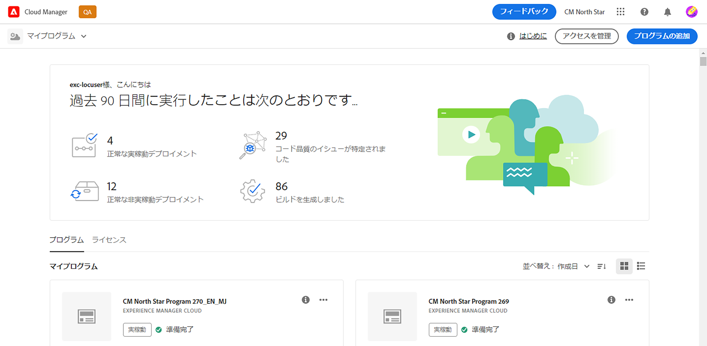
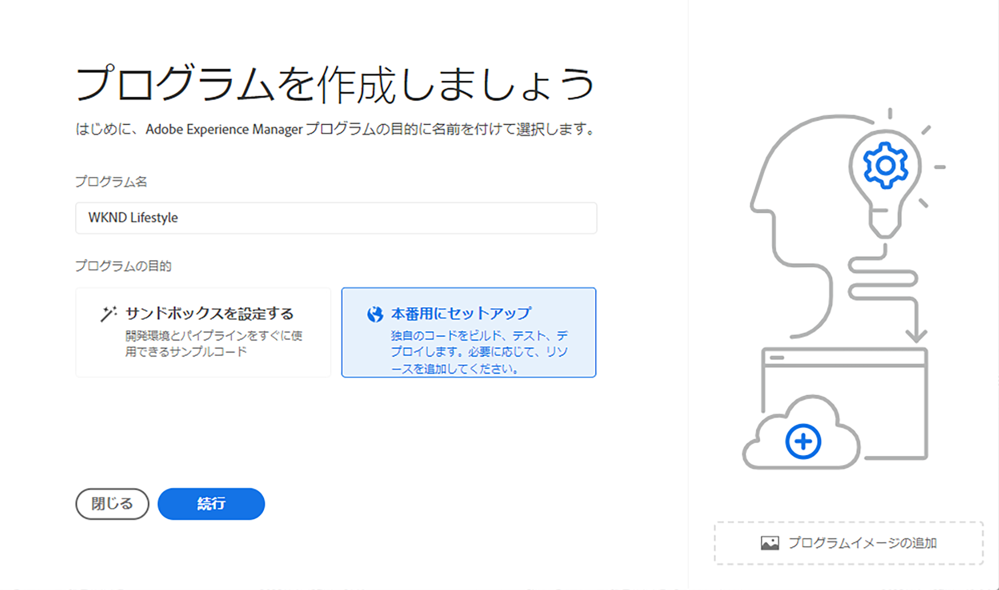
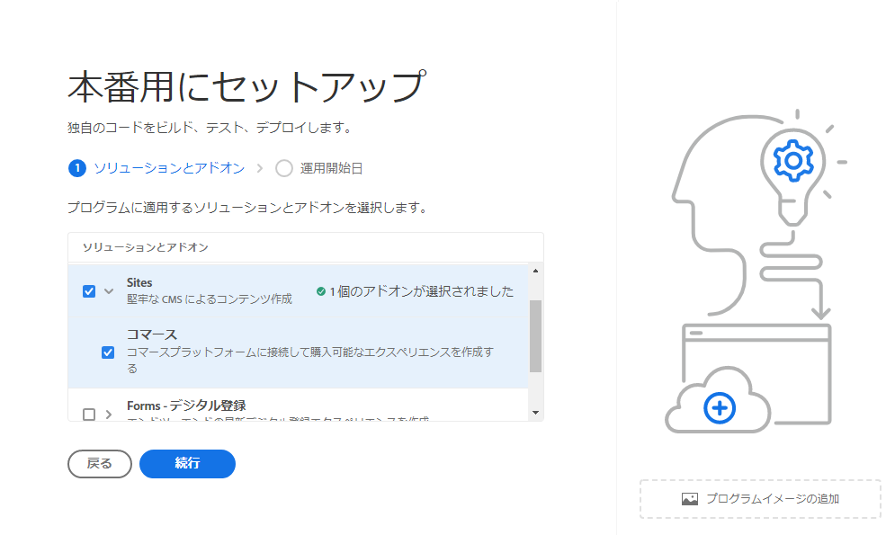
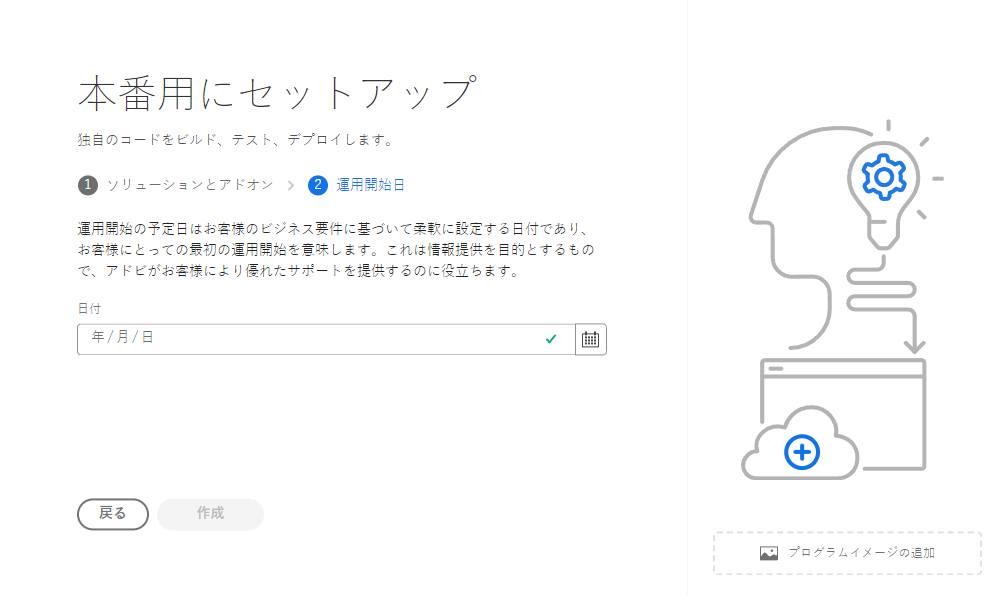
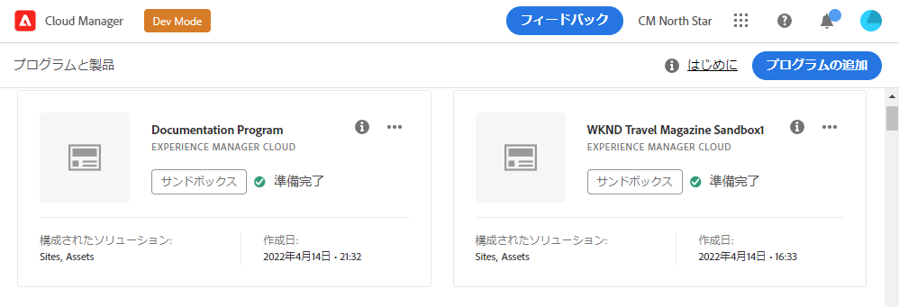
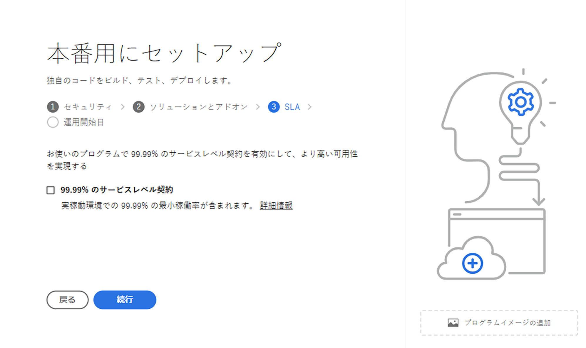
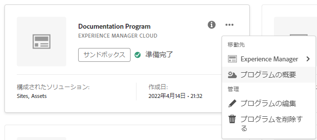
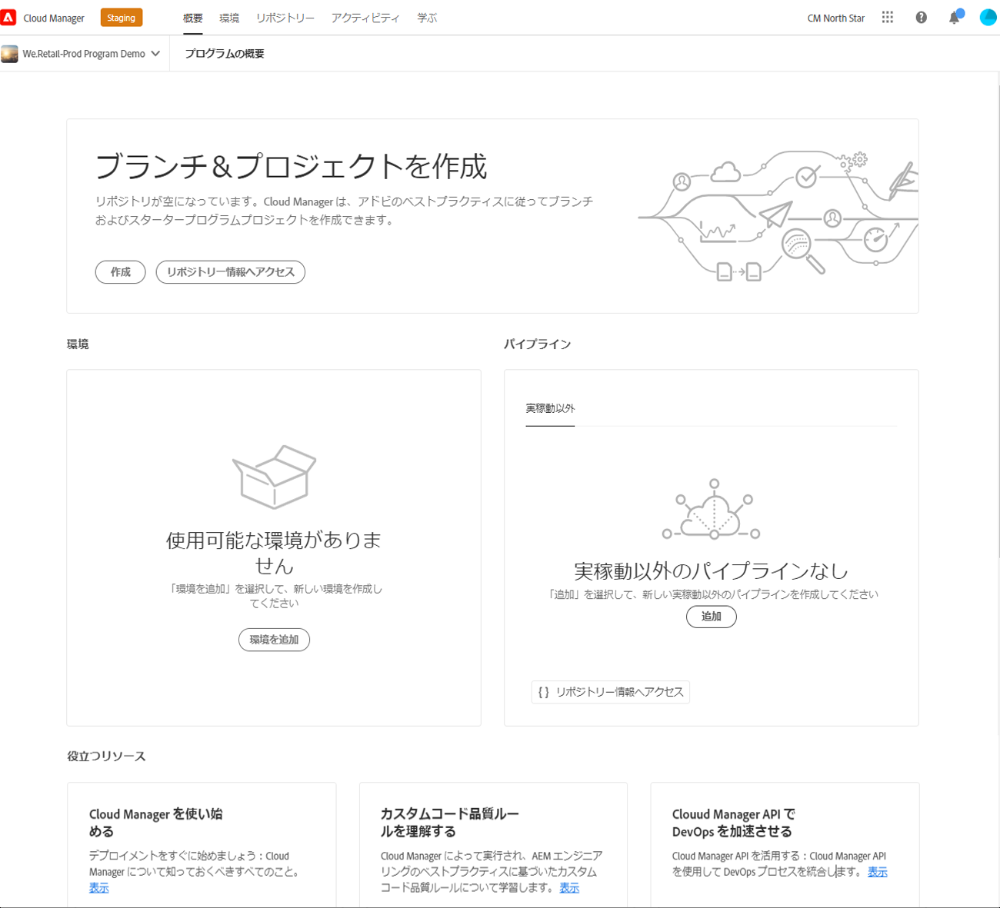

# 実稼動プログラムの作成 {#create-production-program}

実稼動プログラムは、Adobe Experience Manager（AEM）と Cloud Manager に精通し、ライブトラフィックの処理にコードをデプロイすることを目的として、コードの記述、ビルド、テストを行う準備ができているユーザーを対象としています。

プログラムタイプについて詳しくは、[プログラムとプログラムタイプについて](program-types.md)のドキュメントを参照してください。

## 実稼動プログラムの作成 {#create}

お客様の組織の使用権限に応じて、プログラムを追加する際にその他の実稼動プログラムオプションが表示される場合があります。詳しくは、[その他の実稼動プログラムオプション](#options)を参照してください。

**実稼動プログラムを作成するには：**

1. [my.cloudmanager.adobe.com](https://my.cloudmanager.adobe.com/) で Cloud Manager にログインし、適切な組織を選択します。

1. **[マイプログラム](/help/implementing/cloud-manager/navigation.md#my-programs)**&#x200B;コンソールの右上隅付近にある「**プログラムを追加**」をクリックします。

   

1. *プログラムを作成*&#x200B;ウィザードの&#x200B;**プログラム名**&#x200B;テキストフィールドに、プログラムの名前を入力します。

1. **プログラムの目的**&#x200B;の下で、「**実稼動用に設定**」を選択します。

   

1. （オプション）ウィザードダイアログボックスの右下隅で、次のいずれかの操作を行います。

   * 画像ファイルを  **プログラム画像を追加**&#x200B;ターゲットにドラッグ＆ドロップします。
   * 「**プログラム画像を追加**」をクリックし、ファイルブラウザーから画像を選択します。
   *  をクリックして、追加した画像を削除します。

1. 「**続行**」をクリックします。

1. **ソリューションとアドオン**&#x200B;リストボックスで、プログラムに含めるソリューションを 1 つ以上選択します。

   * 利用可能な様々なソリューションに対して 1 つ以上のプログラムが必要かどうかが不明な場合は、最も興味のあるプログラムを選択します。後で[プログラムを編集](/help/implementing/cloud-manager/getting-access-to-aem-in-cloud/editing-programs.md)することで、追加のソリューションをアクティブ化することができます。プログラム設定の推奨事項について詳しくは、[実稼動プログラムの概要ドキュメント](/help/implementing/cloud-manager/getting-access-to-aem-in-cloud/introduction-production-programs.md)を参照してください。
   * プログラムを作成するには、1 つ以上のソリューションを選択する必要があります。例えば、デジタルエクスペリエンスを最適化する完全に管理された CDN ソリューションとして **Edge Delivery Services** を選択できます。詳しくは、[Edge Delivery Services を使用した Cloud Manager プロジェクトの配信について](/help/implementing/cloud-manager/edge-delivery/introduction-to-edge-delivery-services.md)を参照してください。

   

   <!-- * If you selected the **[Enable Enhanced Security](#security)** option, you can select only as many solutions for which HIPAA entitlements are available. -->

   * ソリューション名の左側にある  をクリックして、オプションのアドオンを表示します。<!-- such as the **Commerce** add-on option under **Sites**. -->

   

1. ソリューションとアドオンの選択が完了したら、「**続行**」をクリックします。

1. 「**開始日**」タブで、実稼動プログラムの運用開始予定日を入力します。

   

   * この日付はいつでも編集できます。
   * この日付は、情報として役に立ち、[**プログラムの概要**&#x200B;ページ](/help/implementing/cloud-manager/getting-access-to-aem-in-cloud/editing-programs.md#program-overview)で運用開始ウィジェットをトリガーします。この機能は、AEM as a Cloud Service のベストプラクティスへのタイムリーな製品内リンクを提供して、スムーズな運用開始エクスペリエンスをサポートします。

1. 「**作成**」をクリックします。Cloud Manager によってプログラムが作成され、ランディングページに表示され、選択できるようになります。

   

## その他の実稼動プログラムオプション {#options}

組織が使用できる使用権限に応じて、実稼動プログラムの作成時に次の追加のオプションを使用できる場合があります。

### セキュリティ {#security}

必要な使用資格がある場合は、「**セキュリティ**」タブが **`Set up for production`** ダイアログボックスの最初のタブとして表示されます。

「**セキュリティ**」タブには、実稼動プログラム用の **HIPAA** か **WAF-DDOS 保護**&#x200B;のどちらか一方または両方をアクティブにするオプションが表示されます。

アドビの HIPAA 準拠の WAF-DDOS（web アプリケーションファイアウォール - 分散型サービス拒否）により、脆弱性から保護するための多層アプローチの一環としてクラウドベースのセキュリティが促進されます。

* **HIPAA** – このオプションを使用すると、Adobeの HIPAA 対応ソリューションを実装できます。
   * アドビの HIPAA 対応ソリューションの実装について詳しくは、[こちら](https://www.adobe.com/jp/trust/compliance/hipaa-ready.html)を参照してください。
   * プログラムの作成後に HIPAA を有効または無効にすることはできません。
* **WAF-DDOS 保護** - このオプションは、ルールを介して web アプリケーションファイアウォールを有効にし、アプリケーションを保護します。
   * 有効化されると、WAF-DDOS 保護は、[実稼動以外のパイプライン](/help/implementing/cloud-manager/configuring-pipelines/configuring-non-production-pipelines.md)で設定できます。
   * リポジトリでトラフィックフィルタールールを管理し、適切にデプロイする方法について詳しくは、[WAF ルールを含むトラフィックフィルタールール](/help/security/traffic-filter-rules-including-waf.md)を参照してください。

### SLA {#sla}

必要な権限がある場合は、「**SLA**」タブは、**`Set up for production`** ダイアログで 2 番目か 3 番目のタブとして表示されます。

Sites および Forms は、標準の 99.9％のサービスレベル契約（SLA）を提供しています。「**99.99％のサービスレベル契約**」オプションは、Sites、Forms、Edge Delivery Services または 3 つすべてに関して、本番環境で 99.99％の最小稼動時間を保証します。

99.99％の SLA には、可用性の向上や待ち時間の短縮を含むメリットがあります。

Sites と Forms のプログラムの場合、99.99％の SLA では、プログラムの本番環境に[追加の公開地域](/help/implementing/cloud-manager/manage-environments.md#multiple-regions)を適用する必要があります。99.99％の SLA を有効にする[要件](#sla-requirements)が満たされたら、[フルスタックパイプライン](/help/implementing/cloud-manager/configuring-pipelines/configuring-production-pipelines.md)を実行してアクティベートする必要があります。

Edge Delivery Services の場合、プログラムで 99.99％の SLA ライセンスを設定する以外に要件は&#x200B;*ありません*。

#### 99.99％の SLA の要件 {#sla-requirements}

必要な使用権限に加えて、Sites または Forms プログラムの 99.99％の SLA を使用するには、次の追加要件があります。

* 99.99％の SLA をプログラムに適用する際に、組織は 99.99％の SLA と追加の公開地域の使用権限を使用できる必要があります。
* Cloud Manager では、99.99％の SLA をプログラムに適用する前に、未使用の[追加の公開地域](/help/implementing/cloud-manager/manage-environments.md#multiple-regions)の使用権限が使用できることを確認します。
* プログラムを編集する際、1 つ以上の追加の公開地域がある本番環境が既に含まれている場合、Cloud Manager では 99.99％の SLA 使用権限が使用可能かどうかのみを確認します。
* 99.99％の SLA とレポートのアクティベーションの場合は、[実稼動環境／ステージ環境](/help/implementing/cloud-manager/manage-environments.md#adding-environments)が作成され、1 つ以上の追加の公開地域が実稼動環境／ステージ環境に適用されている必要があります。
   * [高度なネットワーク](/help/security/configuring-advanced-networking.md)を使用している場合は、地域に障害が発生した場合でも接続を維持できるように、[新しい環境への複数の公開地域の追加](/help/implementing/cloud-manager/manage-environments.md#adding-regions)ドキュメントで推奨事項を必ず確認してください。
* 99.99％の SLA プログラムには、常に 1 つ以上の公開地域を含める必要があります。ユーザーは、最後に残っている追加の公開地域をプログラムから削除することは許可されていません。
* Sites または Forms ソリューションが有効になっている実稼動プログラムでは、99.99％の SLA がサポートされます。
* 99.99％の SLA は、[フルスタックパイプライン](/help/implementing/cloud-manager/configuring-pipelines/configuring-production-pipelines.md)を実行してアクティベートするか、プログラム編集時にアクティベート解除します。

## プログラムへのアクセス {#accessing}

1. ランディングページにプログラムカードが表示されたら、 をクリックして、使用可能なメニューオプションを表示します。

   

1. 「**プログラムの概要**」を選択して、Cloud Manager の&#x200B;**概要**&#x200B;ページに移動します。

1. 概要ページにあるメインのコールトゥアクションカードのガイドに従って、環境、実稼動以外のパイプライン、そして最終的に実稼動パイプラインを作成できます。

   

>[!TIP]
>
>Cloud Manager の操作方法と&#x200B;**マイプログラム**&#x200B;コンソールについて詳しくは、[Cloud Manager UI の操作](/help/implementing/cloud-manager/navigation.md)を参照してください。

>[!NOTE]
>
>[サンドボックスプログラム](introduction-sandbox-programs.md#auto-creation)とは異なり、実稼動プログラムでは、Cloud Manager の適切な役割を持つユーザーがセルフサービス UI を使用してプロジェクトを作成し環境を追加する必要があります。

