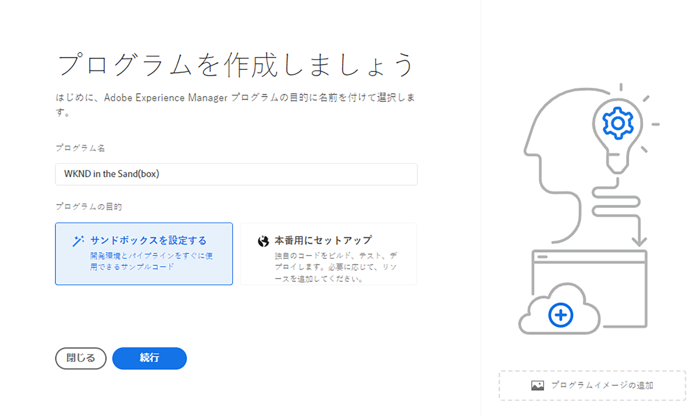
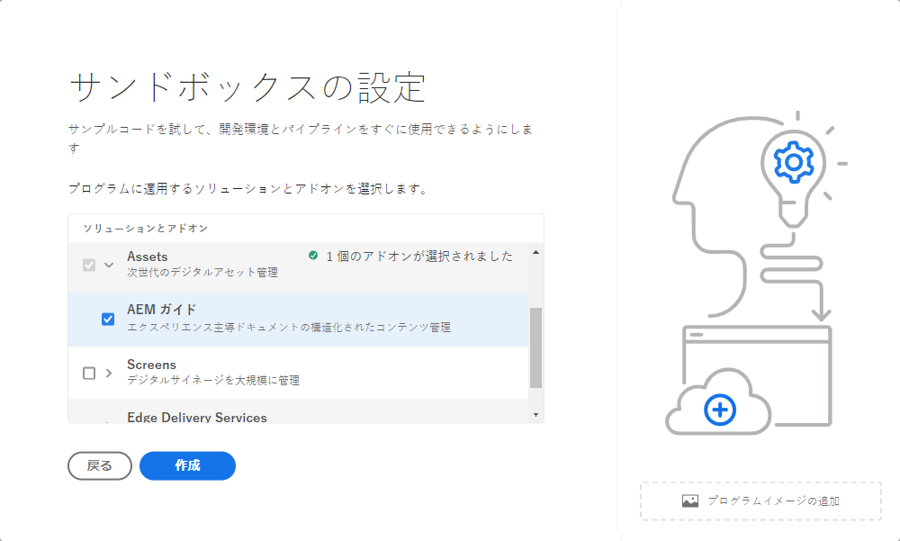
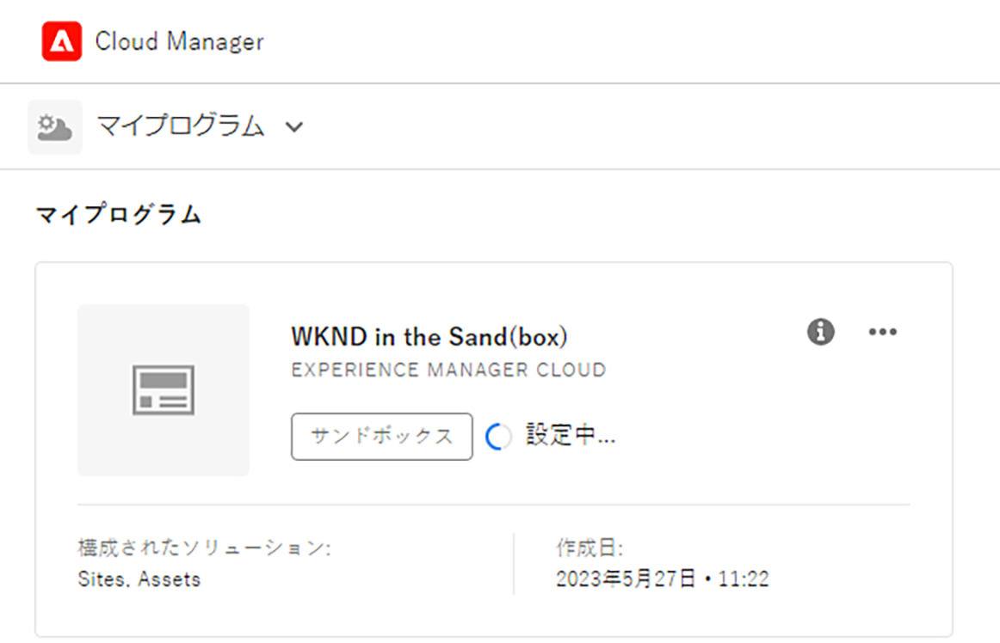
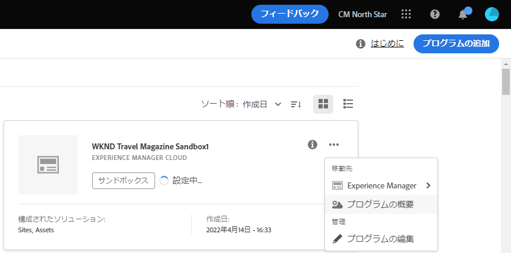
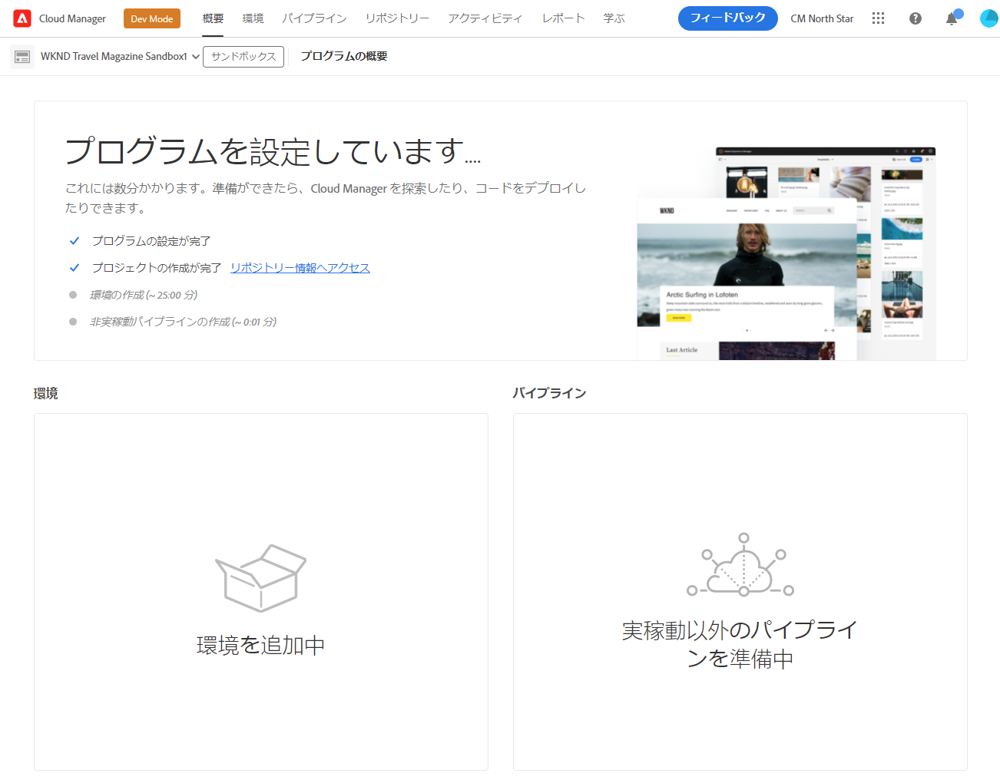
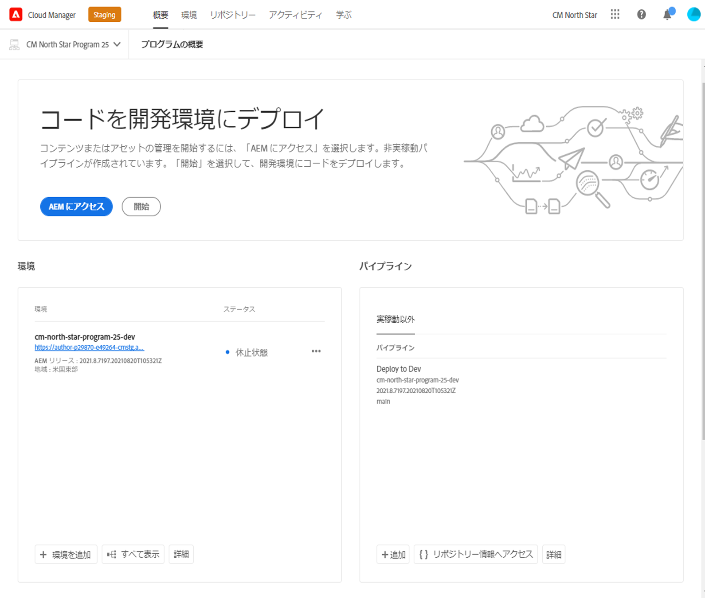

# サンドボックスプログラムの作成 {#create-sandbox-program}

サンドボックスプログラムは通常、トレーニング、デモの実行、有効化、概念実証（POC）またはドキュメント化の目的で作成されるので、ライブトラフィックを実行するためのものではありません。詳しくは、[サンドボックスプログラムの概要](/help/implementing/cloud-manager/getting-access-to-aem-in-cloud/introduction-sandbox-programs.md)を参照してください。

プログラムタイプについて詳しくは、[プログラムとプログラムタイプについて](program-types.md)のドキュメントを参照してください。

## サンドボックスプログラムの作成 {#create}

1. [my.cloudmanager.adobe.com](https://my.cloudmanager.adobe.com/) で Cloud Manager にログオンし、適切な組織を選択します。

1. **[マイプログラム](/help/implementing/cloud-manager/navigation.md#my-programs)**&#x200B;コンソールの右上隅付近にある「**プログラムを追加**」をクリックします。

   

1. *プログラムを作成*&#x200B;ウィザードの&#x200B;**プログラム名**&#x200B;テキストフィールドに、プログラムの名前を入力します。

1. **プログラムの目的**&#x200B;の下で、「**サンドボックスを設定**」を選択します。

   

1. （オプション）ウィザードダイアログボックスの右下隅で、次のいずれかの操作を行います。

   * 画像ファイルを  **プログラム画像を追加**&#x200B;ターゲットにドラッグ＆ドロップします。
   * 「**プログラム画像を追加**」をクリックし、ファイルブラウザーから画像を選択します。
   *  をクリックして、追加した画像を削除します。

1. 「**続行**」をクリックします。

1. **ソリューションとアドオン**&#x200B;リストボックスで、プログラムに含める 1 つ以上のソリューションを選択します。

   * ソリューション名の左側にある山形をクリックすると、選択したソリューションに含める使用可能なオプションのアドオンが表示されます。
   * **Sites**、**Assets**、**Edge Delivery Services** の各ソリューションは、サンドボックスプログラムを作成する際に、デフォルトで常に選択されます。選択を解除することはできません。

   

1. 「**作成**」をクリックします。Cloud Manager によってサンドボックスプログラムが作成され、ランディングページに表示されて選択できます。

## サンドボックスアクセス {#access}

新しいサンドボックスプログラムの作成が完了したら、プログラムの概要ページを表示して、サンドボックス設定の詳細を確認し、環境にアクセスできます。

1. Cloud Manager ランディングページのサンドボックスプログラムで、作成したサンドボックスプログラムの  をクリックします。

   

1. プロジェクト作成手順が完了したら、「**リポジトリ情報にアクセス**」リンクをクリックすると、Git リポジトリを使用できるようになります。

   

   >[!TIP]
   >
   >Git リポジトリへのアクセスと管理について詳しくは、[Git へのアクセス](/help/implementing/cloud-manager/managing-code/accessing-repos.md)を参照してください。

1. 開発環境が作成されたら、「**AEM にアクセス**」リンクをクリックして、AEM にログインします。

   

1. 実稼動以外のパイプラインによる開発環境へのデプロイメントが完了したら、コールトゥアクションのウィザードに従って、AEM 開発環境にアクセスしたり、開発環境にコードをデプロイしたりできます。

   

>[!TIP]
>
>Cloud Manager の操作方法と&#x200B;**マイプログラム**&#x200B;コンソールについて詳しくは、[Cloud Manager UI の操作](/help/implementing/cloud-manager/navigation.md)を参照してください。
