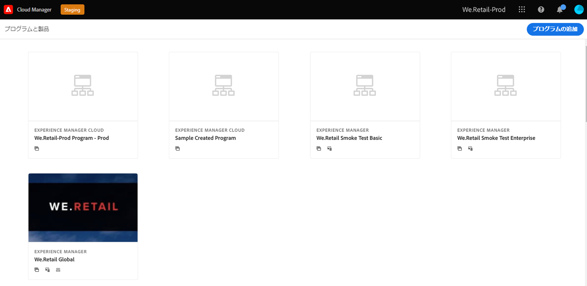
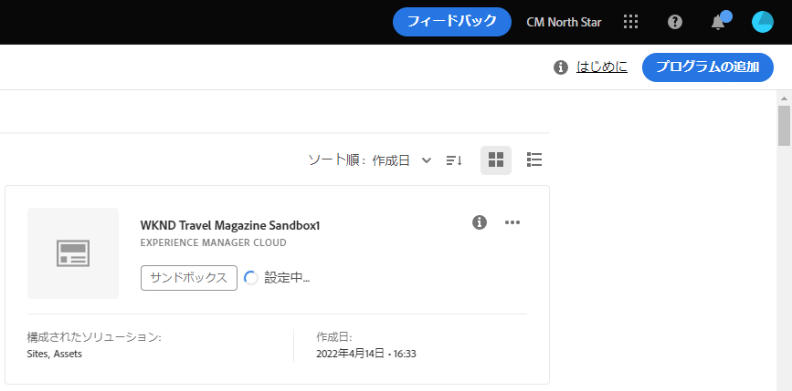
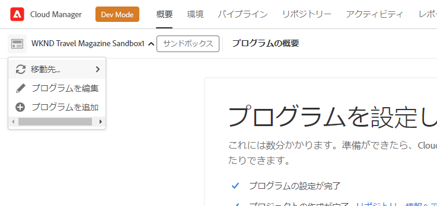

# サンドボックスプログラムの作成 {#create-sandbox-program}

サンドボックスプログラムは、通常、トレーニング、デモの実行、イネーブルメント、POC またはドキュメントの目的を満たすように作成され、ライブトラフィックを運ぶためのものではありません。

プログラムの種類について詳しくは、ドキュメントを参照してください [プログラムとプログラムの種類について](program-types.md)

## サンドボックスプログラムの作成 {#create}

サンドボックスプログラムを作成するには、次の手順に従います。

1. Cloud Manager( ) にログインします。 [my.cloudmanager.adobe.com](https://my.cloudmanager.adobe.com/) 適切な組織を選択します。

1. Cloud Manager のランディングページで、 **プログラムの追加** をクリックします。

   

1. プログラムの作成ウィザードで、「 」を選択します。 **サンドボックスの設定**&#x200B;をクリックし、プログラム名を入力して、 **作成**.

   

ランディングページに新しいサンドボックスプログラムカードが表示され、設定プロセスの進行に応じてステータスインジケーターが表示されます。

## サンドボックスにアクセス {#access}

サンドボックス設定の詳細を表示し、プログラムの概要ページを表示して（利用可能になったら）環境にアクセスできます。

1. Cloud Manager ランディングページで、新しく作成したプログラムの省略記号ボタンをクリックします。

   

1. プロジェクト作成手順が完了したら、 **リポジトリ情報にアクセス** リンクを使用して git リポジトリを使用できます。

   

   >[!TIP]
   >
   >Git リポジトリへのアクセスと管理について詳しくは、 [Git にアクセスします。](/help/implementing/cloud-manager/managing-code/accessing-repos.md)

1. 開発環境が作成されたら、 **アクセスAEM** AEMにログインするためのリンク

   

1. 開発への非実稼動パイプラインのデプロイが完了すると、ウィザードに従って、AEM開発環境へのアクセスまたは開発環境へのコードのデプロイがおこなわれます。

   

別のプログラムに切り替えたり、概要ページに戻って別のプログラムを作成する必要がある場合は、画面の左上にあるプログラム名をクリックすると、 **に移動します。** オプション。

 に移動します。
