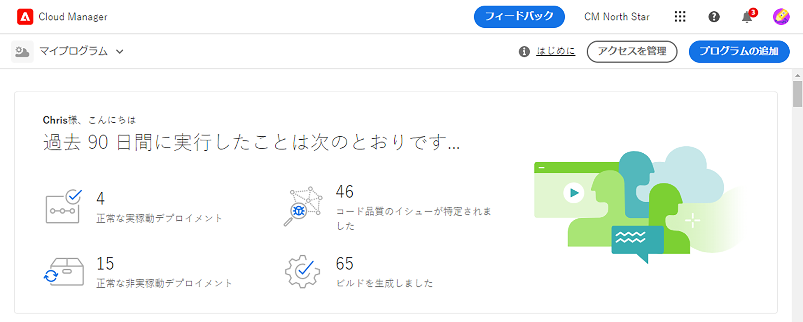

# サンドボックスプログラムの作成 {#create-sandbox-program}

サンドボックスプログラムは、通常、トレーニング、デモの実行、イネーブルメント、POC またはドキュメントの目的にかなうように作成されるもので、ライブトラフィックを実行するためのものではありません。

プログラムの種類について詳しくは、[プログラムとプログラムの種類について](program-types.md)のドキュメントを参照してください。

## サンドボックスプログラムの作成 {#create}

サンドボックスプログラムを作成するには、次の手順に従います。

1. [my.cloudmanager.adobe.com](https://my.cloudmanager.adobe.com/) で Cloud Manager にログインし、適切な組織を選択します。

1. Cloud Manager のランディングページで、画面の右上隅にある「**プログラムを追加**」をクリックします。

   

1. プログラムの作成ウィザードで、「 」を選択します。 **サンドボックスの設定** プログラム名を入力します。

   

1. オプションで、画像ファイルを **プログラムイメージを追加** ターゲットにするかクリックして、ファイルブラウザーから画像を選択します。 「**続行**」をタップまたはクリックします。

   * 画像は、プログラムの概要ウィンドウのタイルとしてのみ機能し、プログラムを識別するのに役立ちます。

1. 内 **サンドボックスの設定** ダイアログで、サンドボックスプログラムで有効にするソリューションを選択するには、 **ソリューションとアドオン** 表。

   * ソリューション名の横にある山括弧を使用して、ソリューションの追加のオプションアドオンを表示します。

   * この **サイト** および **Assets** ソリューションは、常にサンドボックスプログラムに含まれ、選択を解除できません。

   

1. サンドボックスプログラムのソリューションとアドオンを選択したら、「 **作成**.

ランディングページに新しいサンドボックスプログラムカードが表示され、セットアッププロセスの進行に応じてステータスインジケーターも表示されます。

## サンドボックスアクセス {#access}

サンドボックスのセットアップの詳細を表示できるほか、環境が使用可能になったら、プログラムの概要ページを表示して環境にアクセスできます。

1. Cloud Manager ランディングページで、新しく作成したプログラムの省略記号ボタンをクリックします。

   

1. プロジェクト作成手順が完了したら、Git リポジトリを使用できるように、「**リポジトリ情報にアクセス**」リンクをクリックします。

   

   >[!TIP]
   >
   >Git リポジトリへのアクセスと管理について詳しくは、[Git へのアクセス](/help/implementing/cloud-manager/managing-code/accessing-repos.md)のドキュメントを参照してください。

1. 開発環境が作成されたら、「**AEM にアクセス**」リンクをクリックして、AEM にログインします。

   

1. 実稼動以外のパイプラインによる開発環境へのデプロイメントが完了したら、ウィザードに従って、AEM 開発環境にアクセスしたり、開発環境にコードをデプロイしたりできます。

   

別のプログラムに切り替えたり、概要ページに戻って別のプログラムを作成したりする必要がある場合は、いつでも画面の左上のプログラム名をクリックして「**移動先**」オプションを表示します。

 に移動します。
