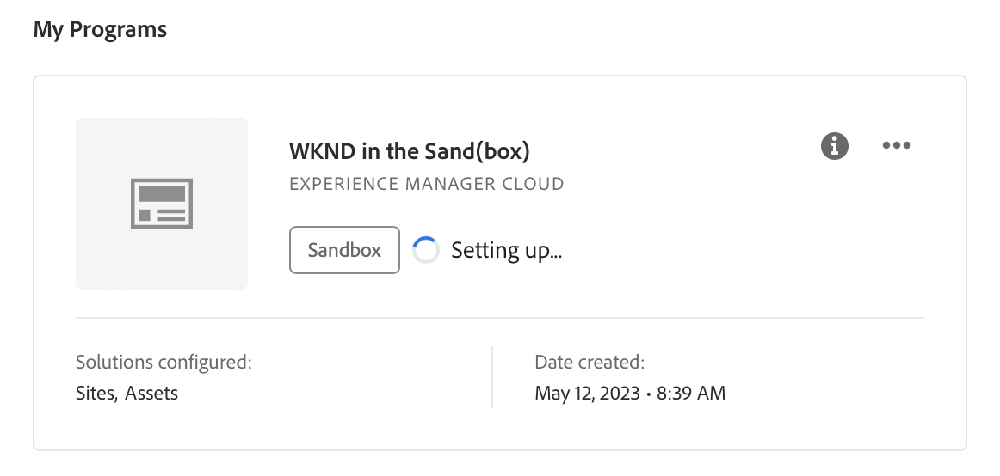

# サンドボックスプログラムの作成 {#create-sandbox-program}

サンドボックスプログラムは、通常、トレーニング、デモの実行、イネーブルメント、POC またはドキュメントの目的にかなうように作成されるもので、ライブトラフィックを実行するためのものではありません。 [ サンドボックスプログラムの概要 ](/help/implementing/cloud-manager/getting-access-to-aem-in-cloud/introduction-sandbox-programs.md) を参照してください。

プログラムの種類について詳しくは、ドキュメント [ プログラムとプログラムの種類について ](program-types.md) を参照してください。

## サンドボックスプログラムの作成 {#create}

1. [my.cloudmanager.adobe.com](https://my.cloudmanager.adobe.com/) で Cloud Manager にログオンし、適切な組織を選択します。

1. **[マイプログラム](/help/implementing/cloud-manager/navigation.md#my-programs)** コンソールの右上隅付近にある「**プログラムを追加**」をクリックします。

   

1. *プログラムを作成しましょう* ウィザードの **プログラム名** テキストフィールドに、プログラムの名前を入力します。

1. **プログラムの目的** の下で、**`Set up a sandbox`** を選択します。

   

1. （オプション）ウィザードダイアログボックスの右下隅で、次のいずれかの操作を行います。

   * 画像ファイルを **プログラム画像を追加** ターゲットにドラッグ&amp;ドロップします。
   * **プログラム画像を追加** をクリックし、ファイルブラウザーから画像を選択します。
   * 追加した画像を削除するには、ごみ箱アイコンをクリックします。

1. 「**続行**」をクリックします。

1. **ソリューションとアドオン** リストボックスで、プログラムに含める 1 つ以上のソリューションを選択します。

   * ソリューション名の左側にある山形アイコンをクリックすると、選択したソリューションに含める使用可能なオプション アドオンが表示されます。
   * **Sites**、**Assets**、**Edge Deliver Servicesy** の各ソリューションは、サンドボックスプログラムを作成する際に、デフォルトで常に選択されます。 選択を解除することはできません。

   

1. 「**作成**」をクリックします。Cloud Managerによってサンドボックスプログラムが作成され、ランディングページに表示されて選択できます。

## サンドボックスアクセス {#access}

新しいサンドボックスプログラムの作成が完了したら、プログラムの概要ページを表示して、サンドボックス設定の詳細を確認し、環境にアクセスできます。

1. Cloud Manager ランディングページで、作成したサンドボックスプログラムの省略記号ボタンをクリックします。

   

1. プロジェクト作成手順が完了したら、「**リポジトリ情報にアクセス**」リンクをクリックして、Git リポジトリを使用できます。

   

   >[!TIP]
   >
   >Git リポジトリへのアクセスと管理について詳しくは、「[Git へのアクセス ](/help/implementing/cloud-manager/managing-code/accessing-repos.md)」を参照してください。

1. 開発環境が作成されたら、「**AEMにアクセス**」をクリックし、AEMにログインします。

   

1. 実稼動以外のパイプラインによる開発環境へのデプロイが完了したら、コールトゥアクションのウィザードに従って、AEM開発環境にアクセスしたり、開発環境にコードをデプロイしたりできます。

   

>[!TIP]
>
>Cloud Managerのナビゲーション方法と ](/help/implementing/cloud-manager/navigation.md) マイプログラム **コンソールについて詳しくは、[Cloud Manager UI の操作** を参照してください。
