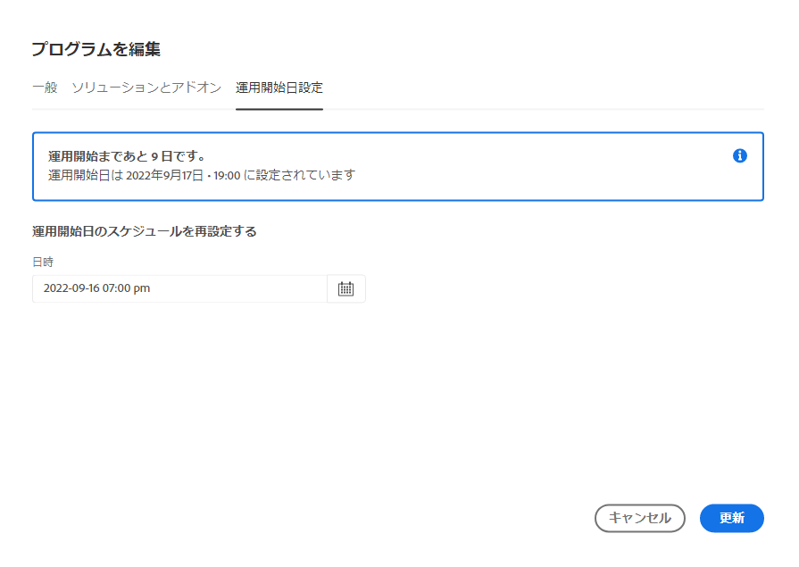

# プログラムの編集 {#editing-programs}

必要な権限を持つユーザーは、 [組織で作成された実稼動プログラム](creating-production-programs.md) および [組織で作成されたサンドボックスプログラム。](creating-sandbox-programs.md) プログラムを編集すると、次の操作を実行できます。

* Assets および反対に、Sites ソリューションを Assets を使用する既存のプログラムに追加します。
* Sites と Assets の両方を使用している既存のプログラムから Sites または Assets を削除する。
* 2 つ目の未使用のソリューション使用権限を、既存のプログラムまたは新しいプログラムに追加します。
* サンドボックスプログラムを削除する。

## 権限 {#permissions}

プログラムの編集またはサンドボックスプログラムを削除するには、**ビジネスオーナー**&#x200B;の役割を持つメンバーである必要があります。

## プログラムの編集 {#editing}

1. [my.cloudmanager.adobe.com](https://my.cloudmanager.adobe.com/) で Cloud Manager にログインし、適切な組織を選択します。

1. 編集するプログラムをクリックすると、その詳細が表示されます。

1. ページの左上にあるプログラムの名前をクリックし、「 」を選択します。 **プログラムを編集**.

   

1. 「**プログラムを編集**」ページが開きます。 「**一般**」タブで、プログラム名と説明を編集します。

   * プログラムには少なくとも 1 つのソリューションを選択する必要があります。

   

1. 「**ソリューションとアドオン**」タブで、プログラムのソリューションを変更します。

   

1. ソリューション名の前の山形記号をクリックすると、「 **コマース** 以下のアドオンオプション **Sites**.

   

1. 「**運用開始日設定**」タブで、プログラムの運用開始予定日を変更します。

   

   * この日付は、情報提供のみを目的としています。 プログラムの概要ページの Go Live ウィジェットをトリガーします。 次に、Adobe Experience Manager(AEM)as a Cloud Serviceのベストプラクティスドキュメントへの製品内リンクを提供し、ジャーニーに合わせて Go Live を成功に導きます。
   * このタブは、サンドボックスプログラムでは使用できません。

1. 必要な権限がプログラムで使用できる場合は、 **セキュリティ** タブには、プログラムのセキュリティオプションを変更できる場所が表示されます。

   

   * HIPAA を有効または無効にするには、次の操作を行う必要があります： [プログラムの作成。](/help/implementing/cloud-manager/getting-access-to-aem-in-cloud/creating-production-programs.md)
      * アドビの HIPAA 対応ソリューションの実装について詳しくは、[こちら](https://www.adobe.com/go/hipaa-ready)を参照してください。
   * 有効化すると、WAF-DDOS 保護は、 [実稼動以外のパイプライン。](/help/implementing/cloud-manager/configuring-pipelines/configuring-non-production-pipelines.md)

   {{waf-limited-release}}

1. クリック **更新** をクリックして、プログラムに対する変更を保存します。

ソリューションやアドオンの追加と削除を含め、プログラムが編集されるたびに、その変更は次回のデプロイメント後に有効になります。

## サンドボックスプログラムの削除 {#delete-sandbox-program}

サンドボックスプログラムを削除すると、それに関連付けられたすべての環境とパイプラインが削除されます。

>[!TIP]
>
>**ビジネスオーナー**&#x200B;または&#x200B;**デプロイメントマネージャー**&#x200B;の役割を持つユーザーは、サンドボックスプログラム全体ではなく、実稼動環境とステージ環境を削除することもできます。

サンドボックスプログラムを削除するには、次の操作を行います。

1. [my.cloudmanager.adobe.com](https://my.cloudmanager.adobe.com/) で Cloud Manager にログインし、適切な組織を選択します。

1. 編集するプログラムをクリックすると、その詳細が表示されます。

1. ページの左上にあるプログラム名をクリックし、「 」を選択します。 **プログラムの削除**.

   

または、Cloud Manager の概要ページでプログラムのカードの省略記号ボタンをクリックし、「**プログラムを削除する**」を選択することもできます。

>[!NOTE]
>
>サンドボックスプログラムのみを削除できます。実稼動プログラムは削除できません。
