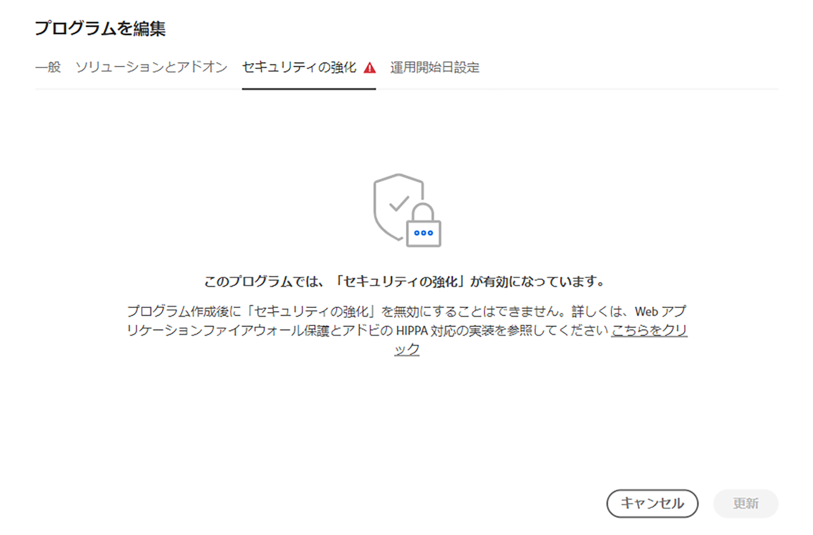

# プログラムの編集 {#editing-programs}

必要な権限を持つユーザーは、[組織で作成された実稼動プログラム](creating-production-programs.md)および[組織で作成されたサンドボックスプログラムを編集できます。](creating-sandbox-programs.md)プログラムを編集すると、次のことが可能です。

* Assets を使用している既存のプログラムに Sites ソリューションを追加する（その逆も同様）。
* Sites と Assets の両方を使用している既存のプログラムから Sites または Assets を削除する。
* 使用されていない 2 つ目のソリューション使用権限を既存のプログラムに追加するか、新しいプログラムとして追加する。
* サンドボックスプログラムを削除する。

## 権限 {#permissions}

プログラムの編集またはサンドボックスプログラムを削除するには、**ビジネスオーナー**&#x200B;の役割を持つメンバーである必要があります。

## プログラムの編集 {#editing}

プログラムを編集するには、次の手順に従います。

1. [my.cloudmanager.adobe.com](https://my.cloudmanager.adobe.com/) で Cloud Manager にログインし、適切な組織を選択します。

1. 編集するプログラムをクリックすると、その詳細が表示されます。

1. ページの左上にあるプログラム名をクリックし、「**プログラムを編集**」を選択します。

   

1. 「**プログラムを編集**」ページが開きます。 「**一般**」タブで、プログラム名と説明を編集します。

   * プログラムには少なくとも 1 つのソリューションを選択する必要があります。

   

1. 「**ソリューションとアドオン**」タブで、プログラムのソリューションを変更します。

   

1. ソリューション名の前の山形記号をクリックすると、オプションのアドオンが表示されます。例えば、**Sites** で **Commerce** アドオンオプションを選択できます。

   

1. 「**運用開始日設定**」タブで、プログラムの運用開始予定日を変更します。

   

   * この日付は情報提供のみを目的とし、プログラム概要ページの運用開始ウィジェットをトリガーし、AEM as a Cloud Service のベストプラクティスドキュメントへの製品内リンクをタイムリーに提供して、運用開始エクスペリエンスの成功とスムーズ化を実現します。
   * このタブは、サンドボックスプログラムでは使用できません。

1. 「**更新**」をクリックして、プログラムに対する変更を保存します。

ソリューションやアドオンの追加や削除など、プログラムが編集されるたびに、その変更内容は次回のデプロイメント後に有効になります。

実稼動プログラムでセキュリティが強化されている場合は、 **セキュリティの強化** タブは **プログラムを編集** ウィンドウが開き、プログラムに対して機能がアクティブであることが確認されます。

この設定は、プログラムの作成後は変更できません。セキュリティの強化オプションについて詳しくは、[実稼働プログラムの作成](creating-production-programs.md)ドキュメントを参照してください。

## サンドボックスプログラムの削除 {#delete-sandbox-program}

サンドボックスプログラムを削除すると、それに関連付けられたすべての環境とパイプラインが削除されます。

>[!TIP]
>
>**ビジネスオーナー**&#x200B;または&#x200B;**デプロイメントマネージャー**&#x200B;の役割を持つユーザーは、サンドボックスプログラム全体ではなく、実稼動環境とステージ環境を削除することもできます。

サンドボックスプログラムを削除するには、次の手順に従います。

1. [my.cloudmanager.adobe.com](https://my.cloudmanager.adobe.com/) で Cloud Manager にログインし、適切な組織を選択します。

1. 編集するプログラムをクリックすると、その詳細が表示されます。

1. ページの左上にあるプログラム名をクリックし、「**プログラムを削除する**」を選択します。

   

または、Cloud Manager の概要ページでプログラムのカードの省略記号ボタンをクリックし、「**プログラムを削除する**」を選択することもできます。

>[!NOTE]
>
>サンドボックスプログラムのみを削除できます。実稼動プログラムは削除できません。
