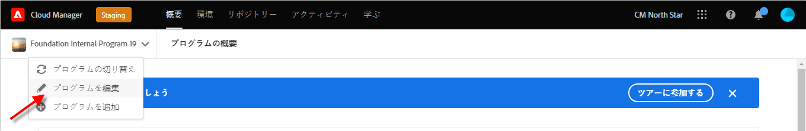
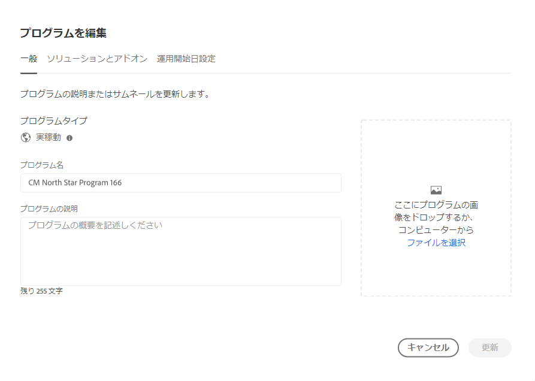
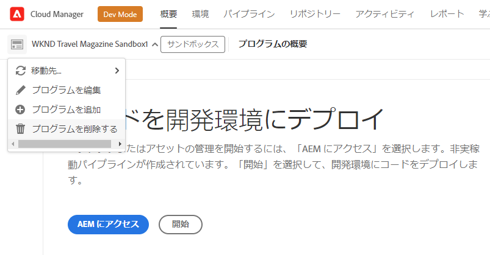
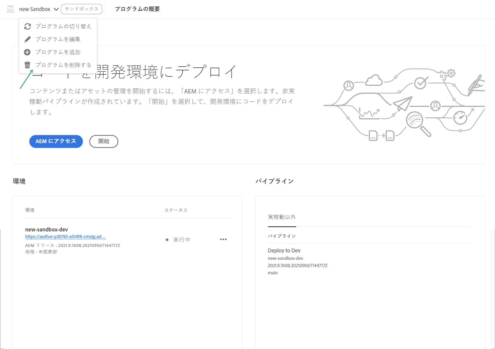

# プログラムの編集 {#editing-programs}

プログラムを管理および編集するには、[**マイプログラム**&#x200B;コンソール](/help/implementing/cloud-manager/navigation.md)から開始します。**マイプログラム**&#x200B;ページには、アクセス権を持つすべてのプログラムの概要が表示されます。個々のプログラムを選択すると、**プログラムの概要**&#x200B;ページで、プログラムの詳細が一目でわかります。

必要な権限を持つユーザーは、**プログラムの概要**&#x200B;から、[組織内で作成された実稼動プログラム](creating-production-programs.md)および[組織内で作成されたサンドボックスプログラム](creating-sandbox-programs.md)を編集できます。プログラムを編集することで、次のことが可能です。

* Assets を使用している既存のプログラムに Sites ソリューションを追加する（その逆も同様）。
* Sites と Assets の両方を使用している既存のプログラムから Sites または Assets を削除する。
* 使用されていないソリューションの使用権限を既存のプログラムに追加するか、新しいプログラムを作成する。
* サンドボックスプログラムを削除する。

## 権限 {#permissions}

プログラムの編集やサンドボックスプログラムの削除およびライセンスダッシュボードへのアクセスは、**ビジネスオーナー**&#x200B;の役割が必要です。

## プログラムの編集 {#editing}

ソリューションやアドオンの追加または削除など、編集されたプログラムの変更内容は次回のデプロイメント後に有効になります。

**プログラムを編集するには：**

1. [my.cloudmanager.adobe.com](https://my.cloudmanager.adobe.com/) で Cloud Manager にログインし、適切な組織を選択します。

1. **[マイプログラム](#my-programs)**&#x200B;ページで、編集するプログラムをクリックして詳細を表示します。

1. ページの左上にあるプログラムの名前をクリックし、「**プログラムを編集**」を選択します。

   

1. **プログラムを編集**&#x200B;ページで「**一般**」タブを開きます。

   

1. プログラムの編集に使用できるオプションは、プログラムの作成のオプションと同じです。
   * 個々のオプションについて詳しくは、[実稼動プログラムの作成](/help/implementing/cloud-manager/getting-access-to-aem-in-cloud/creating-production-programs.md)と[サンドボックスプログラムの作成](/help/implementing/cloud-manager/getting-access-to-aem-in-cloud/creating-sandbox-programs.md)を参照してください。
   * [その他のオプション](/help/implementing/cloud-manager/getting-access-to-aem-in-cloud/creating-production-programs.md#options)は組織の使用権限に応じて、実稼動プログラムで使用できる場合があります。

1. 「**更新**」をクリックして、プログラムに対する変更を保存します。

## サンドボックスプログラムの削除 {#delete-sandbox-program}

サンドボックスプログラムを削除すると、それに関連付けられたすべての環境とパイプラインも削除されます。

>[!TIP]
>
>**ビジネスオーナー**&#x200B;または&#x200B;**デプロイメントマネージャー**&#x200B;の役割を持つユーザーは、サンドボックスプログラム全体ではなく、実稼動環境とステージ環境を削除することもできます。

**サンドボックスプログラムを削除するには：**

1. [my.cloudmanager.adobe.com](https://my.cloudmanager.adobe.com/) で Cloud Manager にログインし、適切な組織を選択します。

1. **[マイプログラム](#my-programs)**&#x200B;ページで、編集するプログラムをクリックして詳細を表示します。

1. ページの左上にあるプログラムの名前をクリックし、「**プログラムを削除**」を選択します。

   

または、Cloud Manager の概要ページからプログラムのカードにある  をクリックし、「**プログラムを削除**」を選択することもできます。

>[!NOTE]
>
>サンドボックスプログラムのみを削除できます。実稼動プログラムは削除できません。
