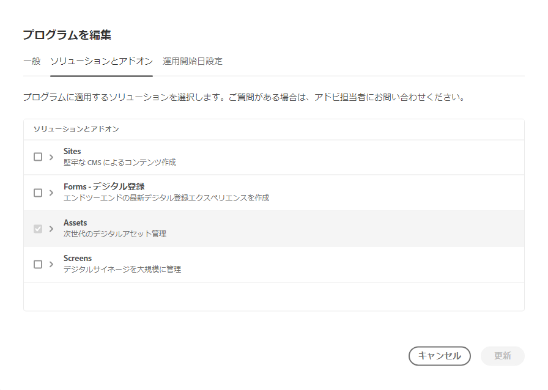
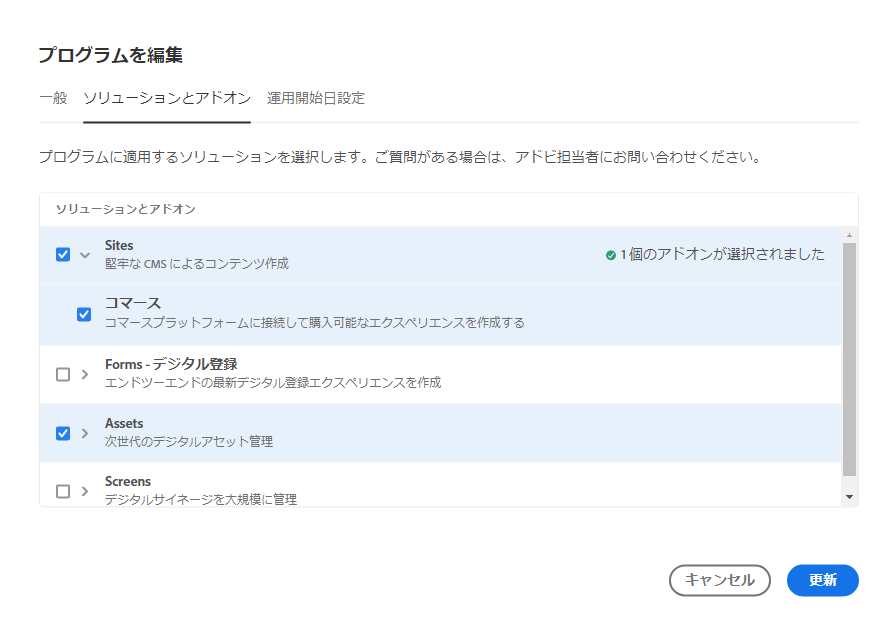

# プログラムの編集 {#editing-programs}

必要な権限を持つユーザーは、 [組織で作成された実稼動プログラム](creating-production-programs.md) 同様に [組織で作成されたサンドボックスプログラム](creating-sandbox-programs.md) プログラムを編集すると、次のことができます。

* Assets を使用する既存のプログラムに Sites ソリューションを追加します。また、Sites ソリューションを Assets を使用する既存のプログラムに Sites ソリューションを追加する。
* Sites と Assets の両方を使用している既存のプログラムから Sites または Assets を削除する。
* 2 つ目の未使用のソリューション使用権限を既存のプログラムまたは新しいプログラムに追加します。
* サンドボックスプログラムを削除します。

>[!NOTE]
>
>次のメンバーである必要があります： **ビジネスオーナー** プログラムの編集またはサンドボックスプログラムの削除を行う役割。

プログラムを編集するには、次の手順に従います。

1. Cloud Manager( ) にログインします。 [my.cloudmanager.adobe.com](https://my.cloudmanager.adobe.com/) 適切な組織を選択します。

1. 編集するプログラムをクリックすると、その詳細が表示されます。

1. ページの左上にあるプログラム名をクリックし、「 」を選択します。 **プログラムを編集**.

   

1. この **プログラムを編集** ページには 2 つのタブが表示されます。 **一般** および **ソリューションとアドオン**. を選択します。 **一般** タブをクリックして、プログラム名と説明を編集します。

   * プログラムには少なくとも 1 つのソリューションを選択する必要があります。

   

1. を選択します。 **ソリューションとアドオン** タブをクリックして、プログラムのソリューションを変更します。

   

1. ソリューション名の前の山形記号をクリックすると、「 **コマース** 以下のアドオンオプション **サイト**.

   

1. クリック **更新** をクリックして、プログラムに対する変更を保存します。

更新が行われると、選択したソリューションが変更された場合、その変更は次のデプロイメント後に有効になります。

## サンドボックスプログラムの削除 {#delete-sandbox-program}

サンドボックスプログラムを削除すると、それに関連付けられたすべての環境とパイプラインが削除されます。

>[!TIP]
>
>を持つ **ビジネスオーナー** または **デプロイメントマネージャー** の役割では、サンドボックスプログラム全体ではなく、実稼動環境とステージ環境を削除することもできます。

サンドボックスプログラムを削除するには、次の手順に従います。

1. Cloud Manager( ) にログインします。 [my.cloudmanager.adobe.com](https://my.cloudmanager.adobe.com/) 適切な組織を選択します。

1. 編集するプログラムをクリックすると、その詳細が表示されます。

1. ページの左上にあるプログラム名をクリックし、「 」を選択します。 **プログラムの削除**.

   

または、Cloud Manager の概要ページでプログラムのカードの省略記号ボタンをクリックし、「 」を選択することもできます。 **プログラムの削除**.

>[!NOTE]
>
>サンドボックスプログラムのみを削除できます。 実稼動プログラムは削除できません。