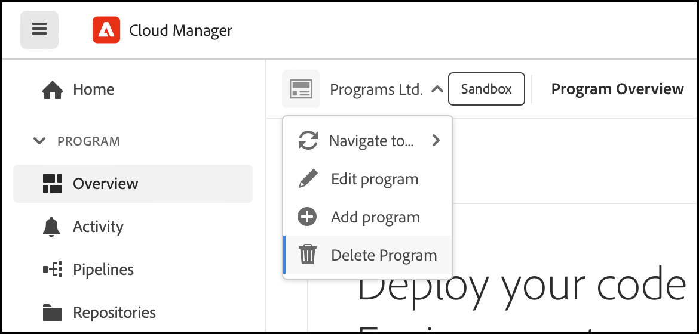

# プログラムの編集 {#editing-programs}

プログラムを管理および編集するには、[**マイプログラム**&#x200B;コンソール](/help/implementing/cloud-manager/navigation.md)から開始します。 **マイプログラム**&#x200B;ページには、アクセス権を持つすべてのプログラムの概要が表示されます。 個々のプログラムを選択すると、**プログラムの概要** ページにプログラムの詳細の概要が表示されます。

必要な権限を持つユーザーは、**プログラムの概要**&#x200B;から、[組織内で作成された実稼動プログラム](creating-production-programs.md)および[組織内で作成されたサンドボックスプログラム](creating-sandbox-programs.md)を編集できます。 プログラムを編集すると、次の操作を実行できます。

* Assets を使用している既存のプログラムに Sites ソリューションを追加する（その逆も同様）。
* SitesとAssetsの両方を持つ既存のプログラムから、SitesまたはAssetsを削除します。
* 使用されていないソリューションの使用権限を既存のプログラムに追加するか、新しいプログラムを作成する。
* 実稼動プログラムに削除用のマークを付けます。
* サンドボックスプログラムを削除する。

## 権限 {#permissions}

プログラムの編集、サンドボックスプログラムの削除、実稼動プログラムの削除用のマーク、ライセンスダッシュボードへのアクセスには、**ビジネスオーナー**&#x200B;の役割が必要です。

## プログラムの編集 {#editing}

ソリューションやアドオンの追加または削除など、編集されたプログラムの変更内容は次回のデプロイメント後に有効になります。

**プログラムを編集するには：**

1. [experience.adobe.com](https://experience.adobe.com)でCloud Managerにログインします。
1. **クイックアクセス** セクションで、**Experience Manager**&#x200B;をクリックします。
1. 左側のサイドパネルで、「**Cloud Manager**」をクリックします。
1. 適切な組織を選択します。
1. **マイプログラム** ページで、編集するプログラムをクリックします。
1. ページの左上隅付近で、プログラムの名前をクリックし、「**プログラムを編集**」を選択します。

   

1. **プログラムを編集** ダイアログボックスで、タブを使用して必要な様々なオプションを設定します。

   

   プログラムの編集に使用できるオプションは、プログラムの作成のオプションと同じです。
   * パブリッシュ層を新しい環境（Beta）用にプロビジョニングするかどうかを設定できます。 [柔軟なパブリッシュ層（Beta） ](/help/implementing/cloud-manager/getting-access-to-aem-in-cloud/creating-production-programs.md#flexible-publish-tier)を参照してください。
   * 個々のオプションについて詳しくは、[実稼動プログラムの作成](/help/implementing/cloud-manager/getting-access-to-aem-in-cloud/creating-production-programs.md)と[サンドボックスプログラムの作成](/help/implementing/cloud-manager/getting-access-to-aem-in-cloud/creating-sandbox-programs.md)を参照してください。
   * [その他のオプション](/help/implementing/cloud-manager/getting-access-to-aem-in-cloud/creating-production-programs.md#options)は組織の使用権限に応じて、実稼動プログラムで使用できる場合があります。

1. 「**更新**」をクリックして変更を保存します。

## 実稼動プログラムを削除用にマーク {#delete-production-program}

実稼動プログラムの削除は2段階のプロセスです。 ビジネスオーナーは、削除のためのプログラムをマークし、検証とテイクダウン期間をトリガーします。 その後、削除された期間が経過すると、プログラムは完全に削除されます。

実稼動プログラムに削除用のマークが付けられると、次の処理が行われます。

* 生産プログラムに関連付けられているクレジットは、顧客に返されます。
* 実稼動プログラムに属するすべての環境が削除されます。

削除のマークを開始する前に、実稼動プログラムが削除の対象であるかどうかを検証します。 マーキングが失敗した場合、実稼動プログラムは代わりに`Failed to mark for deletion`状態に移動します。

>[!NOTE]
>
>サンドボックスプログラムは、このプロセスの影響を受けません。 サンドボックスプログラムを削除するには、[ サンドボックスプログラムの削除](#delete-sandbox-program)を参照してください。

**削除する実稼動プログラムをマークするには：**

1. [experience.adobe.com](https://experience.adobe.com)でCloud Managerにログインします。
1. **クイックアクセス** セクションで、**Experience Manager**&#x200B;をクリックします。
1. 左側のサイドパネルで、「**Cloud Manager**」をクリックします。
1. 適切な組織を選択します。
1. **マイプログラム** ページで、削除対象としてマークする実稼動プログラムの場合、をクリックし、**プログラムを削除**&#x200B;をクリックします。

   *上記の実稼動プログラムの例は、イラスト用です。*

1. **削除のための実稼動プログラムのマーク** ダイアログボックスで、実稼動環境、ステージ環境、開発環境など、プログラムに接続されているリソースを一覧表示する警告を確認します。

   

   >[!NOTE]
   >
   >実稼動プログラムに、現在更新中の環境などのブロックリソースがある場合、「**削除用にマーク**」ボタンは無効になります。 すべてのプログラムリソースがロック解除されるまで待ってから、プログラムに削除用のマークを付けることができます。
   >
   >

1. 確認するには、ダイアログボックスに表示されているプログラム名を入力し、**削除のマーク**&#x200B;をクリックします。

   確認後、実稼動プログラムは、プロセスの実行中に&#x200B;**削除用のマーキング** ステータスを表示します。

   

   完了すると、実稼動プログラムカードが更新され、**削除用にマーク**&#x200B;され、関連するアラートバッジが付きます。

   

1. 実稼動プログラムカードのアラートバッジをクリックして、スケジュールされた永久削除日を表示します。

   

   テイクダウン期間が経過すると、プログラムは完全に削除され、復元できません。

### 実稼動プログラムを削除からマーク解除する {#unmark-from-deletion}

完全な削除がまだ行われていない限り、*削除用に* マークされた実稼動プログラムを復元できます。

>[!IMPORTANT]
>
>削除用にマークされた実稼動プログラムを復元するには、お客様が利用可能なクレジットを持っている必要があります。

**削除から実稼動プログラムのマークを解除するには：**

1. **マイプログラム** ページで、**削除用にマーク済みであることを示す実稼動プログラムカードを探します**。

1. 実稼動プログラムカードで、をクリックし、**削除するマークを解除**&#x200B;をクリックします。

   

   本番プログラムは削除のマークが外されています。

## サンドボックスプログラムの削除 {#delete-sandbox-program}

サンドボックスプログラムを削除すると、それに関連付けられたすべての環境とパイプラインも削除されます。

>[!TIP]
>
>**ビジネスオーナー**&#x200B;または&#x200B;**デプロイメントマネージャー**&#x200B;の役割を持つユーザーは、サンドボックスプログラム全体ではなく、実稼動環境とステージ環境を削除することもできます。

**サンドボックスプログラムを削除するには：**

1. [experience.adobe.com](https://experience.adobe.com)でCloud Managerにログインします。
1. **クイックアクセス** セクションで、**Experience Manager**&#x200B;をクリックします。
1. 左側のサイドパネルで、「**Cloud Manager**」をクリックします。
1. 適切な組織を選択します。

1. **[マイプログラム](#my-programs)** ページで、編集するサンドボックスプログラムをクリックして、その詳細を表示します。

1. ページの左上にあるサンドボックスプログラムの名前をクリックし、**プログラムを削除**&#x200B;を選択します。

   

または、Cloud Managerの概要ページからサンドボックスプログラムのカードのをクリックし、**プログラムの削除**&#x200B;を選択することもできます。

