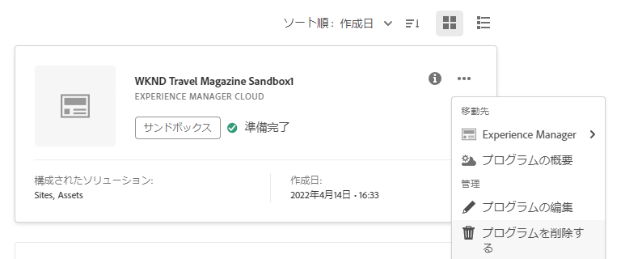

# プログラムの管理と編集 {#editing-programs}

The **マイプログラム** ページには、アクセス権を持つすべてのプログラムの概要が表示されます。 個々のプログラムを選択する場合、 **プログラムの概要** ページには、プログラムの詳細が一目で表示されます。

次から： **プログラムの概要**、必要な権限を持つユーザーが編集できる [組織で作成された実稼動プログラム](creating-production-programs.md) および [組織で作成されたサンドボックスプログラム。](creating-sandbox-programs.md)プログラムの編集で、次のことが可能です。

* Assets を使用している既存のプログラムに Sites ソリューションを追加する（その逆も同様）。
* Sites と Assets の両方を使用している既存のプログラムから Sites または Assets を削除する。
* 使用されていない 2 つ目のソリューション使用権を既存のプログラムに追加するか、新規のプログラムとして追加する。
* サンドボックスプログラムを削除する。

## 権限 {#permissions}

次のメンバーである必要があります： **ビジネスオーナー** の役割を使用して、プログラムの編集やサンドボックスプログラムの削除を行い、ライセンスダッシュボードにアクセスすることができます。

## マイプログラム {#my-programs}

1. [my.cloudmanager.adobe.com](https://my.cloudmanager.adobe.com/) で Cloud Manager にログインし、適切な組織を選択します。

1. The **マイプログラム** ページには、タイルとしてアクセスできるすべてのプログラムのリストが表示されます。

### コールトゥアクション {#cta}

ページの上部には、組織のステータスに関連するコールトゥアクションが表示されます。 例えば、プログラムを正常に設定した場合、過去 90 日間のアクティビティの統計には、次の内容が表示されることがあります。

* 数 [デプロイメント](/help/implementing/cloud-manager/deploy-code.md)
* 数 [コード品質の問題](/help/implementing/cloud-manager/code-quality-testing.md) 特定された
* ビルド数

組織の設定を開始したばかりの場合は、次の手順やドキュメントのリソースに関するヒントが表示される場合があります。

### 「プログラム」タブ {#programs-tab}

The **プログラム** 「 」タブには、アクセス権のある各プログラムを表すカードが一覧表示されます。 カードをタップまたはクリックして、 **プログラムの概要** プログラムのページを参照してください。

並べ替えオプションを使用して、必要なプログラムをより適切に見つけます。

* ソート順
   * 作成日（デフォルト）
   * プログラム名
   * ステータス
* 昇順（デフォルト） /降順
* グリッド表示（デフォルト）
* リスト表示

### 「ライセンス」タブ {#license-tab}

The **ライセンス** 「 」タブからすばやくアクセスできます [ライセンスダッシュボード。](/help/implementing/cloud-manager/license-dashboard.md)

## プログラムの概要 {#program-overview}

プログラムを **[マイプログラム](#my-programs)** 」ページで、Cloud Manager が **プログラムの概要** 選択したプログラムのページ。

ページの左上隅にあるプログラム名をタップまたはクリックすると、別のプログラムにすばやく切り替えたり、 **[マイプログラム](#my-programs)** ページに貼り付けます。 また、 [選択したプログラムを編集](#editing) または [プログラムを追加します。](/help/implementing/cloud-manager/getting-access-to-aem-in-cloud/creating-production-programs.md)

上部のコールトゥアクションは、プログラムの状態に応じて役立つ情報を提供します。 新しいプログラムの場合、次の手順と開始日のリマインダーを確認できます。 [プログラムの作成中に設定されます。](/help/implementing/cloud-manager/getting-access-to-aem-in-cloud/editing-programs.md)

ライブプログラムの場合、最後のデプロイメントのステータスと、詳細のリンク、新しいデプロイメントの開始。

**環境** および **パイプライン** カードを使用すると、選択したプログラム内の両方の概要を簡単に確認できます。

The **パフォーマンス** カードには、 **[CDN ダッシュボード。](/help/implementing/cloud-manager/cdn-performance.md)**

## プログラムの編集 {#editing}

1. [my.cloudmanager.adobe.com](https://my.cloudmanager.adobe.com/) で Cloud Manager にログインし、適切な組織を選択します。

1. 次の日： **[マイプログラム](#my-programs)** ページで、編集するプログラムをクリックして詳細を表示します。

1. ページの左上にあるプログラムの名前をクリックし、「**プログラムを編集**」を選択します。

   

1. 「**プログラムを編集**」ページが開きます。 「**一般**」タブで、プログラム名と説明を編集します。

   * プログラムには少なくとも 1 つのソリューションを選択する必要があります。

   

1. 「**ソリューションとアドオン**」タブで、プログラムのソリューションを変更します。

   

1. ソリューション名の前にある山形アイコンをクリックすると、オプションのアドオンが表示されます（**Sites**&#x200B;の下の「**Commerce**」アドオンオプションなど）。

   

1. 「**運用開始日設定**」タブで、プログラムの運用開始予定日を変更します。

   

   * この日付は、情報提供のみを目的としています。プログラムの概要ページで運用開始ウィジェットをトリガーします。次に、Adobe Experience Manager（AEM）as a Cloud Service のベストプラクティスに関するドキュメントへの製品内リンクが提供され、ジャーニーに合わせて運用開始エクスペリエンスを成功に導きます。
   * このタブは、サンドボックスプログラムでは使用できません。

1. 必要な資格をプログラムで使用できる場合は、プログラムのセキュリティオプションを変更できる場所が「**セキュリティ**」タブに表示されます。

   

   * [プログラムの作成](/help/implementing/cloud-manager/getting-access-to-aem-in-cloud/creating-production-programs.md)後に HIPAA を有効または無効にすることはできません。
      * アドビの HIPAA 対応ソリューションの実装について詳しくは、[こちら](https://www.adobe.com/go/hipaa-ready)を参照してください。
   * 有効化すると、[実稼動以外のパイプライン](/help/implementing/cloud-manager/configuring-pipelines/configuring-non-production-pipelines.md)を設定することで WAF-DDOS 保護を設定できます。

1. 「**更新**」をクリックして、プログラムに対する変更を保存します。

ソリューションやアドオンの追加または削除など、編集されたプログラムの変更内容は次回のデプロイメント後に有効になります。

## サンドボックスプログラムの削除 {#delete-sandbox-program}

サンドボックスプログラムを削除すると、それに関連付けられたすべての環境とパイプラインも削除されます。

>[!TIP]
>
>**ビジネスオーナー**&#x200B;または&#x200B;**デプロイメントマネージャー**&#x200B;の役割を持つユーザーは、サンドボックスプログラム全体ではなく、実稼動環境とステージ環境を削除することもできます。

サンドボックスプログラムを削除するには、次の操作を行います。

1. [my.cloudmanager.adobe.com](https://my.cloudmanager.adobe.com/) で Cloud Manager にログインし、適切な組織を選択します。

1. 次の日： **[マイプログラム](#my-programs)** ページで、編集するプログラムをクリックして詳細を表示します。

1. ページの左上にあるプログラムの名前をクリックし、「 」を選択します。 **プログラムの削除**.

   

または、Cloud Manager の概要ページでプログラムのカードの省略記号ボタンをクリックし、「**プログラムを削除する**」を選択することもできます。

>[!NOTE]
>
>サンドボックスプログラムのみを削除できます。実稼動プログラムは削除できません。
