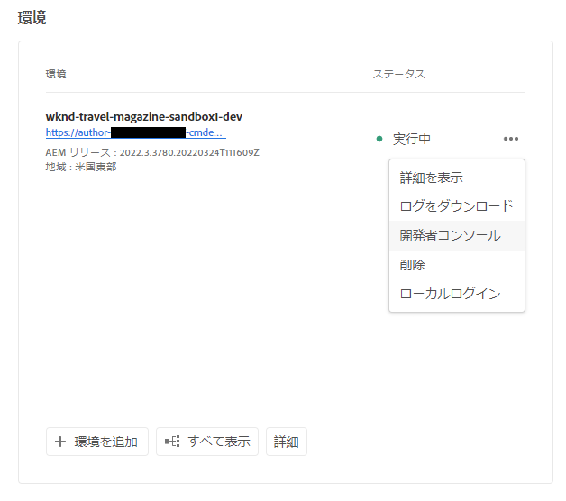

# サンドボックス環境の休止と休止解除 {#hibernating-introduction}

サンドボックスプログラムの環境は、8 時間アクティビティが検出されなかった場合、休止モードに入ります。休止状態は、サンドボックスプログラム環境に固有です。 実稼動プログラム環境は休止状態になりません。

## 休止状態 {#hibernation-introduction}

休止状態には、自動または手動で移行します。

* **自動**  — サンドボックスプログラム環境は、8 時間操作が実行されなかった場合、自動的に休止状態になります。 無操作状態は、オーサーサービスもプレビューサービスもパブリッシュサービスもリクエストを受け取らないものと定義されます。
* **手動**  — ユーザーは、サンドボックスプログラム環境を手動で休止状態にできます。 前述のとおりに休止状態が自動的に発生するので、これをおこなう必要はありません。

サンドボックスプログラム環境が休止モードに入るまで、数分かかる場合があります。 休止中、データは保持されます。

### 手動による休止 {#using-manual-hibernation}

サンドボックスプログラムを開発者コンソールから手動で休止状態にすることができます。 サンドボックスプログラム用の開発者コンソールへのアクセスは、Cloud Manager の任意のユーザーが利用できます。

サンドボックスプログラム環境を手動で休止状態にするには、次の手順に従います。

1. Cloud Manager( ) にログインします。 [my.cloudmanager.adobe.com](https://my.cloudmanager.adobe.com/) 適切な組織を選択します。

1. 休止状態にするプログラムをクリックして詳細を表示します。

1. の **環境** カードで、省略記号ボタンをクリックし、「 **開発者コンソール**.

   * ドキュメントを参照します。 [開発者コンソールへのアクセス](/help/implementing/cloud-manager/manage-environments.md#accessing-developer-console) を参照してください。

   

1. 開発者コンソールで、 **休止**.

   

1. 「**休止**」をクリックして手順を確認します。

   

休止処理が正常に完了すると、環境の休止処理完了通知が&#x200B;**開発者コンソール**&#x200B;画面に表示されます。

開発者コンソールで、 **環境** 次の項目の上にあるパンくずリスト内のリンク **ポッド** 休止状態にする環境のリストのドロップダウン。

## 休止解除 {#de-hibernation-introduction}

サンドボックスプログラムを開発者コンソールから手動で休止状態にすることができます。

>[!IMPORTANT]
>
>ユーザーが **開発者** 役割は、サンドボックスプログラム環境の休止状態を解除できます。

1. Cloud Manager( ) にログインします。 [my.cloudmanager.adobe.com](https://my.cloudmanager.adobe.com/) 適切な組織を選択します。

1. 休止状態にするプログラムをクリックして詳細を表示します。

1. の **環境** カードで、省略記号ボタンをクリックし、「 **開発者コンソール**.

   * ドキュメントを参照します。 [開発者コンソールへのアクセス](/help/implementing/cloud-manager/manage-environments.md#accessing-developer-console) を参照してください。

1. クリック **休止解除**.

   

1. クリック **休止解除** をクリックして手順を確定します。

   

1. 休止解除プロセスが開始され、進行状況に合わせて更新されたことを示す通知が届きます。

   

1. 処理が完了すると、サンドボックスプログラム環境が再びアクティブになります。

   

開発者コンソールで、 **環境** 次の項目の上にあるパンくずリスト内のリンク **ポッド** 休止状態を解除する環境のリストのドロップダウン。

### 休止状態を解除する権限 {#permissions-de-hibernate}

製品プロファイルで AEM as a Cloud Service へのアクセスが許可されている場合は、**開発者コンソール**&#x200B;にアクセスして環境の休止状態を解除できます。

## 休止環境へのアクセス {#accessing-hibernated-environment}

休止状態の環境のオーサー、プレビューまたはパブリッシュサービスに対してブラウザーリクエストをおこなうと、環境の休止状態を示すランディングページと、サービスを休止解除できる開発者コンソールへのリンクが表示されます。

## デプロイメントとAEMアップデート {#deployments-updates}

休止状態の環境でも、デプロイメントとAEMの手動アップグレードが可能です。

* ユーザーは、パイプラインを使用して、休止状態の環境にカスタムコードを導入できます。環境は休止状態のままとなり、新しいコードは環境で休止状態が解除された後に表示されます。

* AEMのアップグレードは、休止状態の環境に適用でき、Cloud Manager から手動でトリガーできます。 環境は休止状態のままとなり、新しいリリースは、休止状態を解除すると環境に表示されます。

## 休止と削除 {#hibernation-deletion}

* サンドボックスプログラム内の環境は、8 時間操作が実行されなかった場合、自動的に休止状態になります。
   * 無操作状態は、オーサーサービスもプレビューサービスもパブリッシュサービスもリクエストを受け取らないものと定義されます。
   * 休止状態にしたら、手動で休止状態を解除できます。
* サンドボックスプログラムは、6 か月間連続休止モードになった後に削除され、その後再作成できます。
