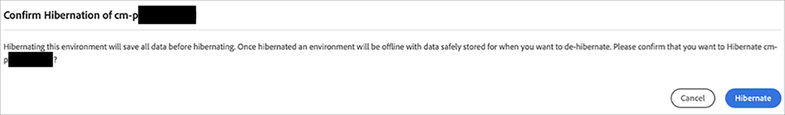
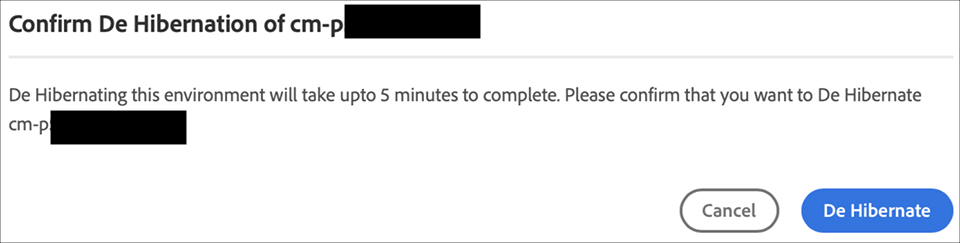

# サンドボックス環境の休止と休止解除 {#hibernating-introduction}

サンドボックスプログラムの環境は、8 時間操作が検出されなかった場合、休止モードに入ります。休止状態は、サンドボックスプログラム環境に固有のものです。実稼動プログラム環境は休止状態になりません。

## 休止状態 {#hibernation-introduction}

休止状態には、自動または手動で移行します。

* **自動** - サンドボックスプログラム環境は、8 時間、無操作状態になると、自動的に休止状態になります。無操作状態とは、オーサーサービスもプレビューサービスもパブリッシュサービスもリクエストを受信しない状態と定義されます。
* **手動** - ユーザーはサンドボックスプログラム環境を手動で休止状態にできます。前述のとおり休止状態は自動的に発生するので、そのための要件はありません。

サンドボックスプログラム環境が休止モードに入るまで、数分かかる場合があります。休止中、データは保持されます。

### 手動による休止 {#using-manual-hibernation}

開発者コンソールからサンドボックスプログラムを手動で休止状態にすることができます。サンドボックスプログラム用の開発者コンソールへのアクセスは、Cloud Manager の任意のユーザーが利用できます。

サンドボックスプログラム環境を手動で休止状態にするには、次の手順に従います。

1. [my.cloudmanager.adobe.com](https://my.cloudmanager.adobe.com/) で Cloud Manager にログインし、適切な組織を選択します。

1. 休止状態にするプログラムをクリックして、そのプログラムの詳細を表示します。

1. **環境**&#x200B;カードで、省略記号ボタンをクリックし、「**開発者コンソール**」を選択します。

   * 開発者コンソールについて詳しくは、[開発者コンソールへのアクセス](/help/implementing/cloud-manager/manage-environments.md#accessing-developer-console)のドキュメントを参照してください。

   

1. 開発者コンソールで、「**休止**」をクリックします。

   

1. 「**休止**」をクリックして手順を確定します。

   

休止処理が正常に完了すると、環境の休止処理完了通知が&#x200B;**開発者コンソール**&#x200B;画面に表示されます。

開発者コンソールで、「**ポッド**」ドロップダウンの上にあるパンくずリスト内の「**環境**」リンクをクリックして、休止状態にする環境のリストを表示することもできます。

## 休止解除 {#de-hibernation-introduction}

開発者コンソールからサンドボックスプログラムを手動で休止状態にすることができます。

>[!IMPORTANT]
>
>**開発者**&#x200B;の役割を持つユーザーは、サンドボックスプログラム環境の休止状態を解除できます。

1. [my.cloudmanager.adobe.com](https://my.cloudmanager.adobe.com/) で Cloud Manager にログインし、適切な組織を選択します。

1. 休止状態にするプログラムをクリックして、そのプログラムの詳細を表示します。

1. **環境**&#x200B;カードで、省略記号ボタンをクリックし、「**開発者コンソール**」を選択します。

   * 開発者コンソールについて詳しくは、[開発者コンソールへのアクセス](/help/implementing/cloud-manager/manage-environments.md#accessing-developer-console)のドキュメントを参照してください。

1. 「**休止解除**」をクリックします。

   

1. 「**休止解除**」をクリックして、手順を確定します。

   

1. 休止解除プロセスが開始されたことを示す通知が届き、進行状況に合わせて情報が更新されます。

   

1. 処理が完了すると、サンドボックスプログラム環境が再度アクティブになります。

   

開発者コンソールで、「**ポッド**」ドロップダウンの上にあるパンくずリスト内の「**環境**」リンクをクリックして、休止状態を解除する環境のリストを表示することもできます。

### 休止状態を解除する権限 {#permissions-de-hibernate}

製品プロファイルで AEM as a Cloud Service へのアクセスが許可されている場合は、**開発者コンソール**&#x200B;にアクセスして環境の休止状態を解除できます。

## 休止環境へのアクセス {#accessing-hibernated-environment}

休止状態の環境のオーサー、プレビューまたはパブリッシュサービスに対してブラウザーリクエストを行うと、環境の休止状態を示すランディングページと、サービスの休止状態を解除できる開発者コンソールへのリンクが表示されます。

## デプロイメントと AEM 更新 {#deployments-updates}

休止状態の環境でも、デプロイメントと AEM の手動アップグレードが可能です。

* ユーザーは、パイプラインを使用して、休止状態の環境にカスタムコードを導入できます。環境は休止状態のままとなり、新しいコードは環境で休止状態が解除された後に表示されます。

* AEM のアップグレードは、休止状態の環境にも適用でき、Cloud Manager から手動でトリガーできます。環境は休止状態のままとなり、新しいリリースは、休止状態を解除すると環境に表示されます。

## 休止と削除 {#hibernation-deletion}

* サンドボックスプログラム内の環境は、8 時間、無操作状態になると、自動的に休止状態になります。
   * 無操作状態とは、オーサーサービスもプレビューサービスもパブリッシュサービスもリクエストを受信しない状態と定義されます。
   * 休止状態になったら、手動で休止状態を解除できます。
* サンドボックスプログラムは、連続休止モードになってから 6 か月が経過すると削除され、その後、再作成できます。
