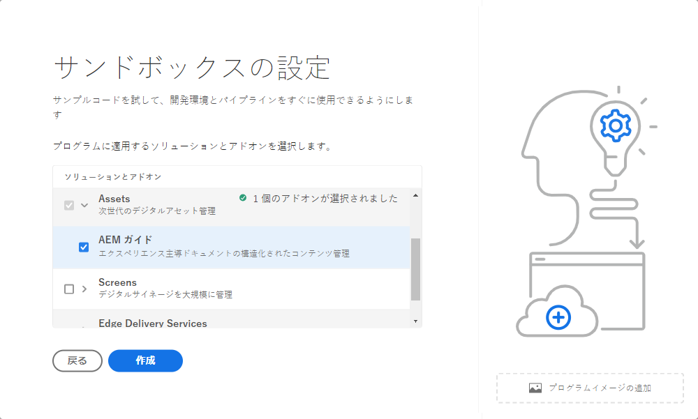

# サンドボックスプログラムの概要 {#sandbox-programs}

サンドボックスプログラムの概要と実稼動プログラムとの違いについて説明します。

## はじめに {#introduction}

サンドボックスプログラムは、通常、トレーニング、デモの実行、イネーブルメント、概念実証（POC）の目的で作成されるので、ライブトラフィックを実行するためのものではありません。

サンドボックスプログラムは、AEM Cloud Service で使用できる 2 種類のプログラムの 1 つで、もう 1 つは[実稼動プログラム](introduction-production-programs.md)です。 プログラムの種類について詳しくは、[&#x200B; プログラムとプログラムの種類について](/help/implementing/cloud-manager/getting-access-to-aem-in-cloud/program-types.md)を参照してください。

## 自動作成 {#auto-creation}

サンドボックスプログラムは自動作成機能を備えています。 [サンドボックスプログラムを作成](/help/implementing/cloud-manager/getting-access-to-aem-in-cloud/creating-sandbox-programs.md)するたびに、Cloud Manager で自動的に以下が実行されます。

* AEM Sites、Assets、Edge Delivery Services を、プログラムのデフォルトのソリューションとして追加します。

  

* [AEM プロジェクトアーキタイプ &#x200B;](https://experienceleague.adobe.com/ja/docs/experience-manager-core-components/using/developing/archetype/overview)に基づくサンプルプロジェクトを使用して、プロジェクト Git リポジトリを初期化します。
* 開発環境を作成します。
* その開発環境へのデプロイメントを行う実稼動以外のパイプラインを作成します。

サンドボックスプログラムは、1つの開発環境に制限されます。

## 使用制限と条件 {#usage-notes-conditions}

サンドボックスプログラムはライブトラフィックを目的としていないため、使用に関する特定の制限と条件があり、実稼動プログラムと区別されます。

| 制限事項／条件 | 説明 |
| --- | --- |
| ライブトラフィックなし | サンドボックスプログラムは、ライブトラフィックを実行するものではないので、[AEM as a Cloud Service のコミットメント](https://www.adobe.com/jp/legal/service-commitments.html)の対象ではありません。 |
| 自動スケーリングなし | サンドボックスプログラムに作成された環境は、自動スケール用に設定されません。 したがって、パフォーマンスや負荷テストには適しません。 |
| カスタムドメインまたは IP 許可リストなし | [カスタムドメイン](/help/implementing/cloud-manager/custom-domain-names/introduction.md)と [IP 許可リスト](/help/implementing/cloud-manager/ip-allow-lists/introduction.md)は、サンドボックスプログラムでは使用できません。 |
| 追加の公開地域なし | [追加の公開地域](/help/operations/additional-publish-regions.md)は、サンドボックスプログラムでは使用できません。 |
| 99.99％ SLA なし | [99.99％ SLA](/help/implementing/cloud-manager/getting-access-to-aem-in-cloud/creating-production-programs.md#sla) は、サンドボックスプログラムには適用されません。 |
| 高度なネットワーク機能なし | [高度なネットワーク機能](/help/security/configuring-advanced-networking.md)（例えば、VPN のセルフサービスプロビジョニング、非標準ポート、専用のエグレス IP アドレスなど）は、サンドボックスプログラムでは使用できません。 |
| AEM の自動アップデートなし | AEMの更新はサンドボックスプログラムに自動的にプッシュされませんが、サンドボックスプログラム内の環境に手動で適用できます。 ・ ターゲット環境に適切に設定されたパイプラインがある場合にのみ、手動アップデートを実行できます。 ・実稼動環境またはステージング環境の手動アップデートは、もう1つの環境を自動的に更新します。 実稼働とステージングの環境セットは、同じ AEM リリースに上に存在している必要があります。 詳しくは、[AEM バージョンのアップデート](/help/implementing/deploying/aem-version-updates.md)を参照してください。 環境を更新する方法について詳しくは、[環境の更新](/help/implementing/cloud-manager/manage-environments.md#updating-dev-environment)を参照してください。 |
| テクニカルサポートなし | サンドボックスプログラムは通常、トレーニング、デモの実行、有効化または概念実証（POC）の目的で作成されるので、サンドボックスプログラムで発生する問題に対してはテクニカルサポートを利用できません。 サンドボックスプログラムの作成と管理で問題が発生した場合、これらの問題はテクニカルサポートの範囲内です。 |
| 休止と削除 | サンドボックスプログラム内の環境は、8 時間、無操作状態になると、自動的に休止状態になります。 サンドボックス環境は、6 か月連続の休止状態が続いた後に削除されます。 環境の休止状態を解除する方法とサンドボックスの自動削除について詳しくは、[サンドボックス環境の休止と休止解除](/help/implementing/cloud-manager/getting-access-to-aem-in-cloud/hibernating-environments.md)を参照してください。 |
