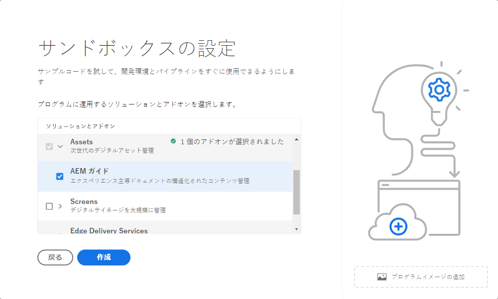

# サンドボックスプログラムの概要 {#sandbox-programs}

サンドボックスプログラムの概要と実稼動プログラムとの違いについて説明します。

## はじめに {#introduction}

サンドボックスプログラムは、通常、トレーニング、デモの実行、イネーブルメントまたは概念実証（POC）の目的にかなうように作成されるので、ライブトラフィックを実行するためのものではありません。

サンドボックスプログラムは、AEM Cloud Serviceで使用できる 2 種類のプログラムの 1 つで、もう 1 つは [ 実稼動プログラム ](introduction-production-programs.md) です。 プログラムタイプについて詳しくは、[ プログラムとプログラムタイプについて ](/help/implementing/cloud-manager/getting-access-to-aem-in-cloud/program-types.md) を参照してください。

## 自動作成 {#auto-creation}

サンドボックスプログラムは自動作成機能を備えています。[ サンドボックスプログラムを作成 ](/help/implementing/cloud-manager/getting-access-to-aem-in-cloud/creating-sandbox-programs.md) するたびに、Cloud Managerは自動的に以下を行います。

* AEM Sites、AssetsおよびEdge Delivery Servicesを、プログラムのデフォルトのソリューションとして追加します。

  

* プロジェクト Git リポジトリと、[AEM プロジェクトアーキタイプ ](https://experienceleague.adobe.com/ja/docs/experience-manager-core-components/using/developing/archetype/overview) に基づくサンプルプロジェクトをセットアップします。
* 開発環境を作成します。
* その開発環境へのデプロイメントを行う実稼動以外のパイプラインを作成します。

サンドボックスプログラムには、開発環境が 1 つしかありません。

## 制限事項と条件 {#limitations}

サンドボックスプログラムはライブトラフィック向けのものではないので、使用に関して一定の制限と条件があります。これが、実稼動プログラムとの違いです。

| 制限/条件 | 説明 |
| --- | --- |
| ライブトラフィックなし | サンドボックスプログラムは、ライブトラフィックを実行するためのものではないので、[AEM as a Cloud Serviceのコミットメント ](https://www.adobe.com/jp/legal/service-commitments.html) には従いません。 |
| 自動スケーリングなし | サンドボックスプログラムに作成された環境は、自動スケール用に設定されません。したがって、パフォーマンスや負荷テストには適しません。 |
| カスタムドメインまたは IP許可リストなし | [ カスタムドメイン ](/help/implementing/cloud-manager/custom-domain-names/introduction.md) および [IP許可リスト](/help/implementing/cloud-manager/ip-allow-lists/introduction.md) は、サンドボックスプログラムでは使用できません。 |
| 追加の公開地域はありません | [追加の公開地域](/help/operations/additional-publish-regions.md)は、サンドボックスプログラムでは使用できません。 |
| 99.99％ SLA なし | [99.99％ SLA](/help/implementing/cloud-manager/getting-access-to-aem-in-cloud/creating-production-programs.md#sla) は、サンドボックスプログラムには適用されません。 |
| 高度なネットワーク機能なし | [高度なネットワーク機能](/help/security/configuring-advanced-networking.md)（例えば、VPN のセルフサービスプロビジョニング、非標準ポート、専用のエグレス IP アドレスなど）は、サンドボックスプログラムでは使用できません。 |
| AEMの自動更新はありません | AEM のアップデートは、サンドボックスプログラムに自動的にはプッシュされませんが、サンドボックスプログラム内の環境に手動で適用することができます。 ・手動更新は、ターゲット環境に適切に設定されたパイプラインがある場合にのみ実行できます。 ・実稼動環境またはステージング環境のどちらか一方を手動で更新すると、もう一方が自動的に更新されます。 実稼働とステージングの環境セットは、同じ AEM リリースに存在する必要があります。  詳しくは、[AEM バージョンのアップデート ](/help/implementing/deploying/aem-version-updates.md) を参照してください。環境を更新する方法については、  環境の更新 ](/help/implementing/cloud-manager/manage-environments.md#updating-dev-environment) を参照してください [。 |
| テクニカルサポートなし | サンドボックスプログラムは、通常、トレーニング、デモの実行、イネーブルメントまたは POC （概念実証）の目的にかなうように作成されるので、サンドボックスプログラムで発生した問題に対するテクニカルサポートは利用できません。  サンドボックスプログラムの作成と管理で問題が発生した場合、それらの問題はテクニカルサポートの範囲内です。 |
| 休止と削除 | サンドボックスプログラム内の環境は、非アクティブな状態が 8 時間を超えると、自動的に休止状態になります。サンドボックス環境は、6 か月連続の休止状態が続いた後に削除されます。  環境の休止解除とサンドボックスの自動削除の方法について詳しくは、[ サンドボックス環境の休止と休止解除 ](/help/implementing/cloud-manager/getting-access-to-aem-in-cloud/hibernating-environments.md) を参照してください。 |
