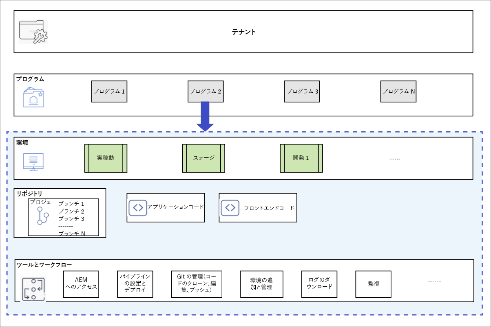

# プログラムとプログラムタイプ {#understanding-programs}

Cloud Manager は、エンティティ階層を軸に構築されています。その詳細は、Cloud Manager での日常業務にとって重要ではありませんが、概要を把握しておくと、プログラムを理解して独自のプログラムをセットアップする際に役に立ちます。



* **テナント** - これは階層の最上位です。すべての顧客にテナントがプロビジョニングされます。
* **プログラム** - 各テナントには 1 つ以上のプログラムがあります。[これらは、多くの場合、顧客がライセンスを取得したソリューションを反映しています](introduction-production-programs.md)。
* **環境** - 各プログラムには複数の環境があります。ライブコンテンツ用の実稼働環境、ステージングの環境、開発目的の環境などです。
   * 各プログラムでは、実稼動環境は 1 つだけですが、実稼働以外の環境は複数存在できます。
* **リポジトリ** - プログラムには Git リポジトリがあり、そこで環境のアプリケーションとフロントエンドコードが維持管理されています。
* **ツールとワークフロー** - パイプラインはリポジトリから環境へのコードのデプロイメントを管理し、他のツールはログへのアクセス、監視および環境管理を可能にします。

多くの場合、この階層を具体的に説明するうえで例が役に立ちます。

* WKND Travel and Adventure Enterprises は、旅行関連のメディアに重点を置いた&#x200B;**テナント**&#x200B;とします。
* WKND Travel and Adventure Enterprises テナントには、2 つの **プログラム**&#x200B;があるとします。WKND Magazine 用の 1 つの Sites プログラムと WKND Media 用の 1 つの Assets プログラムです。
* WKND Magazine プログラムにも WKND Media プログラムにも、開発、ステージング、実稼動の各&#x200B;**環境**&#x200B;があります。

## ソースコードリポジトリ {#source-code-repository}

Cloud Manager プログラムには、独自の Git リポジトリが自動的にプロビジョニングされます。

ユーザーは、コマンドラインツールを備えた Git クライアントまたはスタンドアロンのビジュアル Git クライアントを使用して、Cloud Manager Git リポジトリにアクセスできます。また、Eclipse、IntelliJ、NetBeans など、好みの統合開発環境（IDE）を使用することもできます。

Git クライアントをセットアップすると、Cloud Manager ユーザーインターフェイスから Git リポジトリを管理できます。Cloud Manager ユーザーインターフェイスを使用して Git を管理する方法については、[Git へのアクセス](/help/implementing/cloud-manager/managing-code/accessing-repos.md)を参照してください。

AEM Cloud アプリケーションの開発を開始するには、Cloud Manager リポジトリからローカルコンピューターにアプリケーションコードをチェックアウトします。

```java
$ git clone {URL}
```

標準的な Git プロセスに従ったワークフローを以下に示します。

1. ユーザーがリモート Git リポジトリをローカルにクローンします。
1. ユーザーがローカルリポジトリに変更を加えます。
1. 準備が整ったら、ユーザーは変更内容をリモート Git リポジトリにコミットします。

唯一の違いは、リモート Git リポジトリが Cloud Manager の一部になっており、開発者に対して透過的である点です。

## プログラムタイプ {#program-types}

ユーザーは、**実稼動**&#x200B;プログラムまたは&#x200B;**サンドボックス**&#x200B;プログラムを作成できます。

* **実稼動プログラム**&#x200B;は、サイトのライブトラフィックを有効にするために作成されます。
   * 詳しくは、[実稼動プログラムの概要](/help/implementing/cloud-manager/getting-access-to-aem-in-cloud/introduction-production-programs.md)を参照してください。
* **サンドボックスプログラム**&#x200B;は、通常、トレーニング、デモの実行、イネーブルメント、POC またはドキュメントの目的にかなうように作成されます。
   * サンドボックス環境はライブトラフィックを実行するためのものではなく、実稼動プログラムにはない制限事項があります。
   * Sites、Assets、Edge Delivery Services が含まれており、サンプルコード、開発環境および実稼動以外のパイプラインを含む Git 分岐が事前設定されています。
   * 詳しくは、[サンドボックスプログラムの概要](/help/implementing/cloud-manager/getting-access-to-aem-in-cloud/introduction-sandbox-programs.md)を参照してください。
