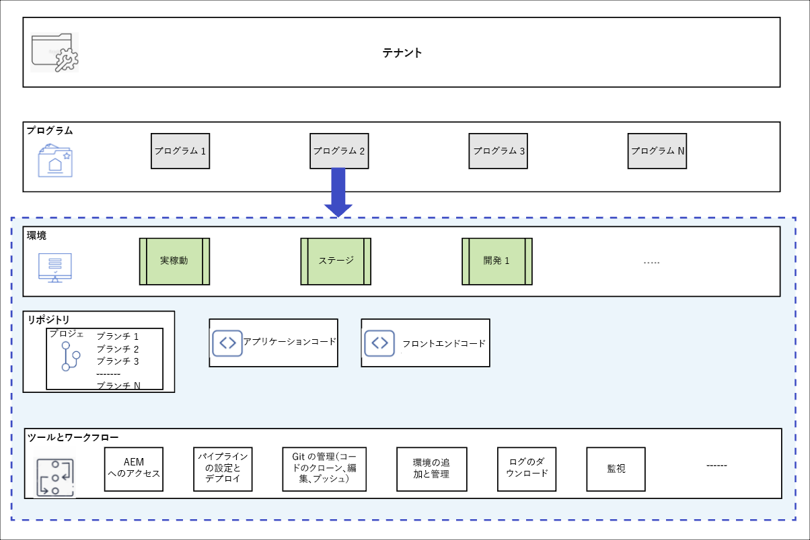

# プログラムとプログラムの種類について {#understanding-programs}

Cloud Manager では、最上位にテナントエンティティがあり、このエンティティ内に複数のプログラムを含めることができます。各プログラムには、1 つの実稼動環境と複数の非実稼動環境を含めることができます。

次の図に、Cloud Manager のエンティティの階層を示します。



## ソースコードリポジトリー {#source-code-repository}

Cloud Manager プログラムには、独自の Git リポジトリーが自動プロビジョニングされます。

ユーザーが Cloud Manager の Git リポジトリーにアクセスするには、コマンドラインツール、スタンドアロンのビジュアル Git クライアント、または Eclipse、IntelliJ、NetBeans などの IDE を使用する必要があります。

Git クライアントを設定すると、Cloud Manager UI から Git リポジトリーを管理できます。Cloud Manager UI を使用して Git を管理する方法については、「[Git へのアクセス](/help/implementing/cloud-manager/accessing-repos.md)」を参照してください。

AEM Cloud アプリケーションの開発を開始するには、 Cloud Manager リポジトリーから、リポジトリーを作成するローカルコンピューター上の場所にアプリケーションコードのローカルコピーをチェックアウトして、作成する必要があります。

```java
$ git clone {URL}
```

>[!NOTE]
>ユーザーは、自分のコードのコピーをチェックアウトし、ローカルコードリポジトリーで変更を行うことができます。準備ができたら、ユーザーはコードの変更内容を Cloud Manager のリモートコードリポジトリーにコミットして戻すことができます。

## プログラムの種類 {#program-types}

ユーザーは、**サンドボックス**&#x200B;または&#x200B;**実稼動**&#x200B;プログラムを作成できます。

* *実稼動プログラム*&#x200B;が作成され、将来の適切なタイミングでライブトラフィックを利用できるようになります。詳しくは、実稼動プログラムの概要を参照してください。


* *サンドボックスプログラム*は、通常、トレーニング、デモの実行、イネーブルメント、POC、ドキュメントの実行の目的で作成されます。ライブトラフィックを運ぶことを目的としたものではなく、実稼動プログラムにはない制限が課されます。Sites と Assets が含まれ、サンプルコード、開発環境、非実稼動パイプラインを含む Git ブランチが自動生成されて配信されます。
詳しくは、サンドボックスプログラムの紹介を参照してください。
