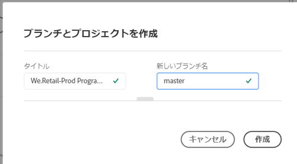
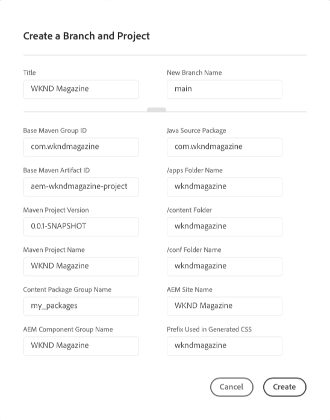
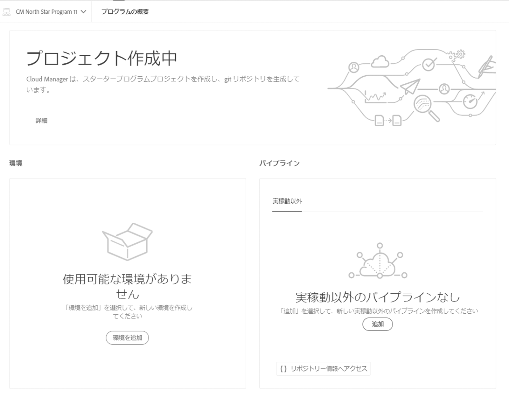
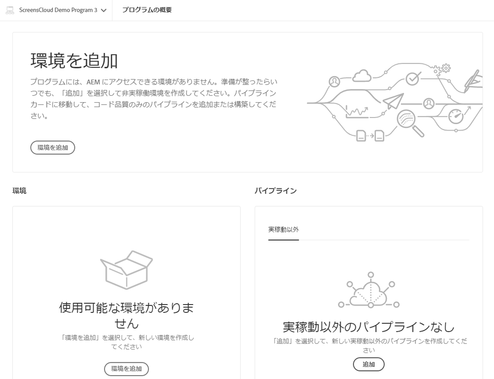

# プロジェクト作成ウィザード {#project-creation-wizard}

実稼動プログラムを作成した後、Cloud Managerでは、[AEM プロジェクトアーキタイプ &#x200B;](https://experienceleague.adobe.com/ja/docs/experience-manager-core-components/using/developing/archetype/overview)に基づいて最小限のAEM プロジェクトを作成するためのウィザードが用意されています。

ウィザードを使用してCloud ManagerでAEM アプリケーションプロジェクトを作成するには、次の手順に従います。

1. [実稼動プログラムの作成](creating-production-programs.md)ドキュメントの手順に従って、実稼動プログラムを作成します。

1. プログラムの設定が完了したら、プログラムの&#x200B;**概要**&#x200B;画面にアクセスし、最上部にある&#x200B;**分岐とプロジェクトを作成**&#x200B;コールトゥアクションカードを確認します。

   

1. 「**作成**」をクリックしてウィザードを起動し、**分岐とプロジェクトを作成**&#x200B;ウィンドウでプロジェクトの「**タイトル**」および「**新しい分岐名**」を確認します。

   

1. オプションで、分割部分をクリックしてプロジェクトのその他のパラメーターを表示します。 AEM プロジェクトアーキタイプは、デフォルト値を提供します。この値は変更する必要はありません。

   

1. 「**作成**」をクリックして、プロジェクト作成プロセスを開始します。

**プログラムの概要**&#x200B;画面の上部にある&#x200B;**分岐とプロジェクトの作成** call-to-action カードに代わる&#x200B;**進行中のプロジェクト作成** カードが表示されるようになりました。

プログラムの作成が完了すると、**プログラムの概要**&#x200B;画面の上部にある&#x200B;**プロジェクトを作成中**&#x200B;カードが、**環境を追加**&#x200B;カードに置き換えられます。

これで、AEM アーキタイプに基づく AEM プロジェクトが Git リポジトリに追加され、自身のプロジェクトの開発基盤として活用できます。 次に、プロジェクトコードをデプロイできる環境を作成できます。

環境を追加または管理する方法については、「[環境の管理](/help/implementing/cloud-manager/manage-environments.md)」を参照してください。

>[!NOTE]
>
>このウィザードは、実稼動プログラムでのみ使用できます。 [サンドボックスプログラム](introduction-sandbox-programs.md#auto-creation)にはプロジェクトの自動作成が含まれているため、このウィザードは不要です。