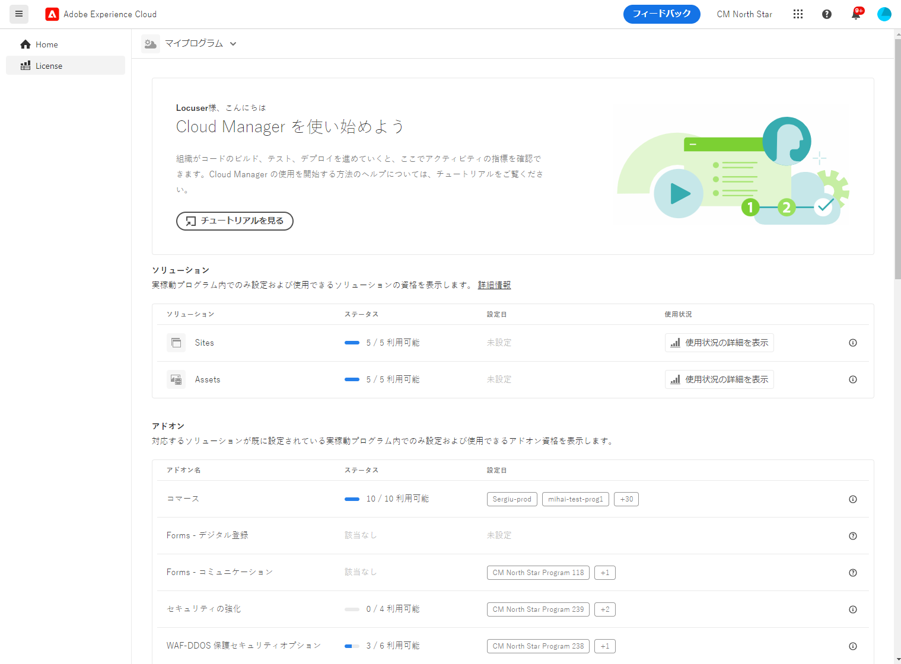
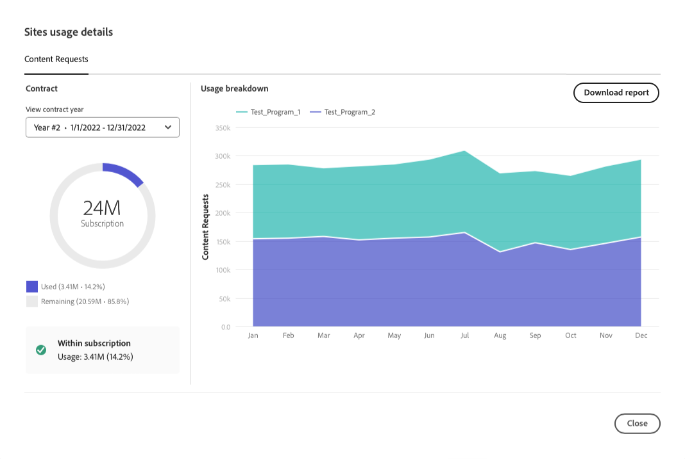
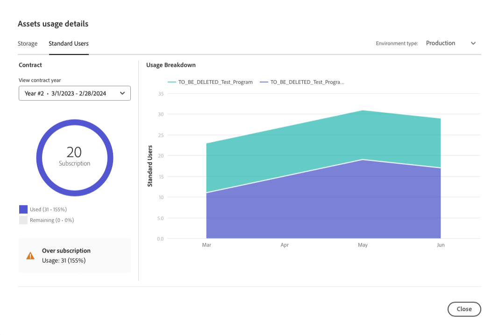

# ライセンスダッシュボード {#license-dashboard}

Cloud Manager には、組織またはテナントが使用できる AEMaaCS 製品の使用権限を簡単に表示できるダッシュボードが用意されています。

>[!IMPORTANT]
>
>ライセンスダッシュボードは、AEM as a Cloud Service プログラムにのみ適用されます。 [AMS プログラム ](https://experienceleague.adobe.com/ja/docs/experience-manager-cloud-manager/content/introduction) は、ライセンスダッシュボードには含まれていません。
>
>お使いのプログラムが保有しているサービスのタイプ（AMS または AEMaaCS）を判断する方法については、[Cloud Manager UI の操作](/help/implementing/cloud-manager/navigation.md#program-cards)を参照してください。

## 概要 {#overview}

Cloud Manager ライセンスダッシュボードを使用すると、使用済みのものや使用可能なものなど、すべてのプログラムで使用できるソリューションの使用権限に簡単にアクセスできます。 さらに、Sites ソリューションの月別のコンテンツリクエスト消費指標のトレンドも確認できます。

## ライセンスダッシュボードへのアクセス {#using-dashboard}

>[!NOTE]
>
>ライセンスダッシュボードを表示するには、**ビジネスオーナー** の役割を持つユーザーがログインする必要があります。

1. [my.cloudmanager.adobe.com](https://my.cloudmanager.adobe.com/) で Cloud Manager にログインし、適切な組織を選択します。
1. **[マイプログラム](/help/implementing/cloud-manager/navigation.md#my-programs)** コンソールで、&lbrace;4 メニューアイコンを表示 [&#128279;](/help/implementing/cloud-manager/navigation.md#cloud-manager-header) をクリックします。 このアクションにより、タブが表示されます。
1. タブの「**ライセンス**」オプションをクリックします。

ダッシュボードは、次の 3 つのセクションに分かれています。

* **ソリューション** - ライセンスを取得したソリューション。
* **アドオン** – 使用可能なライセンス済みソリューションに対するアドオン。
* **その他の使用権限** - テナント内で使用できる、サンドボックスや開発環境およびその他の使用権限。

各セクションでは、利用可能な項目と使用方法をまとめています。現在、テナントに他のソリューションが存在する場合でも、Sites および Assets ソリューションのみが表示されます。

* **ステータス**&#x200B;列には、未使用の使用権限の数と、テナントで使用可能な合計が表示されます。
* **設定済み**&#x200B;列には、ソリューションの使用権限が適用されたプログラムが示されます。
   * 使用権限は、実稼動環境が作成されたときにのみ使用されると見なされます。 または、存在する場合は、更新パイプラインが実行されている場合です。
   * 列には限られた数のプログラムのみが個別にリストされ、残りは `+x` エントリで表されます。
   * `+x` のエントリの上にマウスポインターを置くと、すべてのプログラムの詳細を含むポップアップが表示されます。
* **使用状況**&#x200B;列には、ソリューションの使用状況統計を表示するための「**[使用状況の詳細を表示](#view-usage-details)**」ボタンが表示されます。

>[!TIP]
>
>Admin Console から組織全体の Adobe 使用権限を管理する方法については、[Admin Console の概要](https://helpx.adobe.com/jp/enterprise/using/admin-console.html)を参照してください。

## 使用状況の詳細を表示 {#view-usage-details}

<!--
The **View usage details** button gives access to the chosen solution's **Usage Details** window. This window gives a detailed breakdown including charts to show your solution's usage. How that usage is measured depends on the chosen solution. -->

Cloud Manager のライセンス領域にある「**使用状況の詳細を表示**」ボタンを使用すると、現在のリソース使用状況の詳細な分類が表示されます。クリックすると、ライセンスに関連する重要な指標を示すレポートまたはダッシュボードが開きます。<!-- ADD THIS SENTENCE IF ASSETS USAGE DETAILS GETS REINSTATED ", such as the number of users, storage consumption, or bandwidth usage, depending on the type of services you're using." -->この機能により、契約の制限内に留まっていることを監視および確認しながら、より優れたリソース計画と最適化のインサイトを得ることができます。

### Sites の使用状況の詳細 {#sites-usage-details}

**Sites の使用状況の詳細** ウィンドウには、[ コンテンツリクエスト ](#what-is-a-content-request) に基づいて Sites ライセンスの使用状況の概要を示すグラフが表示されます。

ウィンドウの左側には、**契約年を表示**&#x200B;ドロップダウンで選択した契約年の契約の分類を示す円グラフが表示されます。

ウィンドウの右側には、選択した契約年についてプログラムごとに時間の経過と共に分類された使用状況を示す面グラフが表示されます。カーソルを合わせると、選択した時点のプログラムごとの詳細を示すポップアップが表示されます。

<!-- REMOVED AS PER CQDOC-21983
### Assets usage details {#assets-usage-details}

The **Assets usage details** window, presents graphs giving an overview of the usage of your Assets licenses based on [storage](#storage) and [standard users](#standard-users). Select the appropriate tab to toggle between the views.

For both storage and standard users views, you can use the **Environment Type** dropdown to toggle the view between production, stage, and development environments.

#### Storage {#storage}

The left side of the window presents a pie chart showing the contract breakdown for the contract year selected in the **View contract year** dropdown.

The right side of the window presents an area chart showing the usage broken down by program over time for the selected contract year. A hover reveals a popup with details per program for the selected point in time.

#### Standard Users {#standard-users}

The left side of the window presents a pie chart showing the contract breakdown for the contract year selected in the **View contract year** dropdown.

The right side of the window presents an area chart showing the usage broken down by program over time for the selected contract year. A hover reveals a popup with details per program for the selected point in time. -->

## よくある質問 {#faq}

+++**コンテンツリクエストとは**{#what-is-a-content-request}

コンテンツリクエストとは、AEM Sitesまたは顧客提供のキャッシュシステム（コンテンツ配信ネットワークなど）に対するリクエストのことです。 ページビュー用にHTML形式でコンテンツまたはデータを取得します。 または、API 呼び出し用の JSON 形式で指定します。

コンテンツリクエストは、ページビューごとに、または 5 回の API 呼び出しごとに 1 回カウントされます。これは、コンテンツリクエストを受信する最初のキャッシュシステムの入力時に測定されます。コンテンツリクエストは、実稼働環境に対してのみカウントされます。

コンテンツリクエストは、製品やサービスを提供することのみを目的とし、アドビが開始した、またはアドビに代わって開始されたリクエストやアクティビティを除外します。一般的な検索エンジンやソーシャルメディアサービスに関連する、ボット、クローラー、スパイダーからのアドビが特定したユーザーエージェントトラフィックも除外されます。

詳しくは、[Cloud Service コンテンツリクエストについて](/help/implementing/cloud-manager/content-requests.md)も参照してください。
+++

+++**Adobe Experience Managerではコンテンツリクエストをどのように測定しますか？**{#how-are-content-requests-measured}

コンテンツリクエストは、AEM as a Cloud Service のエッジサーバーで追跡されます。元のトラフィックは、コンテンツリクエストにはカウントされません。AEM as a Cloud Service に組み込まれた CDN は、有効な HTML リクエストと JSON リクエストを追跡します。

AEM には、よく知られているボットを除外するルールも用意されています。これには、検索インデックスまたはサービスを更新するためにサイトに定期的にアクセスするよく知られているサービスも含まれます。

[Cloud Service コンテンツリクエストについて](/help/implementing/cloud-manager/content-requests.md)も参照してください。
+++

+++**Analytics レポートにAEM コンテンツリクエストと異なる結果が表示されるのはなぜですか？**{#why-are-reports-different}

コンテンツリクエストは、組織の Analytics レポートツールと異なる場合があります。詳しくは、[Cloud Service コンテンツリクエストについて](/help/implementing/cloud-manager/content-requests.md)を参照してください。
+++

+++**コンテンツリクエスト量の詳細を把握したい場合はどうすればよいですか？**{#current-request-volumes}

ライセンスダッシュボードに表示されるコンテンツリクエスト量について詳しい情報が必要な場合は、コンテンツリクエスト量を増やす最大要因を示すレポートを、Adobeチームから提供することができます。 アドビチームまたはアドビカスタマーサポートに問い合わせて、上位使用状況レポートをご依頼ください。
+++

+++**独自の CDN を使用している場合はどうなりますか？**{#using-own-cdn}

ライセンスダッシュボードには、Cloud ServiceCDN で追跡されたデータのみが表示されます。 独自の CDN（BYOCDN）を導入する場合は、契約に従い、コンテンツリクエスト量を年単位でアドビに報告します。
+++

