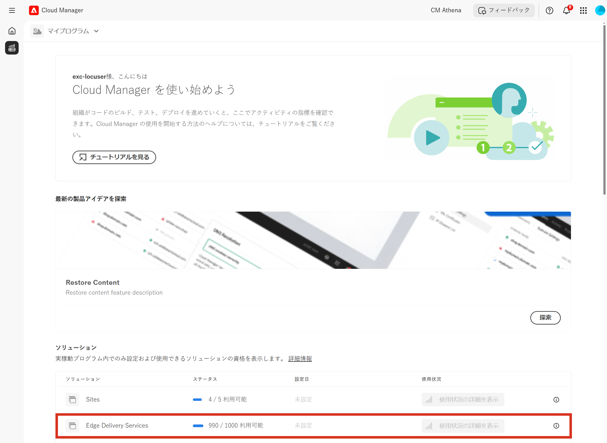

# ライセンスダッシュボード {#license-dashboard}

Cloud Manager には、組織またはテナントが使用できる AEMaaCS 製品の使用権限を簡単に表示できるダッシュボードが用意されています。

## 概要 {#overview}

Cloud Manager ライセンスダッシュボードを使用すると、次の情報に簡単にアクセスできます。

1. 使用済みのものや利用可能なものなど、すべてのプログラムで利用可能なソリューションの使用権限
1. Sites ソリューションの月別のコンテンツリクエスト消費指標

## ライセンスダッシュボードの使用 {#using-dashboard}

ライセンスダッシュボードにアクセスするには、次の手順に従います。

>[!NOTE]
>
>のユーザー **ビジネスオーナー** の役割をログインして、ライセンスダッシュボードを表示する必要があります。

1. [my.cloudmanager.adobe.com](https://my.cloudmanager.adobe.com/) で Cloud Manager にログインし、適切な組織を選択します。

1. 製品の概要ページで、 **ライセンス** タブをクリックします。

ダッシュボードは、次の 3 つのセクションに分かれています。

* **ソリューション**  — この節では、Sites や Assets などのライセンスを取得したソリューションの概要を説明します。
* **アドオン**  — この節では、使用可能なライセンス済みソリューションに対するアドオンの概要を説明します。
* **サンドボックスと開発環境**  — この節では、使用可能な環境の概要を説明します。

各節では、利用可能な項目と現在の使用方法をまとめます（すべての場合）。 現在、テナントに他のソリューションが存在する場合でも、Sites ソリューションのみが表示されます。

* この **ステータス** 「 」列には、テナントの未使用使用権限の数と使用可能な合計が表示されます。
* この **設定日** 「 」列には、ソリューション使用権限が適用されたプログラムが示されます。
   * 使用権限は、実稼動環境が作成された場合、または既に存在する場合（更新パイプラインが実行されている場合）にのみ使用されると見なされます。
* この **使用状況** 列には、過去 12 ヶ月間に消費されたコンテンツリクエストがクリックされたときのグラフとして表示されます。

>[!TIP]
>
>Admin Console から、アドビ製品の使用権限を組織全体で管理する方法については、[Admin Console の概要](https://helpx.adobe.com/jp/enterprise/using/admin-console.html)を参照してください。

## よくある質問 {#faq}

### コンテンツリクエストとは {#what-is-a-content-request}

コンテンツリクエストは、AEM Sitesか、お客様が提供するキャッシュシステム（コンテンツ配信ネットワークなど）で、コンテンツやデータをページビューまたは JSON 形式で API 呼び出しとしてHTMLで配信するリクエストです。

コンテンツリクエストは、ページビューごとに、または 5 回の API 呼び出しごとに 1 回カウントされます。これは、コンテンツリクエストを受け取る最初のキャッシュシステムの入力時に測定されます。

コンテンツリクエストは、製品やサービスを提供する目的のみで、Adobeによって、または代理で開始されたリクエストやアクティビティを除外します。 Adobeが識別したユーザーエージェントトラフィックは、一般的な検索エンジンやソーシャルメディアサービスに関連するボット、クローラー、スパイダーからのトラフィックも除外されます。

### Adobe Experience Managerはコンテンツリクエストをどのように測定しますか？ {#how-are-content-requests-measured}

コンテンツリクエストは、Cloud Service内でサーバーサイドで追跡されます。 AEMas a Cloud Serviceに組み込まれた CDN は、有効なHTMLおよび JSON リクエストを追跡します。 AEMには、よく知られているボットを除外するルールも用意されています。これには、サイトを定期的に訪問して検索インデックスやサービスを更新する、よく知られているサービスも含まれます。

以下は、除外された既知のサービスの例を一覧にしたものです。

* AddSearchBot
* AhrefsBot
* Applebot
* Ask Jeeves Corporate Spider
* Bingbot
* BingPreview
* BLEXBot
* BuiltWith
* Bytespider
* CrawlerKengo
* Facebookexternalhit
* Google AdsBot
* Google AdsBot Mobile

### Analytics レポートにAEMコンテンツリクエストと異なる結果が表示されるのはなぜですか？ {#why-are-reports-different}

コンテンツリクエストは、次の表に要約されるように、組織の Analytics レポートツールとの相違を持ちます。

| 差異の理由 | 説明 |
|---|---|
| タグ付け | AEMコンテンツリクエストとして追跡されるすべてのページが、Analytics トラッキングでタグ付けされる場合とされない場合があります。 AEMコンテンツリクエストとして追跡されるすべての API 呼び出しは、組織の Analytics ツールによってタグ付けされません。 ページまたは API 呼び出しは、ビューではなくアクションを追跡するようにタグ付けされる場合があります。 |
| Tag Management Rules | Tag Management のルール設定により、ページ上で様々なデータ収集設定がおこなわれ、その結果、コンテンツリクエストの追跡との組み合わせに相違が生じる場合があります。 |
| ボット | AEMによって事前に識別および削除されていない不明なボットは、トラッキングの不一致の原因となる場合があります。 |
| レポートスイート | 同じAEMインスタンスとドメインに属するページは、異なる Analytics レポートスイートにデータを送信する場合があります。 |
| サードパーティの監視およびセキュリティツール | 監視およびセキュリティスキャンツールによって、Analytics レポートで追跡されないAEMのコンテンツリクエストが生成される場合があります。 |
| プリフェッチ要求 | プリフェッチサービスを使用してページをプリロードして速度を上げると、コンテンツリクエストのトラフィックが大幅に増加する可能性があります。 |
| DDOS | Adobeは、DDOS 攻撃からのトラフィックを自動的に検出して除外するためのあらゆる努力を行っていますが、DDOS 攻撃がすべて検出される保証はありません。 |

### 独自の CDN を使用している場合はどうなりますか。 {#using-own-cdn}

Cloud Manager のコンテンツリクエストダッシュボードには、独自の CDN のトラッキングは表示されません。
