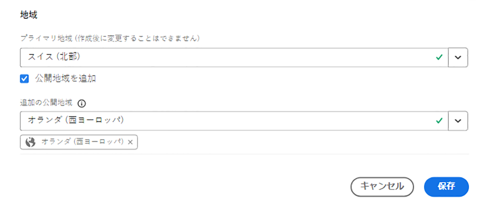
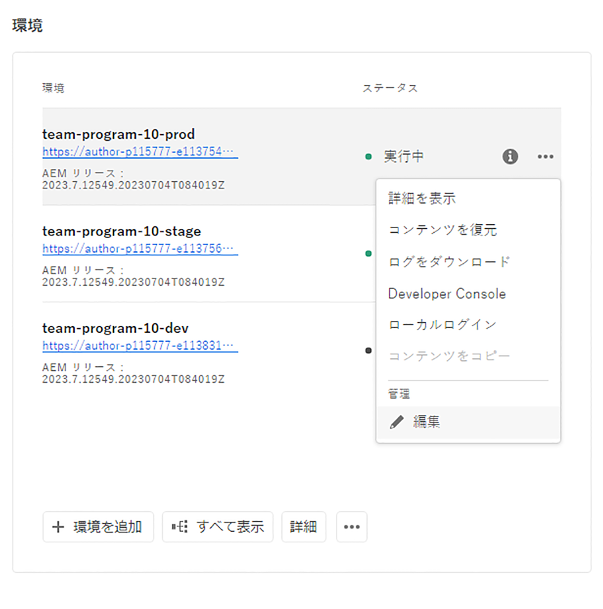
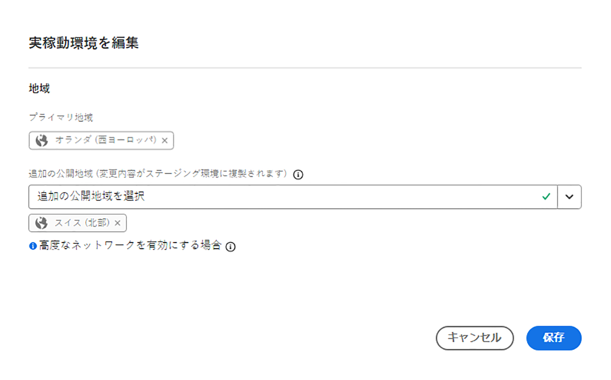
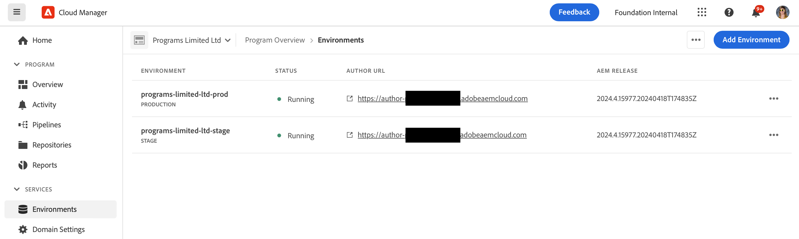
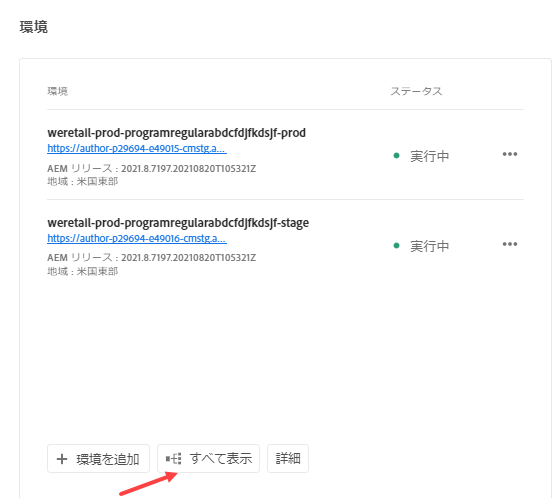
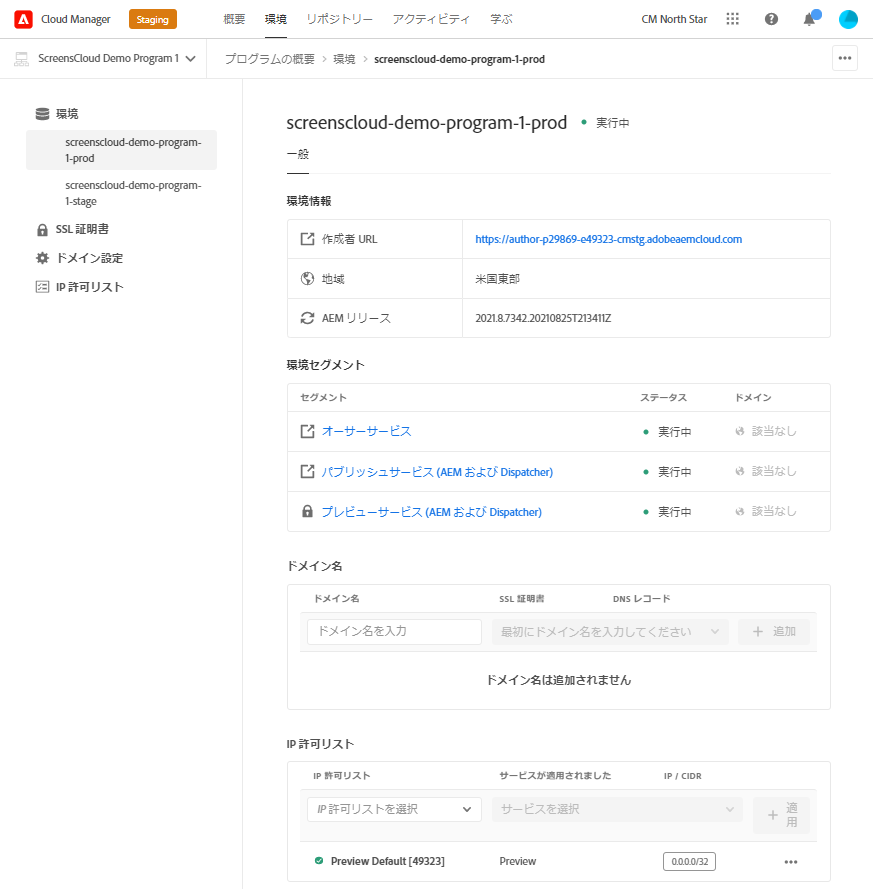
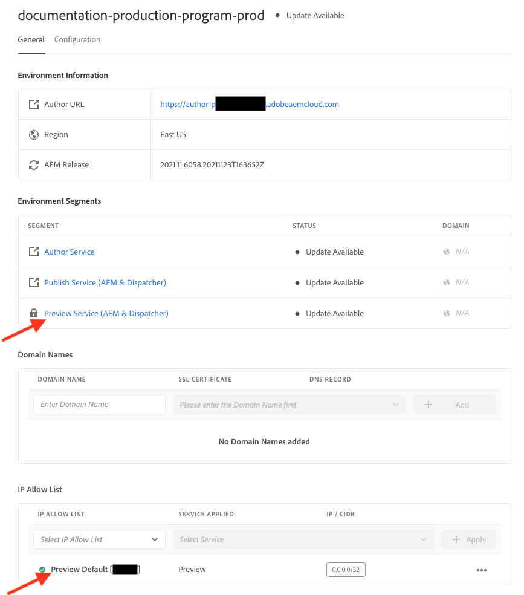

# 環境の管理 {#managing-environments}

作成できる環境のタイプと、Cloud Manager プロジェクト用に環境を作成する方法について説明します。

## 環境タイプ {#environment-types}

必要な権限を持っているユーザーは、（特定のテナントで使用できる範囲内で）次のタイプの環境を作成できます。

| 環境タイプ | 説明 |
| --- | --- |
| **実稼動 + ステージ** | 実稼動環境とステージング環境はペアとして使用でき、それぞれ実稼動およびテストに使用されます。ステージ環境でパフォーマンスとセキュリティのテストを実施します。 規模は実稼動と同じです。 |
| **開発** | 開発環境は、開発およびテストの目的で構築でき、実稼動以外のパイプラインにのみ関連付けることができます。開発環境は、ステージング環境や実稼動環境と同じ規模ではないので、パフォーマンスおよびセキュリティのテストの実行には使用しないでください。 |
| **高速開発** | 高速開発環境（RDE）を使用すると、開発者は変更を迅速にデプロイしてレビューできます。この機能により、ローカル開発環境で既に検証済みの機能のテストに必要な時間が短縮されます。RDE の使用方法について詳しくは、[高速開発環境ドキュメント](/help/implementing/developing/introduction/rapid-development-environments.md)を参照してください。 |
| **特殊なテスト環境** | 専用のテスト環境は、ほぼ実稼動状態で機能を検証する専用のスペースを提供し、ストレステストや高度なデプロイメント前のチェックに最適です。 [専用のテスト環境の追加](/help/implementing/cloud-manager/specialized-test-environment.md)を参照してください。 |

>[!NOTE]
>
>**専用テスト環境** 機能は、現在、非公開のベータプログラムでのみ使用できます。 プライベートベータ版に新規登録するには、[ 専用テスト環境 ](/help/implementing/cloud-manager/release-notes/current.md#specialized-test-environment) を参照してください。

各環境の機能は、その環境の[プログラム](/help/implementing/cloud-manager/getting-access-to-aem-in-cloud/program-types.md)で有効になっているソリューションによって異なります。

* [Sites](/help/overview/introduction.md)
* [Assets](/help/assets/overview.md)
* [Forms](/help/forms/home.md)
* [Screens](/help/screens-cloud/introduction/introduction.md)

>[!NOTE]
>
>実稼動環境とステージング環境はペアとしてのみ作成されます。 実稼動専用またはステージング専用の環境は作成できません。

## 環境の追加 {#adding-environments}

環境を追加または編集するには、ユーザーが&#x200B;**ビジネスオーナー**&#x200B;の役割のメンバーである必要があります。

**環境を追加するには：**

1. [my.cloudmanager.adobe.com](https://my.cloudmanager.adobe.com/) で Cloud Manager にログインし、適切な組織を選択します。

1. **[マイプログラム](/help/implementing/cloud-manager/navigation.md#my-programs)**&#x200B;コンソールで、環境を追加するプログラムをクリックします。

1. 次のいずれかの操作を行います。

   「**環境を追加**」オプションがグレー表示（無効）になっている場合は、権限が不足しているか、ライセンス済みリソースに依存している場合があります。

   * **[マイプログラム](/help/implementing/cloud-manager/navigation.md#my-programs)**&#x200B;コンソールで、**環境**&#x200B;カードの「**環境を追加**」をクリックします。

   

   * 左側のサイドパネルで、「**環境**」をクリックし、環境ページの右上隅近くにある「**環境を追加**」をクリックします。

     

1. **環境を追加**&#x200B;ダイアログボックスで、次の操作を行います。

   * 「[**環境タイプ**](#environment-types)」を選択します。使用可能な環境または使用中の環境の数は、環境タイプ名の後ろの括弧内に表示されます。
   * 環境の&#x200B;**名前**&#x200B;を入力します。環境名は、環境の作成後に変更できません。
   * 環境のオプションの&#x200B;**説明**&#x200B;を入力します。
   * **実稼動環境とステージング環境**&#x200B;を一緒に追加する場合は、実稼動環境とステージング環境の両方の名前と説明を入力する必要があります。
   * ドロップダウンから「**プライマリ地域**」を選択します。プライマリ地域は作成後に変更できません。また、使用可能な権限によっては、[複数の地域](#multiple-regions)を設定できる場合があります。

   

1. 「**保存**」をクリックします。

これで、**概要**&#x200B;ページの&#x200B;**環境**&#x200B;カードに新しい環境が表示されるようになりました。新しい環境にパイプラインを設定できるようになりました。

## 複数の公開地域 {#multiple-regions}

**ビジネスオーナー**&#x200B;の役割を持つユーザーは、メイン地域に加えて、最大 3 つの公開地域を追加で含めるように、実稼動環境とステージング環境を設定できます。 追加の公開地域を使用すると、可用性が向上します。 詳しくは、[追加の公開地域に関するドキュメント](/help/operations/additional-publish-regions.md)を参照してください。

>[!TIP]
>
>[Cloud Manager API](https://developer.adobe.com/experience-cloud/cloud-manager/guides/api-usage/creating-programs-and-environments/#creating-aem-cloud-service-environments?lang=ja) を使用して、使用可能な地域の現在のリストをクエリします。

### 新しい環境への複数の公開地域の追加 {#add-regions}

環境を追加する際に、メイン地域に加えて、追加の地域も設定できます。

1. **メイン地域**&#x200B;を選択します。
   * 環境を作成後は、メイン地域を変更できません。
1. 「**追加の公開地域を追加する**」オプションを選択すると、新しい「**追加の公開地域**」オプションのドロップダウンが表示されます。
1. 「**追加の公開地域**」ドロップダウンで、追加の地域を選択します。
1. 選択した地域がドロップダウンの下に追加され、選択内容が示されます。
   * 選択した地域の隣にある `X` を選択すると、選択を解除できます。
1. 「**追加の公開地域**」ドロップダウンで別の地域を選択して、別の地域を追加します。
1. 環境を作成する準備が整ったら、「**保存**」を選択します。

選択した地域は、実稼動環境とステージング環境の両方に適用されます。

追加の地域を指定しない場合は、[環境を作成した後でも指定できます。](#edit-regions)

プログラムの[高度なネットワーク](/help/security/configuring-advanced-networking.md)をプロビジョニングする場合は、Cloud Manager API を使用して追加の公開地域を環境に追加する前に、このプロビジョニングを行うことをお勧めします。 そうしないと、追加の公開地域のトラフィックがプライマリ地域のプロキシを通過します。

### 複数の公開地域の編集 {#edit-regions}

最初に追加の地域を指定しなかった場合、環境が作成され、必要な権限が付与された後に指定できます。

また、追加の公開地域を削除することもできます。ただし、1 つのトランザクションで行えるのは、地域の追加または削除のいずれかのみとなります。1 つの地域を追加し、1 つの地域を削除する必要がある場合は、まず追加して、変更を保存してから、削除します（または逆の順序）。

1. プログラムのプログラム概要コンソールから、実稼動環境の  をクリックし、メニューの「**編集**」を選択します。

   

1. **実稼動環境を編集**&#x200B;ダイアログで、追加の公開地域に必要な変更を加えます。
   * 「**追加の公開地域**」ドロップダウンリストで、追加の地域を選択します。
   * 選択した追加の公開地域の隣にある「X」をクリックすると、地域の選択が解除されます。

   

1. 「**保存**」を選択して、変更を保存します。

実稼動環境に対する変更は、実稼動環境とステージング環境の両方に適用されます。 複数の公開地域に対する変更を編集できるのは、実稼動環境のみです。

プログラムの[高度なネットワーク](/help/security/configuring-advanced-networking.md)をプロビジョニングする場合は、追加の公開地域を環境に追加する前に、このプロビジョニングを行うことをお勧めします。 そうしないと、追加の公開地域のトラフィックがプライマリ地域のプロキシを通過します。

## 環境の詳細へのアクセス {#viewing-environment}

1. 環境の詳細にアクセスするには、次のいずれかの操作を行います。

   * **概要**&#x200B;ページの左側のサイドメニューで、「**環境**」をクリックします。

   

   * **環境**&#x200B;カードから、「**すべて表示**」をクリックします。

     

   **環境**&#x200B;ページが開いて、プログラムのすべての環境が一覧表示されます。

   

1. 環境ページで、次のいずれかの操作を行います。

   * リスト内の環境をクリックすると、その環境の詳細が表示されます。

   

   * 目的の環境の  をクリックし、「**詳細を表示**」をクリックします。

   

>[!NOTE]
>
>**環境**&#x200B;カードには 3 つの環境のみ表示されます。 カードの「**すべて表示**」をクリックすると、プログラムのすべての環境が表示されます。

### プレビューサービスへのアクセス {#access-preview-service}

Cloud Manager は、各 AEM as a Cloud Service 環境に（追加のパブリッシュサービスとして）プレビューサービスを提供します。

このサービスを使用すると、web サイトが実際のパブリッシュ環境に達して公開される前に、web サイトの最終的なエクスペリエンスをプレビューできます。

作成時に、プレビューサービスには、`Preview Default [<envId>]` というラベルの付いたデフォルトの IP 許可リストが適用されます。これはプレビューサービスへのすべてのトラフィックをブロックします。 デフォルトの IP 許可リストをプレビューサービスから適用解除して、アクセスを有効にできます。

必要な権限を持つユーザーは、プレビューサービスの URL を共有する前に、次の手順を完了して、URL に確実にアクセスできるようにする必要があります。

1. 適切な IP 許可リストを作成してプレビューサービスに適用し、`Preview Default [<envId>]` 許可リストの適用を直ちに解除します。

   詳しくは、[IP 許可リストの適用と適用解除](/help/implementing/cloud-manager/ip-allow-lists/apply-allow-list.md)を参照してください。

1. **IP 許可リスト**&#x200B;の更新ワークフローを使用して、デフォルトの IP を削除し、必要な IP を追加します。詳しくは、[IP 許可リストの管理](/help/implementing/cloud-manager/ip-allow-lists/managing-ip-allow-lists.md)を参照してください。

プレビューサービスへのアクセスをロック解除すると、プレビューサービス名の前にあるロックアイコンは非表示になります。

アクティブ化した後は、AEM 内の、**`Manage Publication`** ユーザーインターフェイスを使用して、コンテンツをプレビューサービスに公開できます。詳しくは、[コンテンツのプレビュー](/help/sites-cloud/authoring/sites-console/previewing-content.md)を参照してください。

>[!NOTE]
>
>プレビューサービスを使用するには、環境が AEM バージョン `2021.05.5368.20210529T101701Z` 以降である必要があります。 プレビューサービスを使用できるよう、自身の環境で更新パイプラインが正常に動作していることを確認します。

### 追加の公開地域のステータス {#additional-region-status}

追加の公開地域を有効化した場合は、**環境**&#x200B;カードからこれらの地域のステータスを確認できます。

1. **概要**&#x200B;ページで、**環境**&#x200B;カードを探します。

1. **環境**&#x200B;カードの&#x200B;**ステータス**&#x200B;列には、設定された追加の公開地域に問題があるかどうかが表示されます。「**情報**」アイコンをクリックして、地域の詳細を表示します。

   

または、「**環境**」タブからも同じ情報にアクセスできます。

1. **概要**&#x200B;ページで、「**環境**」をクリックします。

1. 「**環境**」ページの左側のサイドメニューで、クエリを実行する環境を選択します。

1. 環境を選択したら、次の手順に従います。

   * **環境情報**&#x200B;テーブルには、選択した環境に対して設定されている地域が表示されます。
   * **環境セグメント**&#x200B;テーブルの&#x200B;**ステータス**&#x200B;列には、設定された追加の公開地域に問題があるかどうかが表示されます。ステータスの上にポインタを合わせると、イシューの詳細が表示されます。

   

追加の公開地域で問題が報告された場合は、しばらくお待ちください。Cloud Manager は継続的に地域の回復を試み、この地域はいつでも使用できるようになります。数時間後も問題が解決しない場合は、追加の公開地域を削除し、（同じ地域または別の地域の）公開地域を再度追加して、完全なデプロイメントをトリガーできます。

追加のアクションを実行する前に、システムが自動的に回復するまでどれくらいの時間待つかは、その地域の障害がシステムに与える影響によって異なります。

いずれの場合も、[トラフィックは、常にオンライン状態の最も近い地域にルーティングされます](/help/operations/additional-publish-regions.md)。引き続き問題が発生する場合は、アドビカスタマーケアにお問い合わせください。

## 環境の更新 {#updating-dev-environment}

クラウドネイティブなサービスとして、アドビでは実稼動プログラム内の開発環境、ステージング環境および実稼動環境の更新を自動的に管理します。

ただし、サンドボックスプログラム内の環境の更新は、プログラム内で管理されます。 そのような環境で AEM の最新の公開バージョンが動作していない場合、プログラムの&#x200B;**概要**&#x200B;画面で&#x200B;**環境**&#x200B;カードのステータスには&#x200B;**アップデート利用可能**&#x200B;と表示されます。

### アップデートとパイプライン {#updates-pipelines}

パイプラインは、[AEM as a Cloud Service の環境にコードをデプロイ](deploy-code.md)する唯一の手段です。そのため、各パイプラインは特定の AEM バージョンに関連付けられています。

パイプラインで前回デプロイされた AEM よりも新しいバージョンの AEM が Cloud Manager で検出された場合は、環境のステータスが&#x200B;**更新可能**&#x200B;と表示されます。

したがって、更新プロセスは次の 2 つの手順で構成されます。

1. パイプラインを最新バージョンの AEM に更新する
1. パイプラインを実行して新しいバージョンの AEM を環境にデプロイする

### 環境の更新 {#updating-your-environments}

>[!NOTE]
> 2024年の時点では、開発インスタンスと一部のサンドボックスプログラムは既に自動的に更新されているので、それらの更新を手動で管理する必要はありません。 この移行の結果、開発インスタンスの環境を手動で更新するオプションを、_一部_&#x200B;のプログラムで使用できない場合があります。

「**更新**」オプションは、特定の開発環境およびサンドボックス環境の&#x200B;**環境**&#x200B;カードで使用できます。**更新**&#x200B;にアクセスするには、環境の横にある  をクリックします。

このオプションは、プログラムの「**環境**」タブをクリックした後、環境の  をクリックしても使用できます。

**デプロイメントマネージャー**&#x200B;または&#x200B;**ビジネスオーナー**&#x200B;の役割を持つユーザーは、このオプションを使用して、この環境に関連付けられているパイプラインを最新の AEM バージョンに更新できます。

パイプラインのバージョンが公開済みの最新の AEM バージョンに更新されたら、ユーザーは、関連するパイプラインを実行して最新バージョンの AEM を環境にデプロイするように促されます。

「**更新**」オプションの動作は、プログラムの設定と現在の状態によって異なります。

| 状態 | 「更新」オプション... |
| --- | --- |
| パイプラインが既に更新されている | ユーザーにパイプラインの実行を求めるプロンプトが表示されます。 |
| パイプラインが既に更新中である | 更新が既に実行中であることをユーザーに通知します。 |
| パイプラインが存在しない | ユーザーに作成を求めるプロンプトが表示されます。 |

## 開発環境の削除 {#deleting-environment}

**デプロイメントマネージャー**&#x200B;または&#x200B;**ビジネスオーナー**&#x200B;の役割を持つユーザーは、開発環境を削除できます。

**環境**&#x200B;カードのプログラムの&#x200B;**概要**&#x200B;画面で、削除する開発環境の  をクリックします。

「**削除**」オプションは、プログラムの&#x200B;**概要**&#x200B;ウィンドウの「**環境**」タブでも使用できます。環境の  をクリックし、「**削除**」を選択します。

>[!NOTE]
>
>* 実稼動プログラムに作成された実稼動環境とステージング環境は削除できません。
>* サンドボックスプログラム内の実稼動環境とステージング環境は削除できます。

## アクセスの管理 {#managing-access}

**環境**&#x200B;カードで環境の省略記号メニューから「**アクセスを管理**」を選択します。 オーサーインスタンスに直接移動して、環境のアクセスを管理できます。

>[!TIP]
>
>AEM as a Cloud Service チームおよび製品プロファイルで、ライセンス取得済みのアドビソリューションに対するアクセスを許可および制限する方法について詳しくは、[AEM as a Cloud Service チームおよび製品プロファイル](/help/onboarding/aem-cs-team-product-profiles.md)を参照してください。

## Developer Console へのアクセス {#accessing-developer-console}

1. **環境**&#x200B;カードから、 をクリックし、「**Developer Console**」をクリックします。

ブラウザーに新しいタブが開き、**Developer Console** へのログオンページが表示されます。

**Developer Console** にアクセスできるのは、**開発者**&#x200B;の役割を持つユーザーだけです。 ただし、サンドボックスプログラムの場合は、そのサンドボックスプログラムにアクセスできるユーザーは誰でも、**Developer Console** にアクセスできます。

詳しくは、[サンドボックス環境の休止と休止解除](https://experienceleague.adobe.com/ja/docs/experience-manager-cloud-service/content/implementing/using-cloud-manager/programs/introduction-sandbox-programs#hibernation)を参照してください。

このオプションは、個々の環境の  をクリックする際に&#x200B;**概要**&#x200B;ウィンドウの「**環境**」タブで使用できます。

## ローカルでログイン {#login-locally}

1. 次のいずれかの操作を行います。

   * **環境**&#x200B;カードから、 をクリックし、「**ローカルログイン**」をクリックします。

     

   * 左側のサイドパネルから、「**環境**」をクリックします。**環境**&#x200B;ページで、 をクリックし、「**ローカルログイン**」をクリックします。

     

## カスタムドメイン名の管理 {#manage-cdn}

Cloud Manager では、Sites プログラムのパブリッシュサービスとプレビューサービスの両方に対してカスタムドメイン名がサポートされています。

>[!TIP]
>
>詳しくは、[カスタムドメイン名の概要](/help/implementing/cloud-manager/custom-domain-names/introduction.md)を参照してください。

## IP 許可リストの管理 {#manage-ip-allow-lists}

Cloud Manager では、Sites プログラムのオーサリングサービス、パブリッシュサービス、プレビューサービスで IP 許可リストがサポートされています。

IP 許可リストを管理するには、プログラムの&#x200B;**概要**&#x200B;ページの  **環境**&#x200B;ページに移動します。個々の環境をクリックすると、その詳細を管理できます。

### IP 許可リストの適用 {#apply-ip-allow-list}

IP 許可リストを適用すると、定義されたすべての IP 範囲が、環境のオーサーサービスまたはパブリッシュサービスにリンクされます。

>[!TIP]
>
>詳しくは、[IP 許可リストの概要](/help/implementing/cloud-manager/ip-allow-lists/introduction.md)を参照してください。
