# 環境の管理 {#manage-environments}

以下では、ユーザーが作成できる環境のタイプと、環境の作成方法について説明します。

## 環境タイプ {#environment-types}

必要な権限を持っているユーザーは、（特定のテナントで使用できる範囲内で）次のタイプの環境を作成できます。

* **実稼動環境とステージ環境**：実稼動環境とステージ環境はペアとして使用でき、テストおよび実稼動のために使用されます。

* **開発環境**：開発環境は、開発およびテストのために構築でき、実稼動以外のパイプラインにのみ関連付けられます。

   >[!NOTE]
   >サンドボックスプログラムで自動的に作成される開発環境は、Sites および Assets ソリューションを組み込むように設定されます。

   環境タイプとその属性を次の表にまとめます。

   | 名前 | オーサー層 | パブリッシュ層 | ユーザーによる作成が可能 | ユーザーによる削除が可能 | 環境への関連付けが可能なパイプライン |
   |--- |--- |--- |--- |---|---|
   | 実稼動 | はい | はい（Sites が組み込まれる場合） | はい | 不可 | 実稼動パイプライン |
   | ステージ | はい | はい（Sites が組み込まれる場合） | はい | 不可 | 実稼動パイプライン |
   | 開発 | はい | はい（Sites が組み込まれる場合） | はい | はい | 実稼動以外のパイプライン |

   >[!NOTE]
   >実稼動環境とステージ環境はペアとして使用でき、テストおよび実稼動のために使用されます。ユーザーは、ステージ環境か実稼動環境のどちらか一方のみを構築することはできません。

## 環境の追加 {#adding-environments}

1. 環境を追加するには、「**環境を追加**」をクリックします。このボタンは、**環境**画面で使用できます。
   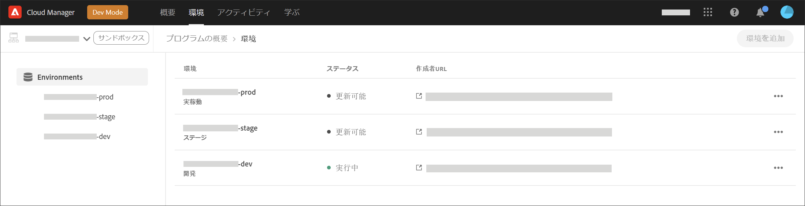

   プログラムに環境がない場合は、**環境**&#x200B;カードでも「**環境を追加**」オプションが使用可能です。

   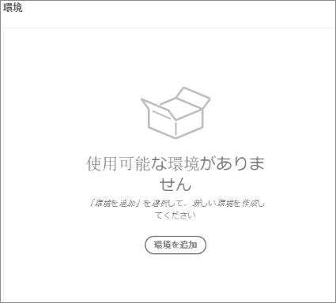

   >[!NOTE]
   >権限がない場合や、契約内容によっては、「**環境を追加**」オプションは無効になります。

1. **環境を追加**&#x200B;ダイアログボックスが表示されます。ユーザーは、「**環境タイプ**」、「**環境名**」、「**環境の説明**」などの詳細を指定する必要があります（必要な情報は、特定のテナントで使用できる範囲内で環境を作成する際のユーザーの目的によって異なります）。

   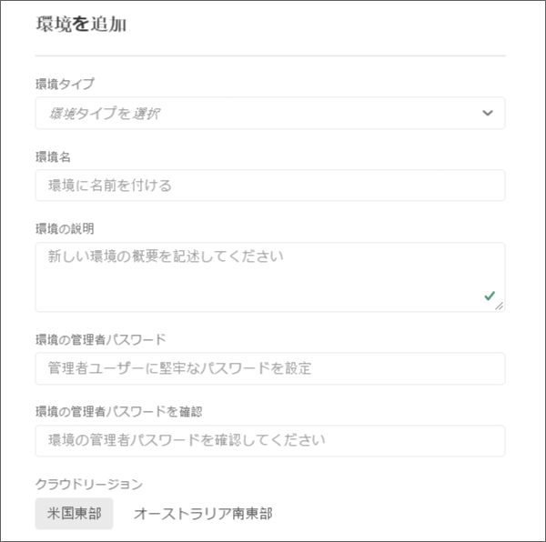

   >[!NOTE]
   >環境を作成すると、Adobe I/O に 1 つ以上の&#x200B;*統合*&#x200B;が作成されます。これらは、Adobe I/O コンソールにアクセスできる顧客ユーザーに表示され、削除することはできません。削除できないことについては、Adobe I/O コンソール内で説明されます。

   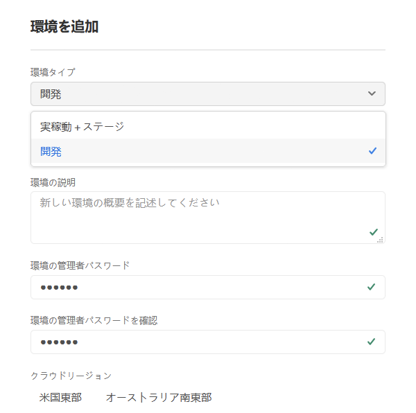

1. 「**保存**」をクリックして、条件が入力された環境を追加します。*概要*&#x200B;画面に、パイプラインのセットアップに使用できるカードが表示されます。

   >[!NOTE]
   >実稼動以外のパイプラインをまだセットアップしていない場合は、*概要*&#x200B;画面に、実稼動以外のパイプラインの作成に使用できるカードが表示されます。

## 表示環境 {#viewing-environment}

概要ページの **環境** ・カードは、最大3環境までリストできます。

1. 「すべて **を表示** 」ボタンを選択して、 **** 環境の概要ページに移動し、環境のリストが完全に含まれた表を表示します。

   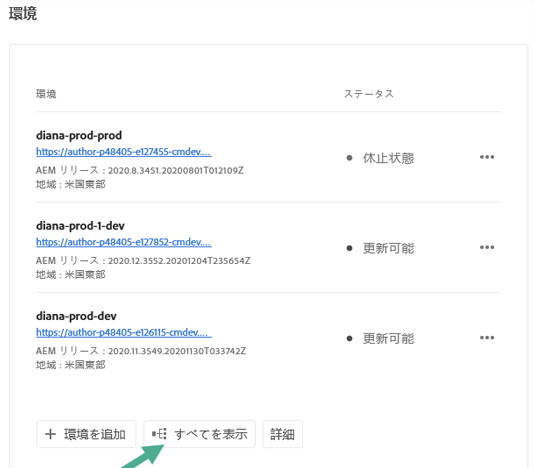

1. **環境** ページには、既存の環境のリストがすべて表示されます。

   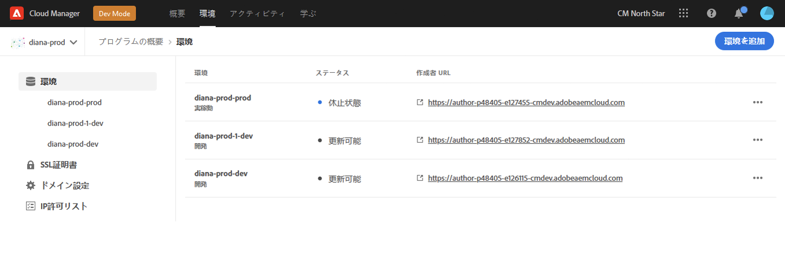

1. 環境の詳細を表示するリストの環境のいずれかを選択します。

   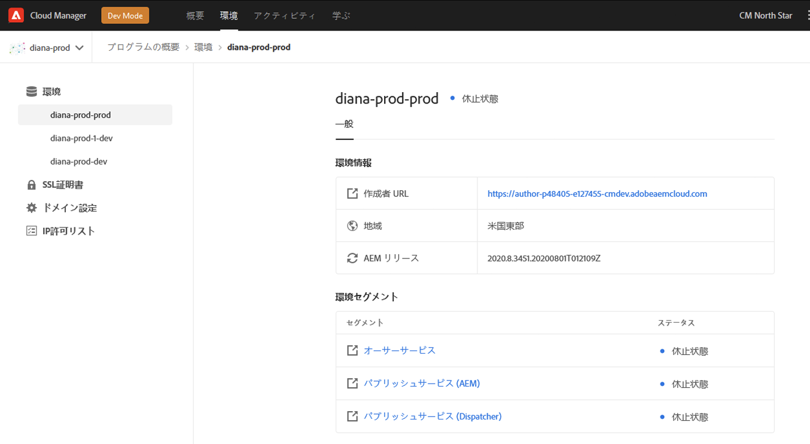

## 環境の更新 {#updating-dev-environment}

ステージ環境と実稼動環境の更新は、アドビで自動的に管理されます。

開発環境の更新は、プログラムのユーザーが管理します。ある環境で AEM の最新の公開リリースが動作していない場合、ホーム画面の環境カードのステータスには&#x200B;**更新可能**&#x200B;と表示されます。

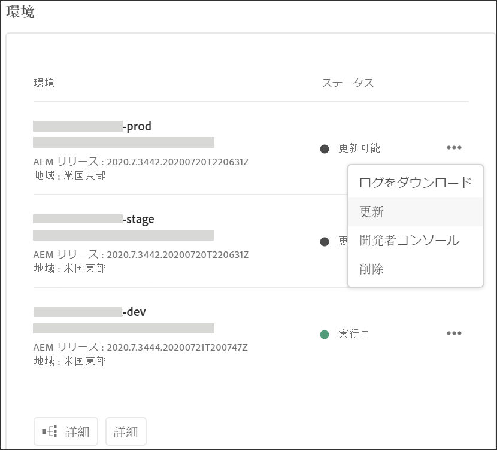

「**更新**」オプションは、**環境**カードから利用できます。
このオプションは、**環境**&#x200B;カードで「**詳細**」をクリックした場合にも使用できます。**環境**&#x200B;ページが開き、「開発」環境を選択したら、「**....**」をクリックして「**更新**」を選択します。次の図を参照してください。

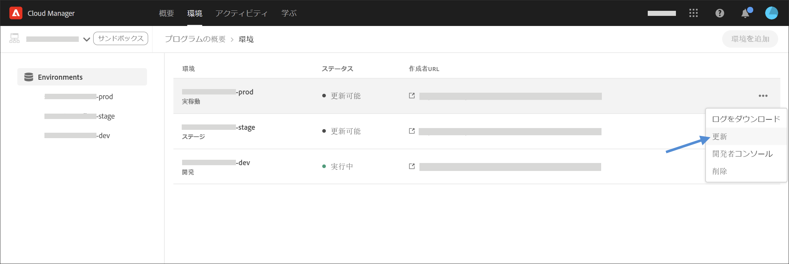

これを選択すると、この環境に関連付けられているパイプラインをデプロイメントマネージャーで最新のリリースに更新してから実行できます。

パイプラインが既に更新されている場合は、パイプラインの実行を求めるプロンプトが表示されます。

## 環境の削除 {#deleting-environment}

必要な権限を持つユーザーは、開発環境を削除できます。

**環境**&#x200B;カードのドロップダウンメニューから「**削除**」オプションを使用できます。削除する開発環境の「**...**」をクリックします。

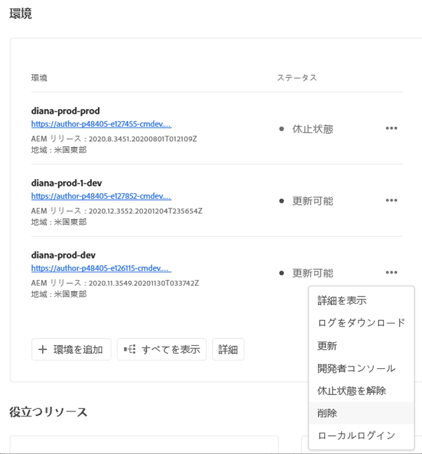

**環境**&#x200B;カードの「**詳細**」をクリックした場合も、削除オプションを使用できます。**環境**&#x200B;ページが開き、「開発」環境を選択したら、「**...**」をクリックして「**削除**」を選択します。次の図を参照してください。

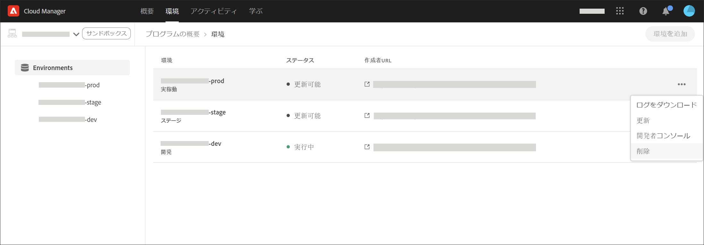

>[!NOTE]
>
>
この機能は、実稼動用に設定された通常のプログラムの実稼働／ステージング環境セットには使用できません。ただし、サンドボックスプログラムの実稼働／ステージング環境には使用できます。

## Managing Access {#managing-access}

Select **Manage Access** from the dropdown menu in the **Environments** Card. オーサーインスタンスに直接移動して、環境のアクセスを管理できます。

詳しくは、「作成者インスタンスへのアクセスの [管理](/help/onboarding/getting-access-to-aem-in-cloud/navigation.md#manage-access-aem) 」を参照してください。

## 開発者コンソールへのアクセス {#accessing-developer-console}

**環境**&#x200B;カードのドロップダウンメニューから「**開発者コンソール**」を選択します。ブラウザーに新しいタブが開き、**開発者コンソール**&#x200B;へのログインページが表示されます。

**開発者コンソール**&#x200B;にアクセスできるのは、開発者ロールのユーザーだけです。サンドボックスプログラムの場合は例外で、Cloud Manager のサンドボックスプログラムにアクセスできるユーザーは誰でも、**開発者コンソール**&#x200B;にアクセスできます。

詳しくは、[サンドボックス環境の休止と休止解除](https://docs.adobe.com/content/help/ja-JP/experience-manager-cloud-service/onboarding/getting-access/cloud-service-programs/sandbox-programs.html#hibernating-introduction)を参照してください。

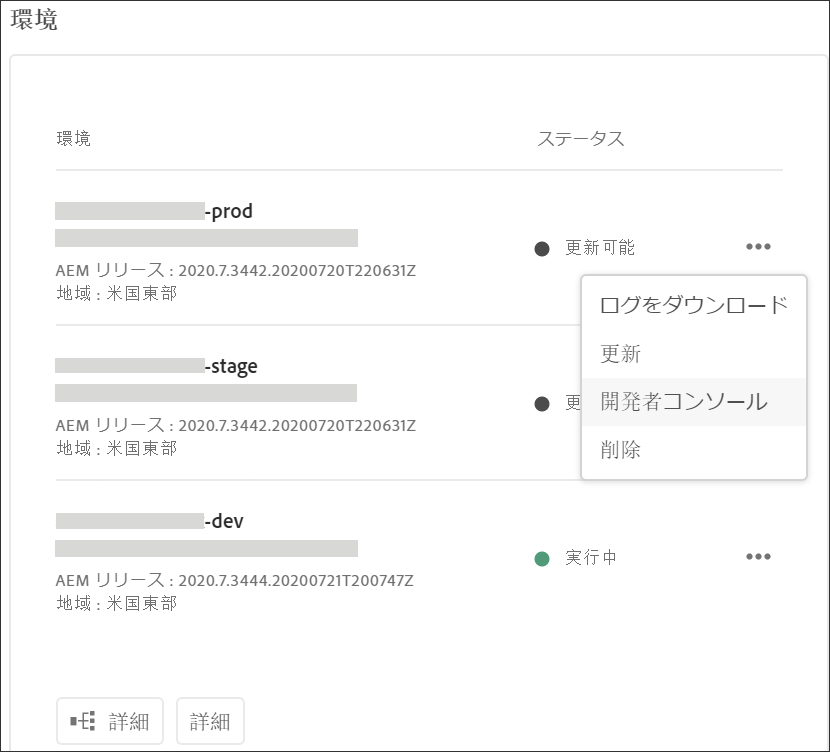

このオプションは、**環境**&#x200B;カードで「**詳細**」をクリックした場合にも使用できます。**環境**&#x200B;ページが開きます。環境を選択したら、「**...**」をクリックし、「**開発者コンソール**」を選択します。

## ローカルログイン {#login-locally}

[ **環境** カード]のドロップダウンメニューから[ローカルログイン **** ]を選択し、ローカルでAdobe Experience Managerにログインします。

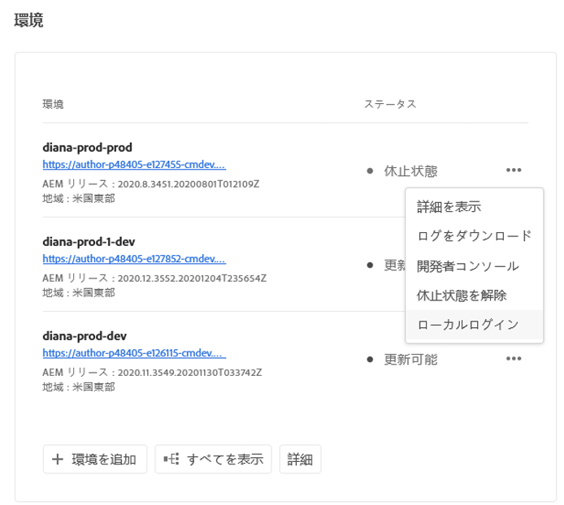

