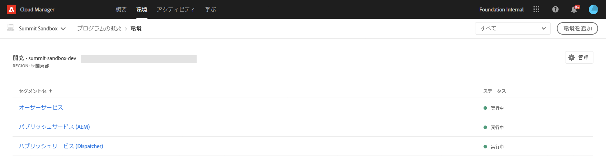
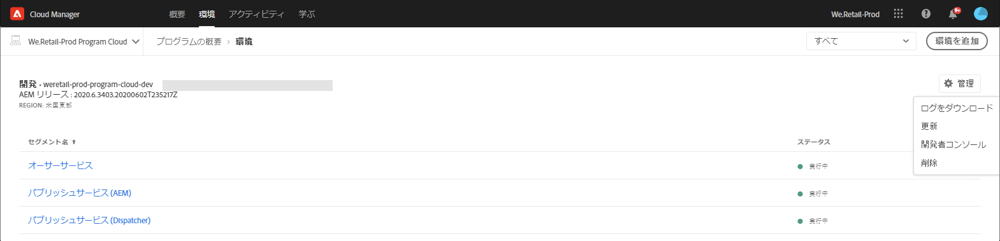

# 環境の管理 {#manage-environments}

以下では、ユーザーが作成できる環境のタイプと、環境の作成方法について説明します。

## 環境タイプ {#environment-types}

必要な権限を持っているユーザーは、（特定のテナントで使用できる範囲内で）次のタイプの環境を作成できます。

* **実稼動環境とステージ環境**：実稼動環境とステージ環境はペアとして使用でき、テストおよび実稼動のために使用されます。

* **開発環境**：開発環境は、開発およびテストのために構築でき、実稼動以外のパイプラインにのみ関連付けられます。

   >[!NOTE]
   >サンドボックスプログラムで自動的に作成される開発環境は、Sites および Assets ソリューションを組み込むように設定されます。

   環境タイプとその属性を次の表にまとめます。

   | 名前 | オーサー層 | パブリッシュ層 | ユーザーによる作成が可能 | ユーザーによる削除が可能 | 環境への関連付けが可能なパイプライン |
   |--- |--- |--- |--- |---|---|
   | 実稼動 | はい | はい（Sites が組み込まれる場合） | はい | 不可 | 実稼動パイプライン |
   | ステージ | はい | はい（Sites が組み込まれる場合） | はい | 不可 | 実稼動パイプライン |
   | 開発 | はい | はい（Sites が組み込まれる場合） | はい | はい | 実稼動以外のパイプライン |

   >[!NOTE]
   >実稼動環境とステージ環境はペアとして使用でき、テストおよび実稼動のために使用されます。ユーザーは、ステージ環境か実稼動環境のどちらか一方のみを構築することはできません。

## 環境の追加 {#adding-environments}

1. 環境を追加するには、 **環境** 追加をクリックします。 このボタンは、 **環境** 画面からアクセスできます。
   

   プログラムに **環境がない場合は、** 環境 **(** )オプションも環境カードで使用できます。

   

   >[!NOTE]
   >権限がないか、 **環境の対象となる可能性があるため、** ・オプションは無効になります。

1. **環境を追加**&#x200B;ダイアログボックスが表示されます。ユーザーは、「**環境タイプ**」、「**環境名**」、「**環境の説明**」などの詳細を指定する必要があります（必要な情報は、特定のテナントで使用できる範囲内で環境を作成する際のユーザーの目的によって異なります）。

   

   >[!NOTE]
   >環境を作成すると、Adobe I/O に 1 つ以上の&#x200B;*統合*&#x200B;が作成されます。これらは、Adobe I/O コンソールにアクセスできる顧客ユーザーに表示され、削除することはできません。削除できないことについては、Adobe I/O コンソール内で説明されます。

   

1. 「**保存**」をクリックして、条件が入力された環境を追加します。*概要*&#x200B;画面に、パイプラインのセットアップに使用できるカードが表示されます。

   >[!NOTE]
   >実稼動以外のパイプラインをまだセットアップしていない場合は、*概要*&#x200B;画面に、実稼動以外のパイプラインの作成に使用できるカードが表示されます。

## 環境の更新 {#updating-dev-environment}

ステージ環境と実稼動環境の更新は、アドビで自動的に管理されます。

開発環境の更新は、プログラムのユーザーが管理します。ある環境で AEM の最新の公開リリースが動作していない場合、ホーム画面の環境カードのステータスには&#x200B;**更新可能**&#x200B;と表示されます。

「 **更新** 」オプションは、 **** 環境カードのドロップダウンメニューから利用できます。
このオプションは、 **環境カードで「** 詳細 **」をクリックした場合に** 、「 **管理** 」ボタンからも使用できます。

ドロップダウンメニューからこれを選択すると、この環境に関連付けられているパイプラインをデプロイメントマネージャーで最新のリリースに更新してから実行できます。

パイプラインが既に更新されている場合は、パイプラインの実行を求めるプロンプトが表示されます。

## 環境の削除 {#deleting-environment}

必要な権限を持つユーザーは、開発環境を削除できます。

「 **削除** 」オプションは、 **環境** ・カードのドロップダウン・メニューから利用できます。
このオプションは、 **環境カードで「** 詳細 **」をクリックした場合に** 、「 **管理** 」ボタンからも使用できます。

>[!NOTE]
この機能は、実稼動用に設定された通常のプログラムセットの実稼働/ステージ環境セットには使用できません。 ただし、この機能はSandboxプログラムの実稼働/ステージ環境で使用できます。

## Developer Consoleへのアクセス {#accessing-developer-console}

[ **環境****]カードのドロップダウンメニューから[** 開発者コンソール]を選択します。 これにより、ブラウザに新しいタブが開き、 **Developer Consoleへのログインページが表示されます**。

開発者ロールに割り当てられているユーザーのみが **開発者コンソールにアクセスできます**。 例外は、Sandboxプログラムに対して発生します。Cloud Manager Sandboxプログラムへのアクセス権を持つユーザーは、 **Developer Console**.

詳しくは、「 [Sandbox環境の冬眠と非冬眠](https://docs.adobe.com/content/help/en/experience-manager-cloud-service/onboarding/getting-access/cloud-service-programs/sandbox-programs.html#hibernating-introduction) 」を参照してください。

「 **環境** 」カードで「 **詳細** 」をクリックすると、「 **管理** 」ボタンからこのオプションを選択することもできます。

