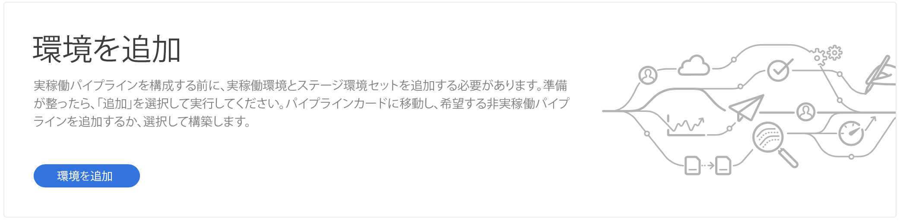

# 環境の管理 {#manage-environments}

次の節では、ユーザが作成できる環境のタイプと、ユーザが環境を作成する方法について説明します。

## 環境タイプ {#environment-types}

必要な権限を持つユーザーは、（特定のテナントが使用できる範囲内で）次の環境タイプを作成できます。

* **実稼働環境とステージ環境**:ProductionとStageは、Duoとして利用でき、テストと制作に使用します。

* **開発**:開発環境は、開発およびテストの目的で作成でき、実稼働以外のパイプラインにのみ関連付けられます。

   >[!NOTE]
   >サンドボックスプログラムで自動作成される開発環境は、サイトとアセットのソリューションを含むように設定されます。

   次の表に、環境タイプとその属性の概要を示します。

   | 名前 | 作成者層 | 公開層 | ユーザーは | ユーザーは削除できます | 環境に関連付け可能なパイプライン |
   |--- |--- |--- |--- |---|---|
   | 実稼動 | はい | サイトが含まれる場合は○ | はい | いいえ | 生産パイプライン |
   | ステージ | はい | サイトが含まれる場合は○ | はい | いいえ | 生産パイプライン |
   | 開発 | はい | サイトが含まれる場合は○ | 可 | 可 | 実稼動以外のパイプライン |

   >[!NOTE]
   >ProductionとStageは、Duoとして利用でき、テストと制作に使用します。  ユーザーは、Stage環境のみ、または実稼働環境のみを作成できません。

## 環境の追加 {#adding-environments}

1. ユーザーが「Add Environment」ボタンをク **リックして** 、環境を追加します。

   

1. [ **Add environment** ]ダイアログ・ボックスが表示されます。ユーザは、 **Environment type** , **Environment name** , **Environment description** Environment descriptionなどの詳細を送信する必要があります（ユーザの目的に応じて、特定のテナントが利用できる環境の範囲内に環境を作成します）。

   

   >[!NOTE]
   >環境を作成すると、Adobe I/Oに1つ *以上の* 「統合」が作成されます。これらは、Adobe I/Oコンソールにアクセスできる顧客ユーザーに表示され、削除しないでください。 これは、Adobe I/Oコンソールの説明では無視されます。

   

1. 「 **Save** 」をクリックして、条件を入力した環境を追加します。  「概要」画面 *に* 、パイプラインを設定できるカードが表示されます。

   >[!NOTE]
   >まだ実稼働以外のパイプラインを設定していない場合は、 *Overview* （概要）画面に、実稼働以外のパイプラインを作成できるカードが表示されます。

## 環境の更新 {#updating-dev-environment}

Stage環境とProduction環境の更新は、アドビによって自動的に管理されます。

開発環境への更新は、プログラムのユーザーが管理します。 ある環境で最新の公開リリースのAEMが実行されていない場合、ホーム画面の環境カードのステータスには「 **UPDATE AVAILABLE」と表示されます**。

)

この状態が表示されると、[ **Update** ]オプションは、ドロップダウンメニューから、[ENVIRONMENTS]カードから[詳細 **]をクリックした場合は[Environments Card]と[** Manage **]メニューの両方で使用でき****** ます。

ドロップダウンメニューからこれを選択すると、Deployment Managerでこの環境に関連付けられたパイプラインを最新のリリースに更新し、パイプラインを実行できます。

パイプラインが既に更新されている場合は、パイプラインの実行を求めるプロンプトが表示されます。
